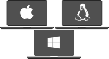
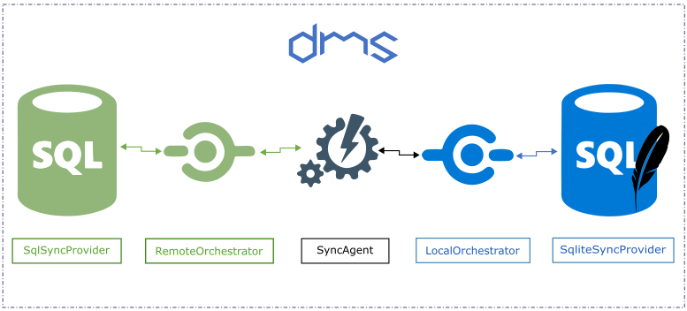

[](https://www.nuget.org/packages?q=dotmim.sync)
[](https://dev.azure.com/dotmim/Dotmim.Sync/_build/latest?definitionId=9)
[](https://dotmimsync.readthedocs.io/?badge=master)

See the Azure Devops CI : [https://dev.azure.com/dotmim/Dotmim.Sync](https://dev.azure.com/dotmim/Dotmim.Sync)

## Documentation

Read the full documentation on [https://dotmimsync.readthedocs.io/](https://dotmimsync.readthedocs.io/)

## Dotmim.Sync

**DotMim.Sync** (**DMS**) is a straightforward framework for syncing relational databases, developed on top of **.Net 8** (and compatible with **.Net Standard 2.0**), available and ready to use within  **IOT**, **Xamarin**, **.NET**, **UWP** and so on :)  

Multi Databases | Cross Plaform |  .Net 8 / .Net Standard 2.0
-------------|---------------------|--------------------
 |  | 



## TL;DR

Here is the easiest way to create a first sync, from scratch :

* Create a **.Net 8 or 6** project or a **.Net Standard 2.0** compatible project (like a **.Net Core 3.1** or **.Net Fx 4.8** console application).  
* Add the **nugets** packages [Dotmim.Sync.SqlServer](https://www.nuget.org/packages/Dotmim.Sync.SqlServer/) (or [Dotmim.Sync.MySql](https://www.nuget.org/packages/Dotmim.Sync.MySql/) if you want to tests MySql) and [Dotmim.Sync.Sqlite](https://www.nuget.org/packages/Dotmim.Sync.Sqlite/)
* Choose one database for testing:
  * Either **SQL Server** test database : [AdventureWorks lightweight script for SQL Server](/CreateAdventureWorks.sql)  
  * Or **MySql** test database :  [AdventureWorks lightweight script for MySQL Server](/CreateMySqlAdventureWorks.sql)  
* Add this code :

``` csharp
// Sql Server provider, the "server" or "hub".
SqlSyncProvider serverProvider = new SqlSyncProvider(
    @"Data Source=.;Initial Catalog=AdventureWorks;Integrated Security=true;");

// Sqlite Client provider acting as the "client"
SqliteSyncProvider clientProvider = new SqliteSyncProvider("advworks.db");

// Tables involved in the sync process:
var setup = new SyncSetup("ProductCategory", "ProductDescription", "ProductModel", 
                          "Product", "ProductModelProductDescription", "Address", 
                          "Customer", "CustomerAddress", "SalesOrderHeader", "SalesOrderDetail");

// Sync agent
SyncAgent agent = new SyncAgent(clientProvider, serverProvider);

do
{
    var result = await agent.SynchronizeAsync(setup);
    Console.WriteLine(result);

} while (Console.ReadKey().Key != ConsoleKey.Escape);
```

And here is the result you should have, after a few seconds:

``` cmd
Synchronization done.
        Total changes  uploaded: 0
        Total changes  downloaded: 2752
        Total changes  applied: 2752
        Total resolved conflicts: 0
        Total duration :0:0:3.776
```

You're done !

Now try to update a row in your client or server database, then hit enter again.
You should see something like that:

``` cmd
Synchronization done.
        Total changes  uploaded: 0
        Total changes  downloaded: 1
        Total changes  applied: 1
        Total resolved conflicts: 0
        Total duration :0:0:0.045
```

Yes it's blazing fast !

## Need Help

* Check the full documentation, available here : [https://dotmimsync.readthedocs.io/](https://dotmimsync.readthedocs.io/)
* Feel free to ping me: [@sebpertus](http://www.twitter.com/sebpertus)
* DMS font is created from the awesome **Cubic** font from [https://www.dafont.com/cubic.font](https://www.dafont.com/cubic.font)
