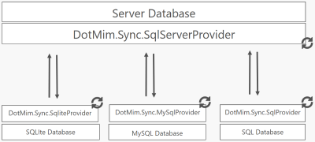

## Warning : This is a work in progress !!!

If you want to see the code and want to contribute, you need to install **Visual Studio 2017 RC** since this project use the new **.csproj** project type.

Go download a free version here : [Visual Studio 2017 RC](https://www.visualstudio.com/fr/vs/visual-studio-2017-rc/)

## Introduction

DotMim.Sync is a new API, based on .Net Core, allowing you to synchronize any kind of relational datasources.

Multi Databases | Cross Plaform |  .Net Standard 1.6 
-------------|---------------------|--------------------
 |  |  

Today supported databases are  :
* SQL Server
* Azure SQL Database
* SQL Server on Linux
* Oracle
* MySql
* SQLite

The sync process is a Master - Slave model (and not a peer to peer model).

It could be represented like this :

**This version is not compatible with any others versions already existing**.

## How it works, in a nutshell

Well, to be honest, how it **should work at the end** :)

    // Server side
    SqlSyncProvider serverProvider = new SqlSyncProvider(serverConnectionString);
    // The configuration ish hosted by the server
    serverProvider.Configuration.ScopeName = "Client With Addresses and Country";
    serverProvider.Configuration.Tables.Add("Client");
    serverProvider.Configuration.Tables.Add("Address");
    serverProvider.Configuration.Tables.Add("Country");

    // Client side
    SqliteSyncProvider clientProvider = new SqliteSyncProvider(clientConnectionString);

    // Sync agent, running on client side
    SyncAgent agent = new SyncAgent(clientProvider, serverProvider);
    
    var stats = await agent.SynchronizeAsync();

## Already Done

Here are the classes the most revelant :

* **CoreProvider** : Base Class for providers
* **SyncAgent** : Orchestrator of the sync process
* **SyncAdapter** : provide an object to manage one Tables
* **SyncContext** : Context for the current sync process
* **DmBinaryFormatter** : A replacement for BinaryFormatter until it's available with .Net Standard 2.0
* **DmSet / DmTables** : DataSet surrogate, much more easy to use, and compatble .Net Standard 1.0

## To Do

So much .... Feel free to push a PR

* The EnsureDatabaseIsReady() architecture
* The TSQL generation (everything !)
* The web proxy architecture when we should be behind a web site
* The batch model
* The conflict handler model
* The filter mechanism
* and so on ....

Seb