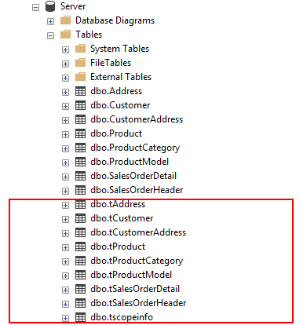
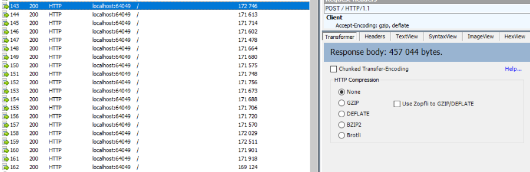

# Setup & Options

You can configure your synchronization model with some parameters, available through the `SyncSetup` and `SyncOptions` objects :

What's the differences between `SyncConfiguration` and `SyncOptions` ?

- `SyncSetup` contains all the parameters **shared** between the server and all the clients.
  - These parameters are set by the **Server** and will override all **Clients** configuration.
- `SyncOptions` contains all the parameters **not shared** between the server and all the clients.

## SyncSetup

If we look at the `SyncSetup` object, we mainly have properties about the schema of your database (at least schema of synced tables)

```csharp
public class SyncSetup
{
    /// <summary>
    /// Gets or Sets the scope name
    /// </summary>
    public string ScopeName { get; set; }

    /// <summary>
    /// Gets or Sets all the synced tables
    /// </summary>
    public SetupTables Tables { get; set; }

    /// <summary>
    /// Specify all filters for each table
    /// </summary>
    public SetupFilters Filters { get; set; }

    /// <summary>
    /// Specify a prefix for naming stored procedure. Default is empty string
    /// </summary>
    public string StoredProceduresPrefix { get; set; }

    /// <summary>
    /// Specify a suffix for naming stored procedures. Default is empty string
    /// </summary>
    public string StoredProceduresSuffix { get; set; }

    /// <summary>
    /// Specify a prefix for naming stored procedure. Default is empty string
    /// </summary>
    public string TriggersPrefix { get; set; }

    /// <summary>
    /// Specify a suffix for naming stored procedures. Default is empty string
    /// </summary>
    public string TriggersSuffix { get; set; }

    /// <summary>
    /// Specify a prefix for naming tracking tables. Default is empty string
    /// </summary>
    public string TrackingTablesPrefix { get; set; }

    /// <summary>
    /// Specify a suffix for naming tracking tables.
    /// </summary>
    public string TrackingTablesSuffix { get; set; }
    
}
```

For instance, these two instructions are equivalent:
``` csharp
var tables = new string[] {"ProductCategory", "ProductModel", "Product",
    "Address", "Customer", "CustomerAddress", "SalesOrderHeader", "SalesOrderDetail" };
var agent = new SyncAgent(clientProvider, serverProvider, tables);

```

``` csharp
var tables = new string[] {"ProductCategory", "ProductModel", "Product",
        "Address", "Customer", "CustomerAddress", "SalesOrderHeader", "SalesOrderDetail" };

// Creating a sync setup object
var setup = new SyncSetup(tables);
var agent = new SyncAgent(clientProvider, serverProvider, setup);

```

The main advantage of using `SyncSetup` is you can personalize what you want from your database:

### Filtering Columns
Once your `SyncSetup` instance is created (with your tables list), you can specify the columns you want to sync:

``` csharp
var tables = new string[] {"ProductCategory", "ProductModel", "Product",
        "Address", "Customer", "CustomerAddress", "SalesOrderHeader", "SalesOrderDetail" };

// Creating a sync setup object
var setup = new SyncSetup(tables);

// Filter columns
setup.Tables["Customer"].Columns.AddRange(new string[] { "CustomerID", "EmployeeID", "NameStyle", "FirstName", "LastName" });
setup.Tables["Address"].Columns.AddRange(new string[] { "AddressID", "AddressLine1", "City", "PostalCode" });
```

For instance, table `Customer` and `Address` won't sync all their columns, but only those specified. 
All others tables will sync all their columns.

### Filtering Rows
From your `SyncSetup` instance, you can also specify a `SetupFilter` on each table, allowing you to filter rows.

``` csharp
setup.Filters.Add("Customer", "CustomerID");
setup.Filters.Add("CustomerAddress", "CustomerID");
setup.Filters.Add("SalesOrderHeader", "CustomerID", "SalesLT");

```
Tables `Customer`, `CustomerAddress` and `SalesLT.SalesOrderHeader` will filter their rows, based on the `CustomerID` column value.

> Filtering rows is a quite complex thing. More information here : [Filtering](./Filters)


### Database configuration

You can personalize how are created the **tracking tables**, **triggers**, **stored procedures** and **scope info** table (for client only) in your database:

```csharp
var setup = new SyncSetup(tables)
{
    ScopeName = "tscopeinfo",
    StoredProceduresPrefix = "s",
    StoredProceduresSuffix = "",
    TrackingTablesPrefix = "t",
    TrackingTablesSuffix = "",
    TriggersPrefix = "",
    TriggersSuffix = "t"
};
```




### HTTP mode

In a more realistic scenario, you will probably have a web proxy in front of your **Server** database.  
You must provide your configuration values on the server side, not on the client side, since the server side will always override the values from the client.

As we saw in the [Web](./Web) chapter, we are using the **ASP.NET Dependency injection** system to create our **Server** remote provider.  
It's the best place to setup your sync configuration:

```csharp
public void ConfigureServices(IServiceCollection services)
{
    services.AddMvc().SetCompatibilityVersion(CompatibilityVersion.Version_2_2);

    // Mandatory to be able to handle multiple sessions
    services.AddMemoryCache();

    // Get a connection string for your server data source
    var connectionString = Configuration.GetSection("ConnectionStrings")["DefaultConnection"];


    // Create the setup used for your sync process
    var tables = new string[] {"ProductCategory",
                    "ProductDescription", "ProductModel",
                    "Product", "ProductModelProductDescription",
                    "Address", "Customer", "CustomerAddress",
                    "SalesOrderHeader", "SalesOrderDetail" };

    var setup = new SyncSetup(tables)
    {
        ScopeName = "all_tables_scope",
        StoredProceduresPrefix = "s",
        StoredProceduresSuffix = "",
        TrackingTablesPrefix = "t",
        TrackingTablesSuffix = "",
        TriggersPrefix = "",
        TriggersSuffix = "t"
    };

    // add a SqlSyncProvider acting as the server hub
    services.AddSyncServer<SqlSyncProvider>(connectionString, setup);
}
```

## SyncOptions

On the other side, `SyncOptions` can be customized on server and on client, with their own different values.  
For instance, we can have a different value for the the `BatchDirectory` (representing the tmp directory when batch is enabled) on server and on client.

```csharp
/// <summary>
/// This class determines all the options you can set on Client & Server, that could potentially be different
/// For instance, the batch directory path could not be the same on the server and client
/// </summary>
public class SyncOptions
{
    /// <summary>
    /// Gets or Sets the directory used for batch mode.
    /// Default value is [User Temp Path]/[DotmimSync]
    /// </summary>
    public string BatchDirectory { get; set; }

    /// <summary>
    /// Gets or Sets the size used (approximatively in kb, depending on the serializer) for each batch file, in batch mode. 
    /// Default is 0 (no batch mode)
    /// </summary>
    public int BatchSize { get; set; }

    /// <summary>
    /// Gets or Sets the log level for sync operations. Default value is false.
    /// </summary>
    public bool UseVerboseErrors { get; set; }

    /// <summary>
    /// Gets or Sets if we should use the bulk operations. Default is true.
    /// If provider does not support bulk operations, this option is overrided to false.
    /// </summary>
    public bool UseBulkOperations { get; set; } = true;

    /// <summary>
    /// Gets or Sets if we should cleaning tracking tables 
    /// </summary>
    public bool CleanMetadatas { get; set; } = true;

    /// <summary>
    /// Gets or Sets if we should disable constraints before making apply changes 
    /// Default value is true
    /// </summary>
    public bool DisableConstraintsOnApplyChanges { get; set; } = true;

    /// <summary>
    /// Gets or Sets the scope_info table name. Default is scope_info
    /// </summary>
    public string ScopeInfoTableName { get; set; }

    /// <summary>
    /// Gets or Sets the default conflict resolution policy. This value could potentially be ovewritten and replaced by the server
    /// </summary>
    public ConflictResolutionPolicy ConflictResolutionPolicy { get; set; }

}
```

> If nothing is supplied, a default `SyncOptions` is created with default values.

`SyncOptions` has some useful methods, you can rely on:

``` csharp
/// <summary>
/// Get the default Batch directory full path ([User Temp Path]/[DotmimSync])
/// </summary>
public static string GetDefaultUserBatchDiretory()

/// <summary>
/// Get the default user tmp folder
/// </summary>
public static string GetDefaultUserTempPath()

/// <summary>
/// Get the default sync tmp folder name (usually 'DotmimSync')
/// </summary>
public static string GetDefaultUserBatchDirectoryName()

```

### Batch mode
Batch mode is an important options if you have to deal with important sync changes.  
If you have a lot of changes to download from your server (or changes to upload from your client), maybe you don't want to download / upload one big change object, stored in memory.
Even worth, when you're in a web environment, you don't want to make a web request with everything inside of it, which could be way too heavy !

The `BatchSize` property from the `SyncOptions` object allows you to define the maximum size of any payload:

``` csharp
var clientOptions = new SyncOptions { BatchSize = 500 };
```
Be careful, the batch size value **is not** a kb maximum size. The maximum size depends on compression, converters and so on...   
Test and adjust the `BatchSize` value regarding your result and expectation.


#### Example

As an example, we make an insert of **100000** product category items in the server database, before making our sync:
```sql
Insert into ProductCategory (Name)
Select SUBSTRING(CONVERT(varchar(255), NEWID()), 0, 7)
Go 100000
```


By default, here is the sync process, where we download everything from the server, without any `BatchSize` option:

``` csharp
var agent = new SyncAgent(clientProvider, proxyClientProvider);
await agent.SynchronizeAsync();
```
Here is the fiddler trace:


As you can see, the fiddler trace shows a http response around **16 Mb** (approximatively **6 Mb** compressed). It could be even more, depending on the size of the selected changes from the server.

Here is the same sync, with the batch mode enabled:

``` csharp
// ----------------------------------
// Client side
// ----------------------------------
var clientOptions = new SyncOptions { BatchSize = 500 };

var agent = new SyncAgent(clientProvider, proxyClientProvider, clientOptions);
var progress = new SynchronousProgress<ProgressArgs>(pa => Console.WriteLine($"{pa.Context.SessionId} - {pa.Context.SyncStage}\t {pa.Message}"));
var s = await agent.SynchronizeAsync(progress);
Console.WriteLine(s);

```

Here is the fiddler trace:



And the progress of the sync process:

``` bash
Web sync start
0030c943-dbb6-4c73-b76a-42bb2ca1f04f - BeginSession      17:50:44.553
0030c943-dbb6-4c73-b76a-42bb2ca1f04f - ScopeLoading      17:50:44.949    Id:dbe3b132-e541-40c6-b1ba-92490ad1729e LastSync: LastSyncDuration:0
0030c943-dbb6-4c73-b76a-42bb2ca1f04f - TableSchemaApplying       17:50:48.770    TableName: ProductCategory Provision:All
0030c943-dbb6-4c73-b76a-42bb2ca1f04f - TableSchemaApplying       17:50:48.848    TableName: ProductModel Provision:All
0030c943-dbb6-4c73-b76a-42bb2ca1f04f - TableSchemaApplying       17:50:48.945    TableName: Product Provision:All
0030c943-dbb6-4c73-b76a-42bb2ca1f04f - TableSchemaApplying       17:50:48.979    TableName: Address Provision:All
0030c943-dbb6-4c73-b76a-42bb2ca1f04f - TableSchemaApplying       17:50:49.34     TableName: Customer Provision:All
0030c943-dbb6-4c73-b76a-42bb2ca1f04f - TableSchemaApplying       17:50:49.65     TableName: CustomerAddress Provision:All
0030c943-dbb6-4c73-b76a-42bb2ca1f04f - TableSchemaApplying       17:50:49.148    TableName: SalesOrderHeader Provision:All
0030c943-dbb6-4c73-b76a-42bb2ca1f04f - SchemaApplied     17:50:49.180    TableName: SalesOrderDetail Provision:All
0030c943-dbb6-4c73-b76a-42bb2ca1f04f - SchemaApplied     17:50:49.180    Tables count:8 Provision:All
0030c943-dbb6-4c73-b76a-42bb2ca1f04f - TableChangesApplied       17:50:53.153    ProductCategory State:Modified Applied:5171 Failed:0
0030c943-dbb6-4c73-b76a-42bb2ca1f04f - TableChangesApplied       17:50:53.399    ProductCategory State:Modified Applied:10343 Failed:0
0030c943-dbb6-4c73-b76a-42bb2ca1f04f - TableChangesApplied       17:50:53.652    ProductCategory State:Modified Applied:15515 Failed:0
0030c943-dbb6-4c73-b76a-42bb2ca1f04f - TableChangesApplied       17:50:53.903    ProductCategory State:Modified Applied:20687 Failed:0
0030c943-dbb6-4c73-b76a-42bb2ca1f04f - TableChangesApplied       17:50:54.201    ProductCategory State:Modified Applied:25859 Failed:0
0030c943-dbb6-4c73-b76a-42bb2ca1f04f - TableChangesApplied       17:50:54.471    ProductCategory State:Modified Applied:31031 Failed:0
0030c943-dbb6-4c73-b76a-42bb2ca1f04f - TableChangesApplied       17:50:54.759    ProductCategory State:Modified Applied:36203 Failed:0
0030c943-dbb6-4c73-b76a-42bb2ca1f04f - TableChangesApplied       17:50:55.70     ProductCategory State:Modified Applied:41375 Failed:0
0030c943-dbb6-4c73-b76a-42bb2ca1f04f - TableChangesApplied       17:50:55.383    ProductCategory State:Modified Applied:46547 Failed:0
0030c943-dbb6-4c73-b76a-42bb2ca1f04f - TableChangesApplied       17:50:55.702    ProductCategory State:Modified Applied:51719 Failed:0
0030c943-dbb6-4c73-b76a-42bb2ca1f04f - TableChangesApplied       17:50:56.28     ProductCategory State:Modified Applied:56891 Failed:0
0030c943-dbb6-4c73-b76a-42bb2ca1f04f - TableChangesApplied       17:50:56.300    ProductCategory State:Modified Applied:62063 Failed:0
0030c943-dbb6-4c73-b76a-42bb2ca1f04f - TableChangesApplied       17:50:56.612    ProductCategory State:Modified Applied:67235 Failed:0
0030c943-dbb6-4c73-b76a-42bb2ca1f04f - TableChangesApplied       17:50:56.907    ProductCategory State:Modified Applied:72407 Failed:0
0030c943-dbb6-4c73-b76a-42bb2ca1f04f - TableChangesApplied       17:50:57.268    ProductCategory State:Modified Applied:77579 Failed:0
0030c943-dbb6-4c73-b76a-42bb2ca1f04f - TableChangesApplied       17:50:57.603    ProductCategory State:Modified Applied:82751 Failed:0
0030c943-dbb6-4c73-b76a-42bb2ca1f04f - TableChangesApplied       17:50:57.919    ProductCategory State:Modified Applied:87923 Failed:0
0030c943-dbb6-4c73-b76a-42bb2ca1f04f - TableChangesApplied       17:50:58.287    ProductCategory State:Modified Applied:93095 Failed:0
0030c943-dbb6-4c73-b76a-42bb2ca1f04f - TableChangesApplied       17:50:58.619    ProductCategory State:Modified Applied:98267 Failed:0
0030c943-dbb6-4c73-b76a-42bb2ca1f04f - TableChangesApplied       17:50:58.746    ProductCategory State:Modified Applied:99742 Failed:0
0030c943-dbb6-4c73-b76a-42bb2ca1f04f - TableChangesApplied       17:50:59.492    ProductModel State:Modified Applied:128 Failed:0
0030c943-dbb6-4c73-b76a-42bb2ca1f04f - TableChangesApplied       17:51:00.281    Product State:Modified Applied:201 Failed:0
0030c943-dbb6-4c73-b76a-42bb2ca1f04f - TableChangesApplied       17:51:00.333    Product State:Modified Applied:295 Failed:0
0030c943-dbb6-4c73-b76a-42bb2ca1f04f - TableChangesApplied       17:51:01.100    Address State:Modified Applied:450 Failed:0
0030c943-dbb6-4c73-b76a-42bb2ca1f04f - TableChangesApplied       17:51:01.916    Customer State:Modified Applied:847 Failed:0
0030c943-dbb6-4c73-b76a-42bb2ca1f04f - TableChangesApplied       17:51:02.733    CustomerAddress State:Modified Applied:417 Failed:0
0030c943-dbb6-4c73-b76a-42bb2ca1f04f - TableChangesApplied       17:51:03.499    SalesOrderHeader State:Modified Applied:32 Failed:0
0030c943-dbb6-4c73-b76a-42bb2ca1f04f - TableChangesApplied       17:51:04.300    SalesOrderDetail State:Modified Applied:542 Failed:0
0030c943-dbb6-4c73-b76a-42bb2ca1f04f - DatabaseChangesApplied    17:51:04.301    Changes applied on database Client: Applied: 102453 Failed: 0
0030c943-dbb6-4c73-b76a-42bb2ca1f04f - ScopeSaved        17:51:04.380    Id:dbe3b132-e541-40c6-b1ba-92490ad1729e LastSync:31/01/2020 16:51:04 LastSyncDuration:198283711
0030c943-dbb6-4c73-b76a-42bb2ca1f04f - EndSession        17:51:04.381
Synchronization done.
        Total changes downloaded: 102453
        Total changes uploaded: 0
        Total conflicts: 0
        Total duration :0:0:19.828
Sync Ended. Press a key to start again, or Escapte to end
```
As you can see, most of the product category items come from different batch requests.


#### UseBulkOperations

This option is only available when using `SQL Server` providers.  
It allows you to use bulk operations from within `SQL Server` using **Table Value Parameters** as input to the stored procedures.
When using `UseBulkOperations`, each table will have new stored procedures and one table value parameter:
- Stored procedure `CustomerAddress_bulkdelete`
- Stored procedure `CustomerAddress_bulkupdate`
- Table value parameter `Customer_BulkType`

Using this option will increase your performances, so do not hesitate to use it !


##### CleanMetadatas

The `CleanMetadatas` option allows you to clean the `_tracking` tables from your client databases.  
**Be careful, this option is only available from client side, not server side !**

Once enabled, the client database will delete all metadatas from the tracking tables, after every successful sync.  
Be careful, the delete method will:
* Work only if client download *something* from server. If there is no changes downloaded and applied on the client, DeleteMetadasAsync is not called
* Work only on T-2 metadatas. To be more secure, the T-1 values stays in the tracking tables.


You can also manually delete metadatas from both server or client, using the method `DeleteMetadatasAsync`, available from `LocalOrchestrator` and `RemoteOrchestrator` also:

``` csharp
var clientProvider = new SqlSyncProvider(DbHelper.GetDatabaseConnectionString(clientDbName));
var localOrchestrator = new LocalOrchestrator(clientProvider);
await localOrchestrator.DeleteMetadatasAsync();
```

> If you're using `SqlSyncChangeTrackingProvider`, the metadatas cleansing is automatically handled by the change tracking feature. This option is not used


#### DisableConstraintsOnApplyChanges

The `DisableConstraintsOnApplyChanges` will disable all constraint on your database, before the sync process is launched, and will be enabled after.   
Use it if you're not sure of the table orders.


#### ScopeInfoTableName

Only used from the client part, this option allows you to customize the scope info table name. Default is `scope_info`.

#### ConflictResolutionPolicy

Define the default conflict resolution policy. See more here : [Conflict resolution](./Conflict)