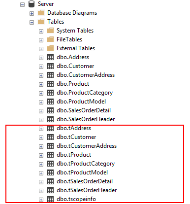
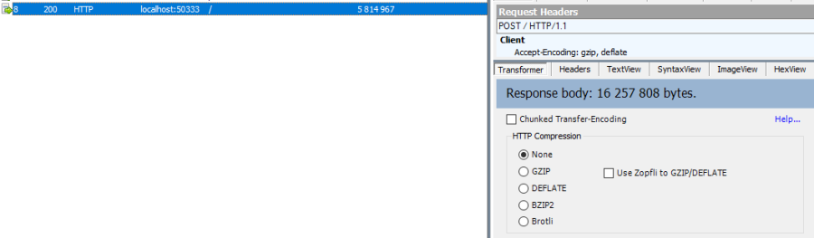
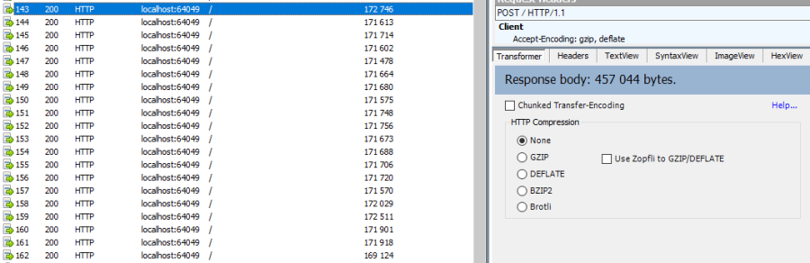

Setup & Options
=================

You can configure your synchronization model with some parameters, available through the ``SyncSetup`` and ``SyncOptions`` objects :

What's the differences between ``SyncSetup`` and ``SyncOptions`` ?

* ``SyncSetup`` contains all the parameters related to your schema, and shared between the server and all the clients.
  
  * In **Http mode**, the ``SyncSetup`` parameters are set by the **Server** and will be send to all **Clients**.

* ``SyncOptions`` contains all the parameters **not shared** between the server and all the clients.

SyncSetup
^^^^^^^^^^^^^^

If we look at the ``SyncSetup`` object, we mainly have properties about your synced tables schema: 

.. code-block:: csharp

    public class SyncSetup
    {
        /// 

        /// Gets or Sets the scope name
        /// 

        public string ScopeName { get; set; }

        /// 

        /// Gets or Sets all the synced tables
        /// 

        public SetupTables Tables { get; set; }

        /// 

        /// Specify all filters for each table
        /// 

        public SetupFilters Filters { get; set; }

        /// 

        /// Specify a prefix for naming stored procedure. Default is empty string
        /// 

        public string StoredProceduresPrefix { get; set; }

        /// 

        /// Specify a suffix for naming stored procedures. Default is empty string
        /// 

        public string StoredProceduresSuffix { get; set; }

        /// 

        /// Specify a prefix for naming stored procedure. Default is empty string
        /// 

        public string TriggersPrefix { get; set; }

        /// 

        /// Specify a suffix for naming stored procedures. Default is empty string
        /// 

        public string TriggersSuffix { get; set; }

        /// 

        /// Specify a prefix for naming tracking tables. Default is empty string
        /// 

        public string TrackingTablesPrefix { get; set; }

        /// 

        /// Specify a suffix for naming tracking tables.
        /// 

        public string TrackingTablesSuffix { get; set; }
        
    }

The ``SyncAgent`` instance creates a ``SyncSetup`` instance automatically when initialized.

For instance, these two instructions are equivalent:

.. code-block:: csharp

    var tables = new string[] {"ProductCategory", "ProductModel", "Product",
        "Address", "Customer", "CustomerAddress", "SalesOrderHeader", "SalesOrderDetail" };
    var agent = new SyncAgent(clientProvider, serverProvider, tables);

.. code-block:: csharp

    var tables = new string[] {"ProductCategory", "ProductModel", "Product",
            "Address", "Customer", "CustomerAddress", "SalesOrderHeader", "SalesOrderDetail" };

    // Creating a sync setup object
    var setup = new SyncSetup(tables);
    var agent = new SyncAgent(clientProvider, serverProvider, setup);

The main advantage of using ``SyncSetup`` is you can personalize what you want from your database:

Schema
--------------

.. note:: The schema feature is only avaialable for SQL Server

One great feature in **SQL Server** is the `schema <https://technet.microsoft.com/en-us/library/dd283095%28v=sql.100%29.aspx?f=255>`_  option.     

You can configure your sync tables with schema if you target the ``SqlSyncProvider``.

You have two way to configure schemas:

* Directly during the tables declaration, as string.

.. code-block:: csharp

    var tables = new string[] { "SalesLT.ProductCategory", "SalesLT.ProductModel", "SalesLT.Product",
                                    "Address", "Customer", "CustomerAddress"};

    SyncAgent agent = new SyncAgent(clientProvider, serverProvider, tables);

* On each table, from the ``SyncSetup`` setup instance.

.. code-block:: csharp

    var tables = new string[] { "ProductCategory", "ProductModel", "Product",
                                "Address", "Customer", "CustomerAddress"};

    SyncAgent agent = new SyncAgent(clientProvider, serverProvider, tables);

    agent.Setup.Tables["ProductCategory"].SchemaName = "SalesLt";
    agent.Setup.Tables["ProductModel"].SchemaName = "SalesLt";
    agent.Setup.Tables["Product"].SchemaName = "SalesLt";

.. warning:: Schemas are not replicated if you target ``SqliteSyncProvider`` or ``MySqlSyncProvider`` as client providers.

Filtering Columns
-----------------------

Once your ``SyncSetup`` instance is created (with your tables list), you can specify the columns you want to sync:

.. code-block:: csharp

    var tables = new string[] {"ProductCategory", "ProductModel", "Product",
            "Address", "Customer", "CustomerAddress", "SalesOrderHeader", "SalesOrderDetail" };

    // Creating a sync setup object
    var setup = new SyncSetup(tables);

    // Filter columns
    setup.Tables["Customer"].Columns.AddRange(new string[] { 
        "CustomerID", "EmployeeID", "NameStyle", "FirstName", "LastName" });
    
    setup.Tables["Address"].Columns.AddRange(new string[] { 
        "AddressID", "AddressLine1", "City", "PostalCode" });

For instance, table ``Customer`` and ``Address`` won't sync all their columns, but only those specified. 

Filtering Rows
-----------------------

From your ``SyncSetup`` instance, you can also specify a ``SetupFilter`` on each table, allowing you to filter rows.

.. code-block:: csharp

    setup.Filters.Add("Customer", "CustomerID");
    setup.Filters.Add("CustomerAddress", "CustomerID");
    setup.Filters.Add("SalesOrderHeader", "CustomerID", "SalesLT");

Tables ``Customer``, ``CustomerAddress`` and ``SalesLT.SalesOrderHeader`` will filter their rows, based on the ``CustomerID`` column value.

.. note:: Filtering rows is a quite complex thing. A full chapter is dedicated to rows filtering: `Filters <Filters.html>`_ 

Database configuration
--------------------------

You can personalize how are created the **tracking tables**, **triggers** and **stored procedures** tables in your database:

.. code-block:: csharp

    var setup = new SyncSetup(tables)
    {
        StoredProceduresPrefix = "s",
        StoredProceduresSuffix = "",
        TrackingTablesPrefix = "t",
        TrackingTablesSuffix = "",
        TriggersPrefix = "",
        TriggersSuffix = "t"
    };

HTTP mode
---------------

| In a more realistic scenario, you will probably have a web proxy in front of your **Server** database.  
| You must provide your configuration values on the server side, not on the client side, since the server side will always override the values from the client.

| As we saw in the `Web <Web.html>`_ chapter, we are using the **ASP.NET Dependency injection** system to create our **Server** remote provider.  
| It's the best place to setup your sync configuration:

.. code-block:: csharp

    public void ConfigureServices(IServiceCollection services)
    {
        services.AddControllers();

        // Mandatory to be able to handle multiple sessions
        services.AddMemoryCache();

        // Get a connection string for your server data source
        var connectionString = Configuration.GetSection("ConnectionStrings")["DefaultConnection"];

        // Create the setup used for your sync process
        var tables = new string[] {"ProductCategory",
                        "ProductDescription", "ProductModel",
                        "Product", "ProductModelProductDescription",
                        "Address", "Customer", "CustomerAddress",
                        "SalesOrderHeader", "SalesOrderDetail" };

        var setup = new SyncSetup(tables)
        {
            StoredProceduresPrefix = "s",
            StoredProceduresSuffix = "",
            TrackingTablesPrefix = "t",
            TrackingTablesSuffix = "",
            TriggersPrefix = "",
            TriggersSuffix = "t"
        };

        // add a SqlSyncProvider acting as the server hub
        services.AddSyncServer<SqlSyncProvider>(connectionString, setup);
    }

.. warning:: The prefix and suffix properties, are not shared betweeen server and client.

SyncOptions
^^^^^^^^^^^^^^

| On the other side, ``SyncOptions`` can be customized on server and on client, with their own different values.  
| For instance, we can have a different value for the the ``BatchDirectory`` (representing the tmp directory when batch is enabled) on server and on client.

.. code-block:: csharp

    /// 

    /// This class determines all the options you can set on Client & Server, 
    /// that could potentially be different
    /// 

    public class SyncOptions
    {
        /// 

        /// Gets or Sets the directory used for batch mode.
        /// Default value is [User Temp Path]/[DotmimSync]
        /// 

        public string BatchDirectory { get; set; }

        /// 

        /// Gets or Sets the directory where snapshots are stored.
        /// This value could be overwritten by server is used in an http mode
        /// 

        public string SnapshotsDirectory { get; set; }

        /// 

        /// Gets or Sets the size used (approximatively in kb, depending on the serializer) 
        /// for each batch file, in batch mode. 
        /// Default is 0 (no batch mode)
        /// 

        public int BatchSize { get; set; }

        /// 

        /// Gets or Sets the log level for sync operations. Default value is false.
        /// 

        public bool UseVerboseErrors { get; set; }

        /// 

        /// Gets or Sets if we should use the bulk operations. Default is true.
        /// If provider does not support bulk operations, this option is overrided to false.
        /// 

        public bool UseBulkOperations { get; set; } = true;

        /// 

        /// Gets or Sets if we should clean tracking table metadatas.
        /// 

        public bool CleanMetadatas { get; set; } = true;

        /// 

        /// Gets or Sets if we should cleaning tmp dir files after sync.
        /// 

        public bool CleanFolder { get; set; } = true;

        /// 

        /// Gets or Sets if we should disable constraints before making apply changes 
        /// Default value is true
        /// 

        public bool DisableConstraintsOnApplyChanges { get; set; } = true;

        /// 

        /// Gets or Sets the scope_info table name. Default is scope_info
        /// On the server side, server scope table is prefixed with _server 
        /// and history table with _history
        /// 

        public string ScopeInfoTableName { get; set; }

        /// 

        /// Gets or Sets the default conflict resolution policy. This value could potentially 
        /// be ovewritten and replaced by the server
        /// 

        public ConflictResolutionPolicy ConflictResolutionPolicy { get; set; }

        /// 

        /// Gets or Sets the default logger used for logging purpose
        /// 

        public ILogger Logger { get; set; }
    }

.. note:: If nothing is supplied when creating a new ``SyncAgent`` instance, a default ``SyncOptions`` is created with default values.

``SyncOptions`` has some useful methods, you can rely on:

.. code-block:: csharp

    /// 

    /// Get the default Batch directory full path ([User Temp Path]/[DotmimSync])
    /// 

    public static string GetDefaultUserBatchDiretory()

    /// 

    /// Get the default user tmp folder
    /// 

    public static string GetDefaultUserTempPath()

    /// 

    /// Get the default sync tmp folder name (usually 'DotmimSync')
    /// 

    public static string GetDefaultUserBatchDirectoryName()

Batch mode
----------------

Batch mode is an important options if you have to deal with *over sized* sync changes.  

| If you have a lot of changes to download from your server (or changes to upload from your client), maybe you don't want to download / upload one big change object, stored in memory.
| Even more, when you're in a web environment, you don't want to make a web request with everything inside of it, which could be way too heavy !

The ``BatchSize`` property from the ``SyncOptions`` object allows you to define the maximum size of any payload:

.. code-block:: csharp

    var clientOptions = new SyncOptions { BatchSize = 500 };

.. warning:: | Be careful, the batch size value **is not** a kb maximum size. 
             | The maximum size depends on compression, converters and so on...   
             | Test and adjust the ``BatchSize`` value regarding your result and expectation.

**Example**

.. hint:: You will find the complete sample here : `Batch size sample <https://github.com/Mimetis/Dotmim.Sync/tree/master/Samples/BatchSize>`_ 

As an example, we make an insert of **100000** product category items in the server database, before making our sync:

.. code-block:: sql

    Insert into ProductCategory (Name)
    Select SUBSTRING(CONVERT(varchar(255), NEWID()), 0, 7)
    Go 100000

By default, here is a sync process, where we download everything from the server, without any ``BatchSize`` option:

.. code-block:: csharp

    var agent = new SyncAgent(clientProvider, proxyClientProvider);
    await agent.SynchronizeAsync();

Here is the fiddler trace:

| As you can see, the fiddler trace shows a http response around **16 Mb** (approximatively **6 Mb** compressed). 
| It could be even more, depending on the size of the selected changes from the server.

Here is the same sync, with the batch mode enabled:

.. code-block:: csharp

    // ----------------------------------
    // Client side
    // ----------------------------------
    var clientOptions = new SyncOptions { BatchSize = 500 };

    var agent = new SyncAgent(clientProvider, proxyClientProvider, clientOptions);
    var progress = new SynchronousProgress<ProgressArgs>(pa => 
    Console.WriteLine(String.Format("{0} -{1}\t {2}", 
                pa.Context.SessionId, pa.Context.SyncStage, pa.Message));
    var s = await agent.SynchronizeAsync(progress);
    Console.WriteLine(s);

.. hint:: The client side dictates the batch size. The server is always adapting its payload, regarding the client ask.

Here is the fiddler trace:

And the progress of the sync process:

.. code-block:: bash

    974f8be9-332d-4d6d-b881-7784b63b4bb7 - BeginSession      10:53:38.762    Session Id:974f8be9-332d-4d6d-b881-7784b63b4bb7
    974f8be9-332d-4d6d-b881-7784b63b4bb7 - ScopeLoaded       10:53:39.385    [Client] [DefaultScope] [Version ] Last sync: Last sync duration:0:0:0.0
    974f8be9-332d-4d6d-b881-7784b63b4bb7 - Provisioned       10:53:42.224    [Client] tables count:8 provision:Table, TrackingTable, StoredProcedures, Triggers
    974f8be9-332d-4d6d-b881-7784b63b4bb7 - ChangesSelected   10:53:42.243    [Client] upserts:0 deletes:0 total:0
    974f8be9-332d-4d6d-b881-7784b63b4bb7 - ChangesApplying   10:53:55.133    [Client] [ProductCategory] Modified applied:5171 resolved conflicts:0
    974f8be9-332d-4d6d-b881-7784b63b4bb7 - ChangesApplying   10:53:55.702    [Client] [ProductCategory] Modified applied:10343 resolved conflicts:0
    974f8be9-332d-4d6d-b881-7784b63b4bb7 - ChangesApplying   10:53:56.297    [Client] [ProductCategory] Modified applied:15515 resolved conflicts:0
    974f8be9-332d-4d6d-b881-7784b63b4bb7 - ChangesApplying   10:53:56.891    [Client] [ProductCategory] Modified applied:20687 resolved conflicts:0
    974f8be9-332d-4d6d-b881-7784b63b4bb7 - ChangesApplying   10:53:57.620    [Client] [ProductCategory] Modified applied:25859 resolved conflicts:0
    974f8be9-332d-4d6d-b881-7784b63b4bb7 - ChangesApplying   10:53:58.280    [Client] [ProductCategory] Modified applied:31031 resolved conflicts:0
    974f8be9-332d-4d6d-b881-7784b63b4bb7 - ChangesApplying   10:53:58.971    [Client] [ProductCategory] Modified applied:36203 resolved conflicts:0
    974f8be9-332d-4d6d-b881-7784b63b4bb7 - ChangesApplying   10:53:59.682    [Client] [ProductCategory] Modified applied:41375 resolved conflicts:0
    974f8be9-332d-4d6d-b881-7784b63b4bb7 - ChangesApplying   10:54:00.420    [Client] [ProductCategory] Modified applied:46547 resolved conflicts:0
    974f8be9-332d-4d6d-b881-7784b63b4bb7 - ChangesApplying   10:54:01.169    [Client] [ProductCategory] Modified applied:51719 resolved conflicts:0
    974f8be9-332d-4d6d-b881-7784b63b4bb7 - ChangesApplying   10:54:01.940    [Client] [ProductCategory] Modified applied:56891 resolved conflicts:0
    974f8be9-332d-4d6d-b881-7784b63b4bb7 - ChangesApplying   10:54:02.657    [Client] [ProductCategory] Modified applied:62063 resolved conflicts:0
    974f8be9-332d-4d6d-b881-7784b63b4bb7 - ChangesApplying   10:54:03.432    [Client] [ProductCategory] Modified applied:67235 resolved conflicts:0
    974f8be9-332d-4d6d-b881-7784b63b4bb7 - ChangesApplying   10:54:04.192    [Client] [ProductCategory] Modified applied:72407 resolved conflicts:0
    974f8be9-332d-4d6d-b881-7784b63b4bb7 - ChangesApplying   10:54:05.82     [Client] [ProductCategory] Modified applied:77579 resolved conflicts:0
    974f8be9-332d-4d6d-b881-7784b63b4bb7 - ChangesApplying   10:54:05.930    [Client] [ProductCategory] Modified applied:82751 resolved conflicts:0
    974f8be9-332d-4d6d-b881-7784b63b4bb7 - ChangesApplying   10:54:06.787    [Client] [ProductCategory] Modified applied:87923 resolved conflicts:0
    974f8be9-332d-4d6d-b881-7784b63b4bb7 - ChangesApplying   10:54:07.672    [Client] [ProductCategory] Modified applied:93095 resolved conflicts:0
    974f8be9-332d-4d6d-b881-7784b63b4bb7 - ChangesApplying   10:54:08.553    [Client] [ProductCategory] Modified applied:98267 resolved conflicts:0
    974f8be9-332d-4d6d-b881-7784b63b4bb7 - ChangesApplying   10:54:08.972    [Client] [ProductCategory] Modified applied:100041 resolved conflicts:0
    974f8be9-332d-4d6d-b881-7784b63b4bb7 - ChangesApplying   10:54:09.113    [Client] [ProductModel] Modified applied:128 resolved conflicts:0
    974f8be9-332d-4d6d-b881-7784b63b4bb7 - ChangesApplying   10:54:09.183    [Client] [Product] Modified applied:198 resolved conflicts:0
    974f8be9-332d-4d6d-b881-7784b63b4bb7 - ChangesApplying   10:54:09.208    [Client] [Product] Modified applied:295 resolved conflicts:0
    974f8be9-332d-4d6d-b881-7784b63b4bb7 - ChangesApplying   10:54:09.255    [Client] [Address] Modified applied:450 resolved conflicts:0
    974f8be9-332d-4d6d-b881-7784b63b4bb7 - ChangesApplying   10:54:09.329    [Client] [Customer] Modified applied:847 resolved conflicts:0
    974f8be9-332d-4d6d-b881-7784b63b4bb7 - ChangesApplying   10:54:09.375    [Client] [CustomerAddress] Modified applied:417 resolved conflicts:0
    974f8be9-332d-4d6d-b881-7784b63b4bb7 - ChangesApplying   10:54:09.414    [Client] [SalesOrderHeader] Modified applied:32 resolved conflicts:0
    974f8be9-332d-4d6d-b881-7784b63b4bb7 - ChangesApplying   10:54:09.476    [Client] [SalesOrderDetail] Modified applied:542 resolved conflicts:0
    974f8be9-332d-4d6d-b881-7784b63b4bb7 - ChangesApplied    10:54:09.636    [Client] applied:102752 resolved conflicts:0
    974f8be9-332d-4d6d-b881-7784b63b4bb7 - EndSession        10:54:09.638    Session Id:974f8be9-332d-4d6d-b881-7784b63b4bb7
    Synchronization done.
            Total changes  uploaded: 0
            Total changes  downloaded: 102752
            Total changes  applied: 102752
            Total resolved conflicts: 0
            Total duration :0:0:30.886

As you can see, most of the product category items come from different batch requests.

UseBulkOperations
-----------------------

This option is only available when using ``SQL Server`` providers.  

It allows you to use bulk operations from within `SQL Server` using **Table Value Parameters** as input to the stored procedures.

When using ``UseBulkOperations``, each table will have new stored procedures and one table value parameter:

* Stored procedure ``CustomerAddress_bulkdelete``
* Stored procedure ``CustomerAddress_bulkupdate``
* Table value parameter ``Customer_BulkType``

Using this option will increase your performances, so do not hesitate to use it !

CleanMetadatas
----------------------

The ``CleanMetadatas`` option allows you to clean the ``_tracking`` tables from your client databases.  

Once enabled, the client database will delete all metadatas from the tracking tables, after every successful sync.  

Be careful, the delete method will:

* Work only if client download *something* from server. If there is no changes downloaded and applied on the client, ``DeleteMetadasAsync`` is not called
* Work only on **T-2** metadatas. To be more secure, the **T-1** values stays in the tracking tables.

You can also manually delete metadatas from both server or client, using the method ``DeleteMetadatasAsync``, available from both ``LocalOrchestrator`` and ``RemoteOrchestrator``:

.. code-block:: csharp

    var clientProvider = new SqlSyncProvider(DbHelper.GetDatabaseConnectionString(clientDbName));
    var localOrchestrator = new LocalOrchestrator(clientProvider);
    await localOrchestrator.DeleteMetadatasAsync();

.. note:: If you're using ``SqlSyncChangeTrackingProvider``, the metadatas cleansing is automatically handled by the change tracking feature.

DisableConstraintsOnApplyChanges
-----------------------------------

The `DisableConstraintsOnApplyChanges` will disable all constraint on your database, before the sync process is launched, and will be enabled after.   
Use it if you're not sure of the table orders.

ScopeInfoTableName
-------------------------

This option allows you to customize the scope info table name. Default is `scope_info`.

On the server side, server scope table is prefixed with **_server** and history table with **_history**

ConflictResolutionPolicy
------------------------------

Define the default conflict resolution policy. See more here : `Conflict <Conflict.html>`_ 