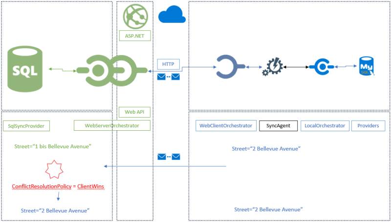

Conflicts
==========================

Overview
^^^^^^^^^^^^^

Conflicts occurs when a client update / delete / insert a record that is updated / deleted or inserted on the server as well, *before any sync happened*.

As an example, we can imagine a conflict occuring during an update on a column called ``Street`:

1) As a starting point, both server and client has a value of ``Street=1 Bellevue Avenue`` after an initial sync (where no conflicts occured).
2) Server is updating the row with a value of "*1 bis Bellevue Avenue*".
3) Client is updating as well the same row value with "*2 Bellevue Avenue*".
4) Sync is launched, and a conflict is raised **on the server side**.

Here is the diagram of the situation:

By default, conflicts are resolved automaticaly using the configuration policy property ``ConflictResolutionPolicy`` set in the ``SyncOptions`` object :  

You can choose: 

* ``ConflictResolutionPolicy.ServerWins`` : The server is the winner of any conflict. this behavior is the default behavior.
* ``ConflictResolutionPolicy.ClientWins`` : The client is the winner of any conflict.

.. hint:: Default value is ``ServerWins``.

.. code-block:: csharp

    var options = new SyncOptions { ConflictResolutionPolicy = ConflictResolutionPolicy.ServerWins };

Here is the same diagram with the final step, where resolution is set to ``ServerWins`` (default value, by the way)

Resolution
^^^^^^^^^^^^^^^^^^^^^^

.. warning:: A conflict is always resolved on the server side.

Depending on your policy resolution, the workflow could be:

* A conflict is generated on the client and the server side.
* The client is launching a sync processus.
* The server tries to apply the row and a conflict is generated.
* The server resolves the conflict on the server side.
* If the server wins, the resolved server row is sent to the client and is *force-applied* on the client database.
* If the client wins, the server will *force-apply* the client row on the server. Nothing happen on the client, since the row is correct.

Here is the workflow, when the conflict resolution is set to ``ServerWins`` in an **HTTP** mode:

.. image:: assets/Conflict03.png

Here is the same workflow, when the conflict resolution is now set to ``ClientWins``:

Handling conflicts manually
^^^^^^^^^^^^^^^^^^^^^^^^^^^^^^

| If you decide to manually resolve a conflict, the ``ConflictResolutionPolicy`` option will be ignored.  
| To be able to resolve a conflict, you just have to *Intercept*  the ``ApplyChangedFailed`` method and choose the correct version.  

.. code-block:: csharp

    agent.OnApplyChangesFailed(args =>
    {
    // do stuff and choose correct resolution policy
    });

The ``ApplyChangeFailedEventArgs`` argument contains all the required properties to be able to resolve your conflict.

You will determinate the correct version through the `Action` property of type ``ConflictResolution``:

.. code-block:: csharp

    public enum ConflictResolution
    {
        /// 

        /// Indicates that the change on the server is the conflict winner
        /// 

        ServerWins,

        /// 

        /// Indicates that the change sent by the client is the conflict winner
        /// 

        ClientWins,

        /// 

        /// Indicates that you will manage the conflict by filling the final row and sent it to 
        /// both client and server
        /// 

        MergeRow,

        /// 

        /// Indicates that you want to rollback the whole sync process
        /// 

        Rollback
    }

* ``ConflictResolution.ClientWins`` : The client row will be applied on server, even if there is a conflict, so the client row wins.
* ``ConflictResolution.ServerWins`` : The client row won't be applied on the server, so the server row wins.
* ``ConflictResolution.MergeRow``   : It's up to you to choose the correct row to send on both server and client. the ``FinalRow`` instance will be used instead of Server or Client row.

You are able to compare the row in conflict through the ``Conflict`` property of type ``SyncConflict``:

* ``Conflict.LocalRow``   : Contains the conflict row from the client side. This row is readonly.
* ``Conflict.RemoteRow``  : Contains the conflict row from the server side. This row is readonly.
* ``Conflict.Type``       : Gets the ``ConflictType`` enumeration. For example ``ConflictType.RemoteUpdateLocalUpdate`` represents a conflict row beetween an updated row on the server and the same row updated on the client as well.

| You can use the current connection during this event to be able to perform actions on the server side through the ``DbConnection`` and ``DbTransaction`` properties.  
| If you decide to rollback the transaction, all the sync process will be rollback. 

| Eventually, the ``FinalRow`` property is used when you specify an Action to ``ConflictAction.MergeRow``. 
| You decide what will contains the row applied on both server and client side. Be careful, the ``FinalRow`` property is null until you specify the ``Action`` property to ``ConflictAction.MergeRow`` !

TCP mode
-----------------

Manually resolving a conflict based on a column value:

.. code-block:: csharp

    agent.OnApplyChangesFailed(e =>
    {
        if (e.Conflict.RemoteRow.Table.TableName == "Region")
        {
            e.Action = (int)e.Conflict.RemoteRow["Id"] == 1 ? 
                    ConflictResolution.ClientWins :
                    ConflictResolution.ServerWins;
        }
    }

Manually resolving a conflict based on the conflict type :

.. code-block:: csharp

    agent.OnApplyChangesFailed(args =>
    {
        switch (args.Conflict.Type)
        {
            //
            case ConflictType.RemoteExistsLocalExists:
            case ConflictType.RemoteExistsLocalIsDeleted:
            case ConflictType.RemoteIsDeletedLocalExists:
            case ConflictType.RemoteIsDeletedLocalIsDeleted:
            case ConflictType.RemoteCleanedupDeleteLocalUpdate:
            case ConflictType.RemoteExistsLocalNotExists:
            case ConflictType.RemoteIsDeletedLocalNotExists:
            default:
                break;
        }
    });

Resolving a conflict by specifying a merged row :

.. code-block:: csharp

    agent.OnApplyChangesFailed(e =>
    {
        if (e.Conflict.RemoteRow.Table.TableName == "Region")
        {
            e.Action = ConflictResolution.MergeRow;
            e.FinalRow["RegionDescription"] = "Eastern alone !";
        }
    }

.. note:: Be careful, the ``e.FinalRow`` is null until you set the ``Action`` property to ``ConflictAction.MergeRow`` !

HTTP Mode
------------------

We saw that conflicts are resolved on the server side, if you are in an **HTTP** mode, involving a server web side, it is there that you need to intercept failed applied changes:

.. code-block:: csharp

    [Route("api/[controller]")]
    [ApiController]
    public class SyncController : ControllerBase
    {
        private WebServerManager webServerManager;

        // Injected thanks to Dependency Injection
        public SyncController(WebServerManager webServerManager) 
                            => this.webServerManager = webServerManager;

        [HttpPost]
        public async Task Post()
        {
            try
            {
                // Get Orchestrator regarding the incoming scope name (from http context)
                var orchestrator = webServerManager.GetOrchestrator(this.HttpContext);

                orchestrator.OnApplyChangesFailed(e =>
                {
                    if (e.Conflict.RemoteRow.Table.TableName == "Region")
                    {
                        e.Resolution = ConflictResolution.MergeRow;
                        e.FinalRow["RegionDescription"] = "Eastern alone !";
                    }
                    else
                    {
                        e.Resolution = ConflictResolution.ServerWins;
                    }
                });

                var progress = new SynchronousProgress<ProgressArgs>(pa => 
                    Debug.WriteLine("{0}\t{1}", pa.Context.SyncStage, pa.Message));

                // handle request
                await webServerManager.HandleRequestAsync(this.HttpContext, default, progress);

            }
            catch (Exception ex)
            {
                await WebServerManager.WriteExceptionAsync(this.HttpContext.Response, ex);
            }
        }

        /// 

        /// This Get handler is optional. It allows you to see the configuration hosted on the server
        /// The configuration is shown only if Environmenent == Development
        /// 

        [HttpGet]
        public async Task Get() => await webServerManager.HandleRequestAsync(this.HttpContext);
    }

Handling conflicts from the client side
^^^^^^^^^^^^^^^^^^^^^^^^^^^^^^^^^^^^^^^^

| As we said, all the conflicts are resolved from the server side.  
| But, using a **Two sync trick**, you are able to resolve the conflict from the client side.

.. tip:: This feature is only available from version `0.5.6`

Basically the process is occuring in this order:
- The first sync will raise the conflict and will be resolved on the server.
- The first sync will send back the resolved conflict to the client, containing the server row and the client row
- From the client side, you will now be able to ask the client to choose the correct version
- The second sync will then send back the *new* version of the row to the server.

.. warning:: To be able to use this technic, the ConflictResolutionPolicy MUST be set to ConflictResolutionPolicy.ServerWins

Here is a full example using this special trick:

.. code-block:: csharp

    var agent = new SyncAgent(clientProvider, serverProvider, options, setup);

    var localOrchestrator = agent.LocalOrchestrator;
    var remoteOrchestrator = agent.RemoteOrchestrator;

    // Conflict resolution MUST BE set to ServerWins
    options.ConflictResolutionPolicy = ConflictResolutionPolicy.ServerWins;

    // From client : Remote is server, Local is client
    // From here, we are going to let the client decides 
    // who is the winner of the conflict :
    localOrchestrator.OnApplyChangesFailed(acf =>
    {
        // Check conflict is correctly set
        var localRow = acf.Conflict.LocalRow;
        var remoteRow = acf.Conflict.RemoteRow;

        // From that point, you can easily letting the client decides 
        // who is the winner
        // Show a UI with the local / remote row and 
        // letting him decides what is the good row version
        // for testing purpose; will just going to set name to some fancy BLA BLA value

        // SHOW UI
        // OH.... CLIENT DECIDED TO SET NAME TO "BLA BLA BLA" 

        // BE AS FAST AS POSSIBLE IN YOUR DESICION, 
        // SINCE WE HAVE AN OPENED CONNECTION / TRANSACTION RUNNING
    
        remoteRow["Name"] = clientNameDecidedOnClientMachine;

        // Mandatory to override the winner registered in the tracking table
        // Use with caution !
        // To be sure the row will be marked as updated locally, 
        // the scope id should be set to null
        acf.SenderScopeId = null;
    });

    // From Server : Remote is client, Local is server
    // From that point we do not do anything, 
    // letting the server resolves the conflict and send back
    // the server row and client row conflicting to the client
    remoteOrchestrator.OnApplyChangesFailed(acf =>
    {
        // Check conflict is correctly set
        var localRow = acf.Conflict.LocalRow;
        var remoteRow = acf.Conflict.RemoteRow;

        // remote is client; local is server
        Assert.StartsWith("CLI", remoteRow["Name"].ToString());
        Assert.StartsWith("SRV", localRow["Name"].ToString());

        Assert.Equal(ConflictResolution.ServerWins, acf.Resolution);
        Assert.Equal(ConflictType.RemoteExistsLocalExists, acf.Conflict.Type);

    });

    // First sync, we allow server to resolve the conflict and send back the result to client
    var s = await agent.SynchronizeAsync();

    
    Assert.Equal(1, s.TotalChangesDownloaded);
    Assert.Equal(1, s.TotalChangesUploaded);
    Assert.Equal(1, s.TotalResolvedConflicts);

    // From this point the Server row Name is STILL "SRV...."
    // And the Client row NAME is "BLA BLA BLA..."
    // Make a new sync to send "BLA BLA BLA..." to Server

    s = await agent.SynchronizeAsync();

    Assert.Equal(0, s.TotalChangesDownloaded);
    Assert.Equal(1, s.TotalChangesUploaded);
    Assert.Equal(0, s.TotalResolvedConflicts);
