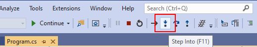
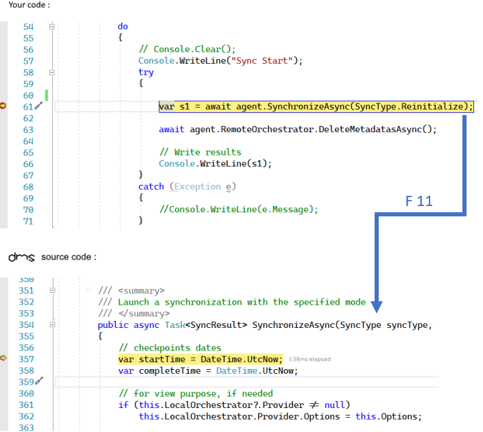
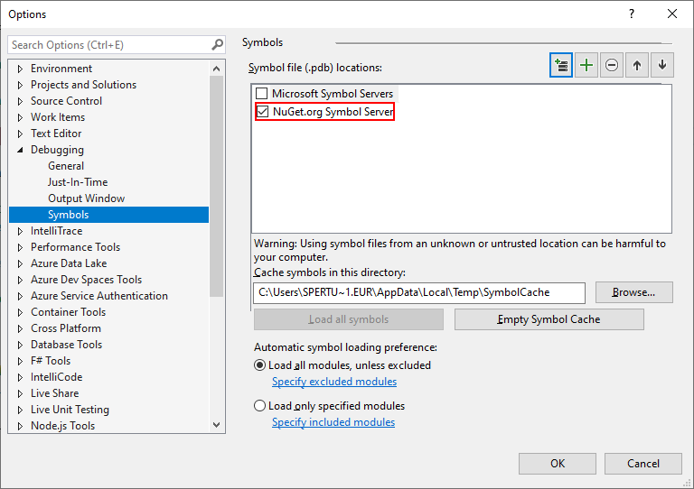
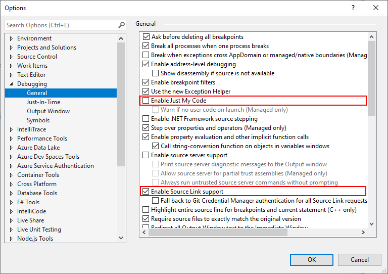

Debugging DMS
====================

Thanks to **Symbol files** and **Source Link**, we're able to debug the **DMS** framework from within our application, 
without having to donwload the source code locally.

To be able to **Step Into** the code, we should configure **Visual Studio** to:

* Download the symbol files from nuget if available.
* Enable the source link to redirect the pdb information to the source code hosted on Github.

Once we've correctly configured our Visual Studio environment, we are able to **Step Into** the **DMS** code, during a debugging session (or press **F11**):

As you can see in the previous screenshot, we are actually *step into* the ``SynchronizeAsync`` method directly from your code.

Behinds the scene, the **.pdb file** retrieves the correct filename and position and the **Source link** download the correct file from the `DMS Github repository <https://www.github.com/mimetis/dotmim.sync>`_ .

Let's see in details how to configure your Visual Studio environment:

Symbols packages
^^^^^^^^^^^^^^^^^^^^

| **Symbol files** (*.pdb) are produced by the .NET compiler alongside assemblies. 
| **Symbol files** map execution locations to the original source code so you can step through source code as it is running using a debugger. 

**DMS** publishes the symbols packages, containing the .pdb files, for each release to the nuget symbols server.

To be able to get the symbols, we should check we have **Nuget** as a symbol server availabe from our Visual Studio options:

Go to **Tools** > **Options** > **Debugging** > **Symbols**:

* Verify we have **Nuget.Org Symbol** Servers checked.
* Uncheck **Microsoft Symbol Servers**, unless we want also to debug the .NET Core assemblies from within our application.

.. hint:: If you don't have the Nuget.Org Symbol option, you can add this url directly : `https://symbols.nuget.org/download/symbols <https://symbols.nuget.org/download/symbols>`_ 

| Now we are able to map the execution to the original source code location, but we still miss... the source code itself !
| That's why need also the **Source link** options.

Source link
^^^^^^^^^^^^^^^^^

| **Source Link** is a technology that enables source code debugging of .NET assemblies from NuGet by developers. 
| **Source Link** executes when creating the NuGet package and embeds source control metadata inside assemblies and the package. 
| Developers who download the package and have **Source Link** enabled in Visual Studio can step into its source code. 
| **Source Link** provides source control metadata to create a great debugging experience.

.. note:: More information on source link technology: `SourceLink <https://github.com/dotnet/sourcelink/blob/master/README.md>`_ 

To be able to use the **Source link** technolgy, we should verify the option is checked from within our Visual Studio options:

Go to **Tools** > **Options** > **Debugging** > **General**:

* Uncheck **Enable Just My Code**
* Check **Enable Source Link support**

We can now debug our code, and **Step Into** the DMS code as well.

If you need more information, you can check this documentation: `Using Pdb and Source code <https://docs.microsoft.com/en-us/visualstudio/debugger/specify-symbol-dot-pdb-and-source-files-in-the-visual-studio-debugger?view=vs-2019>`_ 

