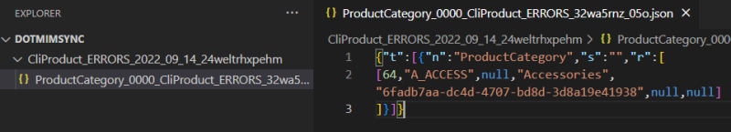
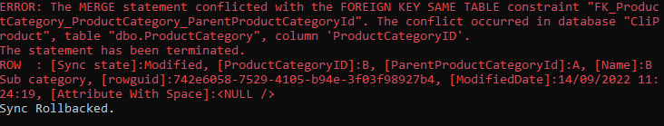
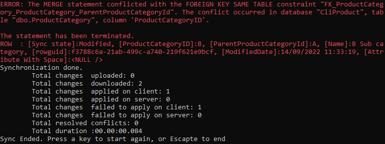
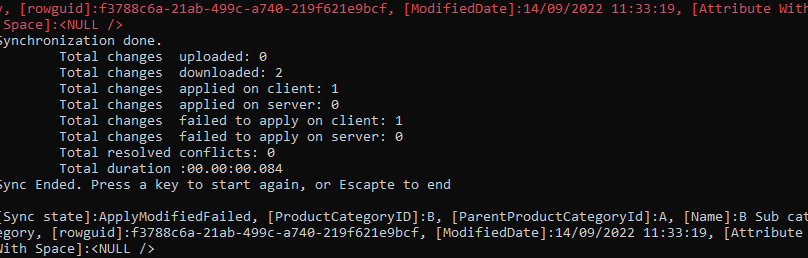
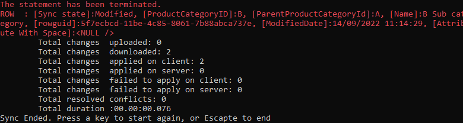
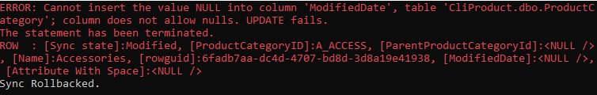
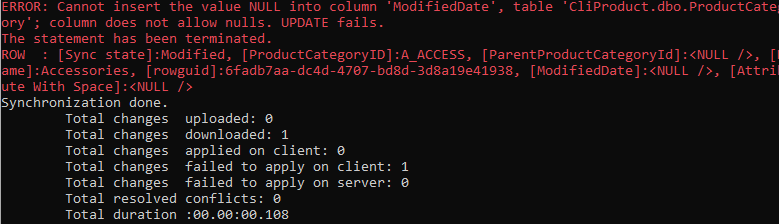
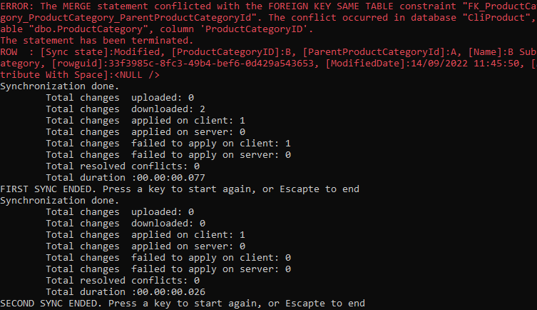
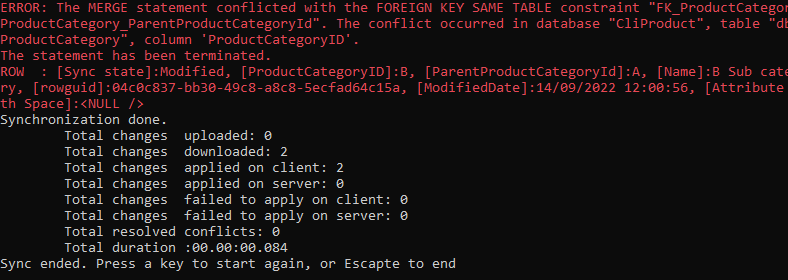

Errors
==========================

Overview
^^^^^^^^^^^^^

Errors can happens during a synchronization process.

By default, if an error occurs, the synchronization process is stopped and the transaction is rolled back.

.. note:: The Error Resolution can be different on each side.

That's being said, you can configure the synchronization process to continue even if an error occurs, and adapt the resolution process.

- The default error resolution can be defined from the ``SyncOptions`` instance on each side.
- You can use the ``OnApplyChangesConflictOccured`` interceptor to handle errors on a per-row basis.

.. code-block:: csharp

    // OPTION 1: Default error resolution using SyncOptions:
    var syncOptions = new SyncOptions { ErrorResolutionPolicy = ErrorResolution.RetryOnNextSync };

    var agent = new SyncAgent(clientProvider, serverProvider, options);

    // OPTION 2: Per-row error resolution using OnApplyChangesConflictOccured event:
    agent.LocalOrchestrator.OnApplyChangesErrorOccured(args =>
    {
        Console.WriteLine($"ERROR: {args.Exception.Message}");
        Console.WriteLine($"ROW: {args.ErrorRow}");
        args.Resolution = ErrorResolution.RetryOnNextSync;
    });

Here is the description of the ``ErrorResolution`` enum, used to define the default error resolution:

.. code-block:: csharp

    /// 

    /// Determines what kind of action should be taken when an error is raised from the datasource
    /// during an insert / update or delete command
    /// 

    public enum ErrorResolution
    {
        /// 

        /// Ignore the error and continue to sync. Error will be stored 
        /// locally in a separate batch info file
        /// <para>
        /// Row is stored locally with a state of <see cref="SyncRowState.ApplyDeletedFailed"/> 
        /// or <see cref="SyncRowState.ApplyModifiedFailed"/> depending on the row state.
        /// </para>
        /// 

        ContinueOnError,

        /// 

        /// Will try one more time once after all the others rows in the table. 
        /// <para>
        /// If the error is raised again, an exception is thrown and transaction is rollback
        /// </para>
        /// 

        RetryOneMoreTimeAndThrowOnError,

        /// 

        /// Will try one more time once after all the others rows in the table. 
        /// <para>
        /// If the error is raised again, Sync continues normally and error will be stored locally in a 
        /// separate batch info file with a state of <see cref="SyncRowState.ApplyDeletedFailed"/> 
        /// or <see cref="SyncRowState.ApplyModifiedFailed"/> depending on the row state.
        /// </para>
        /// 

        RetryOneMoreTimeAndContinueOnError,

        /// 

        /// Row is stored locally and will be applied again on next sync. Sync continues normally and 
        /// row is stored locally with a state of <see cref="SyncRowState.RetryDeletedOnNextSync"/> 
        /// or <see cref="SyncRowState.RetryModifiedOnNextSync"/> depending on the row state.
        /// 

        RetryOnNextSync,

        /// 

        /// Considers the row as applied.
        /// 

        Resolved,

        /// 

        /// Throw the error. Default value.
        /// 

        Throw
    }

Each time a row is in error (due to various reasons like **Unique constraint** or **ForeignKeys constraint** or any other failure that could happens), 
the row in error will be logged locally in a ``BatchInfo`` directory. 

Usually the batch info file has "*ERROR*" in its directory name.

.. note:: The batch info file is a json file, and can be opened with any text editor.

You can read all the lines from the error folders, using the ``LoadBatchInfosAsync`` method from your ``LocalOrchestrator`` or ``RemoteOrchestrator`` instance.

.. code-block:: csharp

    var batchInfos = await agent.LocalOrchestrator.LoadBatchInfosAsync();

    foreach (var batchInfo in batchInfos)
    {
        Console.WriteLine($"BatchInfo: {batchInfo.DirectoryName}");
        
        // Load all tables from the batch info files        
        var syncTables = agent.LocalOrchestrator.LoadTablesFromBatchInfoAsync(batchInfo);

        await foreach (var syncTable in syncTables)
        {
            Console.WriteLine(syncTable.TableName);
            foreach (var syncRow in syncTable.Rows)
            {
                Console.WriteLine($"Row: {syncRow}");
            }
        }
    }

Resolution
^^^^^^^^^^^^^^

To emphazise, we are going to see the error resolution in action. We are creating a foreign key error on the :guilabel:`ProductCategory` table:

.. code-block:: sql

    CREATE TABLE [ProductCategory](
        [ProductCategoryID] [nvarchar](50) NOT NULL,
        [ParentProductCategoryId] [nvarchar](50) NULL,
        [Name] [nvarchar](50) NOT NULL,
        [rowguid] [uniqueidentifier] NULL,
        [ModifiedDate] [datetime] NULL,
        [Attribute With Space] [nvarchar](max) NULL,
    CONSTRAINT [PK_ProductCategory] PRIMARY KEY CLUSTERED ([ProductCategoryID] ASC))

    GO
    ALTER TABLE [ProductCategory] WITH CHECK ADD CONSTRAINT [FK_ParentProductCategoryId] 
    FOREIGN KEY([ParentProductCategoryId]) REFERENCES [ProductCategory] ([ProductCategoryID])

    GO
    BEGIN TRAN
        ALTER TABLE [ProductCategory] NOCHECK CONSTRAINT ALL
        INSERT [ProductCategory] ([ProductCategoryID], [ParentProductCategoryId], [Name]) 
        VALUES (N'A', 'B', N'A Sub category')
        
        INSERT [ProductCategory] ([ProductCategoryID], [ParentProductCategoryId], [Name]) 
        VALUES (N'B', NULL, N'B Category');
        ALTER TABLE [ProductCategory] CHECK CONSTRAINT ALL
    COMMIT TRAN;

As you can see the **A** :guilabel:`ProductCategory` belongs to **B** :guilabel:`ProductCategory` . But because **A** is before **B**, on a Select statement, the **A** row will come firstly, before **B**. 

We have generated a **ForeignKey constraint failure**.

.. note:: For the explanation purpose, we are going to use the ``OnApplyChangesConflictOccured`` interceptor to see the error message on each row.

    You can do the same using the ``SyncOptions`` ``ErrorResolutionPolicy`` property.

Here is the description of the ``ErrorResolution`` enum, used to define the error resolution, for this particular foreign key constraint failure:

ErrorResolution.Throw
----------------------

| The default ErrorResolution is ``ErrorResolution.Throw``. This means that the sync will stop on the first error, and will throw an exception.
| In the following example, we are going to see the error message on each row.
| No need to specify ``args.Resolution = ErrorResolution.Throw;`` as it is the default value. We do it here to emphazise the error resolution behavior:

.. code-block:: csharp

    // ErrorResolution.Throw is the default resolution. No need to explicitly set it.
    // It's done here for the demo explanation.
    agent.LocalOrchestrator.OnApplyChangesErrorOccured(args =>
    {
        Console.ForegroundColor = ConsoleColor.Red;
        Console.WriteLine($"ERROR: {args.Exception.Message}");
        Console.WriteLine($"ROW  : {args.ErrorRow}");
        Console.ResetColor();

        args.Resolution = ErrorResolution.Throw;
    });

    var serverProvider = new SqlSyncProvider(serverConnectionString)
    { UseBulkOperations = false };

    var clientProvider = new SqlSyncProvider(clientConnectionString)
    { UseBulkOperations = false };

    var setup = new SyncSetup("ProductCategory");
    var agent = new SyncAgent(clientProvider, serverProvider);

    do
    {
        try
        {
            Console.ResetColor();
            result = await agent.SynchronizeAsync(setup);
            Console.WriteLine(result);
            Console.WriteLine("Sync Ended. Press a key to start again, or Escapte to end");
        }
        catch (Exception e)
        {
            Console.ResetColor();
            Console.WriteLine("Sync Rolled back.");
        }
    } while (Console.ReadKey().Key != ConsoleKey.Escape);
    

The error is raised for the second line, as it's the one who triggers the foreing key constraint failure:

Be careful, we do not have any files in the ``BatchInfo`` directory, as the sync has been rolled back.

ErrorResolution.ContinueOnError
-------------------------------

| The ``ErrorResolution.ContinueOnError`` will continue the sync, and will not rollback the transaction. 
| Error is logged in the error's batch info directory:

.. code-block:: csharp

    // ErrorResolution.Throw is the default resolution. No need to explicitly set it.
    // It's done here for the demo explanation.
    agent.LocalOrchestrator.OnApplyChangesErrorOccured(args =>
    {
        Console.ForegroundColor = ConsoleColor.Red;
        Console.WriteLine($"ERROR: {args.Exception.Message}");
        Console.WriteLine($"ROW  : {args.ErrorRow}");
        Console.ResetColor();

        args.Resolution = ErrorResolution.ContinueOnError;
    });

The error's batch info directory contains the error file:

.. image:: assets/ErrorResolutionRetryThrow2ErrorFile.png
    :align: center
    :alt: ErrorResolution.ErrorResolutionRetryThrow2ErrorFile

And you can get it using the ``LoadBatchInfosAsync`` method:

ErrorResolution.RetryOneMoreTimeAndThrowOnError
------------------------------------------------

The ``ErrorResolution.RetryOneMoreTimeAndThrowOnError`` will retry the row one more time, and if it fails again, will throw an exception.

.. code-block:: csharp

    // ErrorResolution.Throw is the default resolution. No need to explicitly set it.
    // It's done here for the demo explanation.
    agent.LocalOrchestrator.OnApplyChangesErrorOccured(args =>
    {
        Console.ForegroundColor = ConsoleColor.Red;
        Console.WriteLine($"ERROR: {args.Exception.Message}");
        Console.WriteLine($"ROW  : {args.ErrorRow}");
        Console.ResetColor();

        args.Resolution = ErrorResolution.RetryOneMoreTimeAndThrowOnError;
    });

As you can see, we have an error raised **BUT** because we tried **AGAIN** to applied the failed row one more time, the sync has been successfully applied.

As a demo purpose, we are going to generate a new error (A **Not Null Constraint** error), on the :guilabel:`ProductCategory` table, to see the difference:

Ok, this time, the error can't be resolved, even if we tried to apply the row twice. So the sync has been rolled back, and the error has been raised.

ErrorResolution.RetryOneMoreTimeAndContinueOnError
----------------------------------------------------

The ``ErrorResolution.RetryOneMoreTimeAndContinueOnError`` will retry the row one more time, and if it fails again, will ignore the error and continue the sync.

.. note:: We are going to use the same **Not Null Constraint** error on the :guilabel:`ProductCategory` table, as we did in the previous example.

.. code-block:: csharp

    // ErrorResolution.Throw is the default resolution. No need to explicitly set it.
    // It's done here for the demo explanation.
    agent.LocalOrchestrator.OnApplyChangesErrorOccured(args =>
    {
        Console.ForegroundColor = ConsoleColor.Red;
        Console.WriteLine($"ERROR: {args.Exception.Message}");
        Console.WriteLine($"ROW  : {args.ErrorRow}");
        Console.ResetColor();

        args.Resolution = ErrorResolution.RetryOneMoreTimeAndContinueOnError;
    });

We tried to apply the row twice, and then the error has been ignored, and logged in the batch info directory.

ErrorResolution.RetryOnNextSync
----------------------------------------------------

Last option, the ``ErrorResolution.RetryOnNextSync`` will retry to apply the row on the next sync, and if it fails again, will try again and again, until the server (or client) resolves the issue.

As demo purpose we are chaining multiple call to ``SynchronizeAsync`` to see the error being retried on the next sync.

.. code-block:: csharp

    // ErrorResolution.Throw is the default resolution. No need to explicitly set it.
    // It's done here for the demo explanation.
    agent.LocalOrchestrator.OnApplyChangesErrorOccured(args =>
    {
        Console.ForegroundColor = ConsoleColor.Red;
        Console.WriteLine($"ERROR: {args.Exception.Message}");
        Console.WriteLine($"ROW  : {args.ErrorRow}");
        Console.ResetColor();

        args.Resolution = ErrorResolution.RetryOnNextSync;
    });

As you can see, the error has been logged in the batch info directory during the first sync, and has been automatically retried on the second sync.

.. note:: IF you look carefully the result on the second sync, you will see that we did not download any rows, but the error has been resolved.

ErrorResolution.Resolved
----------------------------------------------------

Last option, the ``ErrorResolution.Resolved`` will mark the error as resolved, and will not retry to apply the row on the next sync.

.. code-block:: csharp

    // ErrorResolution.Throw is the default resolution. No need to explicitly set it.
    // It's done here for the demo explanation.
    agent.LocalOrchestrator.OnApplyChangesErrorOccured(args =>
    {
        Console.ForegroundColor = ConsoleColor.Red;
        Console.WriteLine($"ERROR: {args.Exception.Message}");
        Console.WriteLine($"ROW  : {args.ErrorRow}");
        Console.ResetColor();

        args.Resolution = ErrorResolution.Resolved;
    });

.. warning:: Be careful, if you use this resolution, you will have to manually resolve the error on the server (or client).

    DMS will consider the row as successfully applied, and will not retry to apply it on the next sync. As you can see, we have a Total Changes Applied On Client equals to 2, but the server has only 1 row applied.
