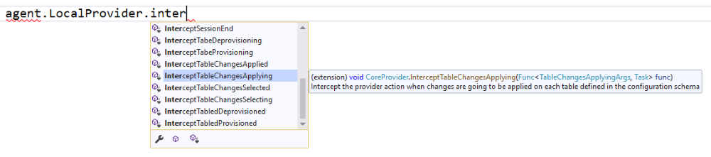
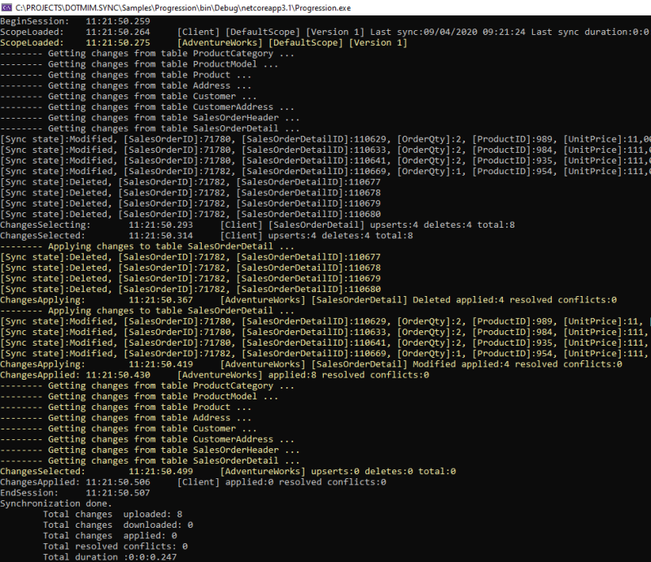

Interceptors
=====================

``Ìnterceptor<T>`` : A more advanced technic to handle a lot of more events from within **DMS**

Overview
^^^^^^^^^^^^

The ``Progress<T>`` stuff is great, but as we said, it's mainly read only, and the progress is always reported **at the end of a current sync stage**.   

| So, if you need a more granular control on all the progress values, you can subscribe to an ``Interceptor<T>``.   
| On each **orchestrator**, you will find a lot of relevant methods to intercept the sync process, encapsulate in a fancy ``OnMethodAsync()`` method:

Imagine you have a table that should **never** be synchronized. You're able to use an interceptor like this:

.. code-block:: csharp

    // We are using a cancellation token that will be passed as an argument 
    // to the SynchronizeAsync() method !
    var cts = new CancellationTokenSource();

    agent.LocalOrchestrator.OnTableChangesApplying((args) =>
    {
        if (args.SchemaTable.TableName == "Table_That_Should_Not_Be_Sync")
            args.Cancel = true;
    });

Be careful, your table will never be synced !

Intercepting rows
^^^^^^^^^^^^^^^^^^

| You may want to intercept all the rows that have just been selected from the source (client or server), and are about to be sent to their destination (server or client).   
| Or even intercept all the rows that are going to be applied on a destination database.   
| That way, you may be able to modify these rows, to meet your business / requirements rules.  

To do so, you can use the **interceptors** ``OnTableChangesSelecting`` and ``OnTableChangesSelected`` to have more details on what changes are selected for each table.

In the other hand, you can use the **interceptors** ``OnTableChangesApplying`` and ``OnTableChangesApplied`` to get all the rows that will be applied to a destination database.

.. hint:: You will find the sample used for this chapter, here : `Spy sample <https://github.com/Mimetis/Dotmim.Sync/tree/master/Samples/Spy>`_. 

Intecepting applying changes
---------------------------------

.. code-block:: csharp

    // Intercept a table changes selecting stage.
    agent.LocalOrchestrator.OnTableChangesSelecting(args =>
    {
        Console.WriteLine('$'"-- Getting changes from table {args.Table.GetFullName()} ...");
    });

    // Intercept a table changes applying stage, with a particular state [Upsert] or [Deleted]
    // The rows included in the args.Changes table will be applied right after.
    agent.LocalOrchestrator.OnTableChangesBatchApplying(args =>
    {
        Console.WriteLine('$'"-- Applying changes {args.State} to table {args.Changes.GetFullName()}");

        if (args.Changes == null || args.Changes.Rows.Count == 0)
            return;

        foreach (var row in args.Changes.Rows)
            Console.WriteLine(row);
    });

    // Intercept a table changes selected stage.
    // The rows included in the args.Changes have been selected 
    // from the local database and will be sent to the server.
    agent.LocalOrchestrator.OnTableChangesSelected(args =>
    {
        if (args.Changes == null || args.Changes.Rows.Count == 0)
            return;

        foreach (var row in args.Changes.Rows)
            Console.WriteLine(row);
    });

*In the screenshot below, yellow lines are interceptors from server side.*

Interceptors DbCommand execution
---------------------------------

Interceptors on ``DbCommand`` will let you change the command used, depending on your requirements:

* ``Interceptors`` on creating the architecture.
* ``Interceptors`` when executing sync queries.

Let see a straightforward sample : *Customizing a tracking table*.

Adding a new column in a tracking table
============================================

The idea here is to add a new column ``internal_id`` in the tracking table:

.. code-block:: csharp

    var provider = new SqlSyncProvider(serverConnectionString);
    var options = new SyncOptions();
    var setup = new SyncSetup(new string[] { "ProductCategory", "ProductModel", "Product" });
    var orchestrator = new RemoteOrchestrator(provider, options, setup);

    // working on the product Table
    var productSetupTable = setup.Tables["Product"];

    orchestrator.OnTrackingTableCreating(ttca =>
    {
        var addingID = '$'" ALTER TABLE {ttca.TrackingTableName.Schema().Quoted()} " +
                       '$'" ADD internal_id varchar(10) null";
        ttca.Command.CommandText += addingID;
    });

    var trExists = await orchestrator.ExistTrackingTableAsync(productSetupTable);
    if (!trExists)
        await orchestrator.CreateTrackingTableAsync(productSetupTable);

.. image:: https://user-images.githubusercontent.com/4592555/103886481-e08af980-50e1-11eb-97cf-b54af5a44e8c.png

Ok, now we need to customize the triggers to insert a correct value in the ``internal_id`` column:

.. code-block:: csharp

    orchestrator.OnTriggerCreating(tca =>
    {
        string val;
        if (tca.TriggerType == DbTriggerType.Insert)
            val = "INS";
        else if (tca.TriggerType == DbTriggerType.Delete)
            val = "DEL";
        else
            val = "UPD";

        var cmdText = '$'"UPDATE Product_tracking " +
                    '$'"SET Product_tracking.internal_id='{val}' " +
                    '$'"FROM Product_tracking JOIN Inserted ON " + 
                    '$'"Product_tracking.ProductID = Inserted.ProductID;";

        tca.Command.CommandText += Environment.NewLine + cmdText;
    });

    var trgExists = await orchestrator.ExistTriggerAsync(productSetupTable, 
                            DbTriggerType.Insert);
    if (!trgExists)
        await orchestrator.CreateTriggerAsync(productSetupTable, 
                            DbTriggerType.Insert);

    trgExists = await orchestrator.ExistTriggerAsync(productSetupTable, 
                            DbTriggerType.Update);
    if (!trgExists)
        await orchestrator.CreateTriggerAsync(productSetupTable, 
                            DbTriggerType.Update);

    trgExists = await orchestrator.ExistTriggerAsync(productSetupTable, 
                            DbTriggerType.Delete);
    if (!trgExists)
        await orchestrator.CreateTriggerAsync(productSetupTable, 
                            DbTriggerType.Delete);

    orchestrator.OnTriggerCreating(null);

Here is the `Sql` script executed for trigger ``Insert``:

.. code-block:: sql

    CREATE TRIGGER [dbo].[Product_insert_trigger] ON [dbo].[Product] FOR INSERT AS

    SET NOCOUNT ON;

    -- If row was deleted before, it already exists, so just make an update
    UPDATE [side] 
    SET  [sync_row_is_tombstone] = 0
        ,[update_scope_id] = NULL -- scope id is always NULL when update is made locally
        ,[last_change_datetime] = GetUtcDate()
    FROM [Product_tracking] [side]
    JOIN INSERTED AS [i] ON [side].[ProductID] = [i].[ProductID]

    INSERT INTO [Product_tracking] (
        [ProductID]
        ,[update_scope_id]
        ,[sync_row_is_tombstone]
        ,[last_change_datetime]
    ) 
    SELECT
        [i].[ProductID]
        ,NULL
        ,0
        ,GetUtcDate()
    FROM INSERTED [i]
    LEFT JOIN [Product_tracking] [side] ON [i].[ProductID] = [side].[ProductID]
    WHERE [side].[ProductID] IS NULL

    UPDATE Product_tracking SET Product_tracking.internal_id='INS' 
    FROM Product_tracking 
    JOIN Inserted ON Product_tracking.ProductID = Inserted.ProductID;

Intercepting and controlling data applying
----------------------------------------------

| You can use ``Interceptors`` to control how your data are applied (or not)
| Imagine that, for some reasons, you don't want to delete data that should be deleted.

Here is a quick example:

First of all, making a full sync to be sure we have the same data between the server and one client

.. code-block:: csharp

    var serverProvider = new SqlSyncProvider(serverConnectionString);
    var clientProvider = new SqlSyncProvider(clientConnectionString);

    // Tables involved in the sync process:
    var tables = new string[] {"Product" };

    // Creating an agent that will handle all the process
    var agent = new SyncAgent(clientProvider, serverProvider, tables);

    // First sync to have some rows on client
    var s1 = await agent.SynchronizeAsync();
    // Write results
    Console.WriteLine(s1);

.. code-block:: bash

    Synchronization done.
            Total changes  uploaded: 0
            Total changes  downloaded: 295
            Total changes  applied: 295
            Total resolved conflicts: 0
            Total duration :0:0:7.324

Now let's imagine we are deleting some rows on the server

.. code-block:: csharp

    var c = serverProvider.CreateConnection();
    var cmd = c.CreateCommand();
    cmd.Connection = c;
    cmd.CommandText = "DELETE FROM Product WHERE ProductId >= 750 AND ProductId < 760";
    c.Open();
    cmd.ExecuteNonQuery();
    c.Close();

| Ok, now we are expecting to have around 10 rows to be deleted on the next sync on the client.
| But for some reasons, you don't want them to be deleted (it's your choice)
| Here is a quick snippet using `OnTableChangesApplying` interceptor :

.. code-block:: csharp

    // Do not delete product rows
    agent.LocalOrchestrator.OnTableChangesApplying(args =>
    {
        if (args.State == DataRowState.Deleted && args.Changes.TableName == "Product")
        {
            Console.WriteLine('$'"Preventing deletion on {args.Changes.Rows.Count} rows.");
            args.Cancel = true;
        }
    });

    // Second sync
    s1 = await agent.SynchronizeAsync();
    // Write results
    Console.WriteLine(s1);

Second sync result:

.. code-block:: bash

    Preventing deletion on 10 rows.
    Synchronization done.
            Total changes  uploaded: 0
            Total changes  downloaded: 10
            Total changes  applied: 0
            Total resolved conflicts: 0
            Total duration :0:0:0.62

As you can see, the client downloaded 10 rows to be deleted, but nothing has been applied.

Intercepting web events
----------------------------

Some interceptors are specific to web orchestrators ``WebClientOrchestrator`` & ``WebServerOrchestrator``.

These orchestrators will let you intercept all the ``Requests`` and ``Responses`` that will be generated by ``DMS`` during a web call.

WebServerOrchestrator
===========================

The two first interceptors will intercept basically all requests and responses coming in and out:

* ``webServerOrchestrator.OnHttpGettingRequest(args => {})``
* ``webServerOrchestrator.OnHttpSendingResponse(args => {})``

Each of them will let you access the `HttpContext`, `SyncContext` and `SessionCache` instances:

.. code-block:: csharp

    webServerOrchestrator.OnHttpGettingRequest(args =>
    {
        var httpContext = args.HttpContext;
        var syncContext = args.Context;
        var session = args.SessionCache;
    });

The two last new web server http interceptors will let you intercept all the calls made when server *receives* client changes and when server *sends back* server changes.

* ``webServerOrchestrator.OnHttpGettingChanges(args => {});``
* ``webServerOrchestrator.OnHttpSendingChanges(args => {});``

Here is a quick example using all of them:

.. code-block:: csharp

    var webServerOrchestrator = webServerManager.GetOrchestrator(context);

    webServerOrchestrator.OnHttpGettingRequest(req =>
        Console.WriteLine("Receiving Client Request:" + req.Context.SyncStage + ". " + req.HttpContext.Request.Host.Host + "."));

    webServerOrchestrator.OnHttpSendingResponse(res =>
        Console.WriteLine("Sending Client Response:" + res.Context.SyncStage + ". " + res.HttpContext.Request.Host.Host));

    webServerOrchestrator.OnHttpGettingChanges(args => Console.WriteLine("Getting Client Changes" + args));
    webServerOrchestrator.OnHttpSendingChanges(args => Console.WriteLine("Sending Server Changes" + args));

    await webServerManager.HandleRequestAsync(context);

.. code-block:: bash

    Receiving Client Request:ScopeLoading. localhost.
    Sending Client Response:Provisioning. localhost
    Receiving Client Request:ChangesSelecting. localhost.
    Sending Server Changes[localhost] Sending All Snapshot Changes. Rows:0
    Sending Client Response:ChangesSelecting. localhost
    Receiving Client Request:ChangesSelecting. localhost.
    Getting Client Changes[localhost] Getting All Changes. Rows:0
    Sending Server Changes[localhost] Sending Batch  Changes. (1/11). Rows:658
    Sending Client Response:ChangesSelecting. localhost
    Receiving Client Request:ChangesSelecting. localhost.
    Sending Server Changes[localhost] Sending Batch  Changes. (2/11). Rows:321
    Sending Client Response:ChangesSelecting. localhost
    Receiving Client Request:ChangesSelecting. localhost.
    Sending Server Changes[localhost] Sending Batch  Changes. (3/11). Rows:29
    Sending Client Response:ChangesSelecting. localhost
    Receiving Client Request:ChangesSelecting. localhost.
    Sending Server Changes[localhost] Sending Batch  Changes. (4/11). Rows:33
    Sending Client Response:ChangesSelecting. localhost
    Receiving Client Request:ChangesSelecting. localhost.
    Sending Server Changes[localhost] Sending Batch  Changes. (5/11). Rows:39
    Sending Client Response:ChangesSelecting. localhost
    Receiving Client Request:ChangesSelecting. localhost.
    Sending Server Changes[localhost] Sending Batch  Changes. (6/11). Rows:55
    Sending Client Response:ChangesSelecting. localhost
    Receiving Client Request:ChangesSelecting. localhost.
    Sending Server Changes[localhost] Sending Batch  Changes. (7/11). Rows:49
    Sending Client Response:ChangesSelecting. localhost
    Receiving Client Request:ChangesSelecting. localhost.
    Sending Server Changes[localhost] Sending Batch  Changes. (8/11). Rows:32
    Sending Client Response:ChangesSelecting. localhost
    Receiving Client Request:ChangesSelecting. localhost.
    Sending Server Changes[localhost] Sending Batch  Changes. (9/11). Rows:758
    Sending Client Response:ChangesSelecting. localhost
    Receiving Client Request:ChangesSelecting. localhost.
    Sending Server Changes[localhost] Sending Batch  Changes. (10/11). Rows:298
    Sending Client Response:ChangesSelecting. localhost
    Receiving Client Request:ChangesSelecting. localhost.
    Sending Server Changes[localhost] Sending Batch  Changes. (11/11). Rows:1242
    Sending Client Response:ChangesSelecting. localhost
    Synchronization done.

The main differences are that the two first ones will intercept **ALL** requests coming from the client and the two last one will intercept **Only** requests where data are exchanged (but you have more detailed)

WebClientOrchestrator
============================

You have pretty much the same ``Http`` interceptors on the client side. ``OnHttpGettingRequest`` becomes ``OnHttpSendingRequest`` and ``OnHttpSendingResponse`` becomes ``OnHttpGettingResponse``:

.. code-block:: csharp

    localOrchestrator.OnHttpGettingResponse(req => Console.WriteLine("Receiving Server Response"));
    localOrchestrator.OnHttpSendingRequest(res =>Console.WriteLine("Sending Client Request."));
    localOrchestrator.OnHttpGettingChanges(args => Console.WriteLine("Getting Server Changes" + args));
    localOrchestrator.OnHttpSendingChanges(args => Console.WriteLine("Sending Client Changes" + args));

.. code-block:: bash

    Sending Client Request.
    Receiving Server Response
    Sending Client Request.
    Receiving Server Response
    Sending Client Changes[localhost] Sending All Changes. Rows:0
    Sending Client Request.
    Receiving Server Response
    Getting Server Changes[localhost] Getting Batch Changes. (1/11). Rows:658
    Sending Client Request.
    Receiving Server Response
    Getting Server Changes[localhost] Getting Batch Changes. (2/11). Rows:321
    Sending Client Request.
    Receiving Server Response
    Getting Server Changes[localhost] Getting Batch Changes. (3/11). Rows:29
    Sending Client Request.
    Receiving Server Response
    Getting Server Changes[localhost] Getting Batch Changes. (4/11). Rows:33
    Sending Client Request.
    Receiving Server Response
    Getting Server Changes[localhost] Getting Batch Changes. (5/11). Rows:39
    Sending Client Request.
    Receiving Server Response
    Getting Server Changes[localhost] Getting Batch Changes. (6/11). Rows:55
    Sending Client Request.
    Receiving Server Response
    Getting Server Changes[localhost] Getting Batch Changes. (7/11). Rows:49
    Sending Client Request.
    Receiving Server Response
    Getting Server Changes[localhost] Getting Batch Changes. (8/11). Rows:32
    Sending Client Request.
    Receiving Server Response
    Getting Server Changes[localhost] Getting Batch Changes. (9/11). Rows:758
    Sending Client Request.
    Receiving Server Response
    Getting Server Changes[localhost] Getting Batch Changes. (10/11). Rows:298
    Sending Client Request.
    Receiving Server Response
    Getting Server Changes[localhost] Getting Batch Changes. (11/11). Rows:1242
    Synchronization done.

Example: Hook Bearer token
------------------------------------

The idea is to inject the user identifier ``UserId`` in the ``SyncParameters`` collection on the server, after having extract this value from a ``Bearer`` token.

That way the ``UserId`` is not hard coded or store somewhere on the client application, since this value is generated during the authentication part.

As you can see:

* My ``SyncController`` is marked with the `[Authorize]` attribute.
* The orchestrator is only called when we know that the user is authenticated.
* We are injecting the ``UserId`` value coming from the bearer into the ``SyncContext.Parameters``.
* Optionally, because we don't want to send back this value to the client, we are removing it when sending the response.

.. code-block:: csharp

    [Authorize]
    [ApiController]
    [Route("api/[controller]")]
    public class SyncController : ControllerBase
    {
        // The WebServerManager instance is useful to manage all the Web server orchestrators register in the Startup.cs
        private WebServerManager webServerManager;

        // Injected thanks to Dependency Injection
        public SyncController(WebServerManager webServerManager) => this.webServerManager = webServerManager;

        /// 

        /// This POST handler is mandatory to handle all the sync process
        [HttpPost]
        public async Task Post()
        {
            // If you are using the [Authorize] attribute you don't need to check
            // the User.Identity.IsAuthenticated value
            if (HttpContext.User.Identity.IsAuthenticated)
            {
                var orchestrator = webServerManager.GetOrchestrator(this.HttpContext);

                // on each request coming from the client, just inject the User Id parameter
                orchestrator.OnHttpGettingRequest(args =>
                {
                    var pUserId = args.Context.Parameters["UserId"];

                    if (pUserId == null)
                        args.Context.Parameters.Add("UserId", this.HttpContext.User.Identity.Name);

                });

                // Because we don't want to send back this value, remove it from the response 
                orchestrator.OnHttpSendingResponse(args =>
                {
                    if (args.Context.Parameters.Contains("UserId"))
                        args.Context.Parameters.Remove("UserId");
                });

                await webServerManager.HandleRequestAsync(this.HttpContext);
            }
            else
            {
                this.HttpContext.Response.StatusCode = StatusCodes.Status401Unauthorized;
            }
        }

        /// 

        /// This GET handler is optional. It allows you to see the configuration hosted on the server
        /// The configuration is shown only if Environmenent == Development
        /// 

        [HttpGet]
        [AllowAnonymous]
        public async Task Get() => await webServerManager.HandleRequestAsync(this.HttpContext);
    }

