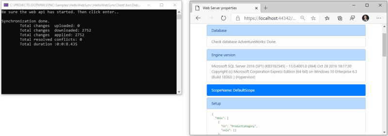

Logging
================================

Overview
^^^^^^^^^^

.. hint:: You will find the sample used on this chapter, here : `Hello web sync sample <https://github.com/Mimetis/Dotmim.Sync/tree/master/Samples/HelloWebSync>`_ .

Server side
^^^^^^^^^^^^

.. note:: More info on Seq : `Datalust Seq <https://datalust.co/seq>`_ 

Installing the Docker image : 

.. code-block:: bash

    docker run --name seq -e ACCEPT_EULA=Y -p 5341:80 datalust/seq:latest

Once your **ASP.NET** application is created, we're adding the specific web server package and our server provider:

* ``Dotmim.Sync.Web.Server``: This package will allow us to expose everything we need, through a **.Net core Web API**
* ``Dotmim.Sync.SqlServer.ChangeTracking``: This package will allow us to communicate with the SQL Server database.

Once we have added these **DMS** packages to our project, we are configuring the Sync provider in the ``Startup`` class, thanks to Dependency Injection.

Be careful, some services are required, but not part of **DMS** (like ``MemoryCache`` for instance)

.. code-block:: csharp

    public void ConfigureServices(IServiceCollection services)
    {
        services.AddControllers();

        // [Required]: To be able to handle multiple sessions
        services.AddMemoryCache();

        // [Required]: Get a connection string to your server data source
        var connectionString = Configuration.GetSection("ConnectionStrings")["DefaultConnection"];

        // [Required]: Tables list involved in the sync process
        var tables = new string[] {"ProductCategory", "ProductModel", "Product",
                "Address", "Customer", "CustomerAddress", "SalesOrderHeader", "SalesOrderDetail" };

        // [Required]: Add a SqlSyncProvider acting as the server hub.
        services.AddSyncServer<SqlSyncChangeTrackingProvider>(connectionString, tables);
    }

.. note:: We have added a memory cache, through ``services.AddMemoryCache();``. 
          
          Having a cache is mandatory to be able to serve multiple requests 
          for one particular session (representing one sync client)

Once we have correctly configured our sync process, we can create our controller:

* Create a new controller (for example ``SyncController``)
* In this newly created controller, inject a ``WebServerManager`` instance.   
* Use this newly injected instance in the ``POST`` method, calling the ``HandleRequestAsync`` method and ... **that's all** !
* We can optionally add a ``GET`` method, to see our configuration from within the web browser. Useful to check if everything is configured correctly.

.. code-block:: csharp

    [Route("api/[controller]")]
    [ApiController]
    public class SyncController : ControllerBase
    {
        // The WebServerManager instance is useful to manage all 
        // the Web server orchestrators registered in the Startup.cs
        private WebServerManager manager;

        // Injected thanks to Dependency Injection
        public SyncController(WebServerManager manager) => this.manager = manager;

        /// 

        /// This POST handler is mandatory to handle all the sync process
        /// 

        [HttpPost]
        public async Task Post() => await manager.HandleRequestAsync(this.HttpContext);

        /// 

        /// This GET handler is optional. It allows you to see the configuration hosted on the server
        /// The configuration is shown only if Environmenent == Development
        /// 

        [HttpGet]
        public async Task Get() => await manager.HandleRequestAsync(this.HttpContext);
    }

Launch your browser and try to reach *sync* web page. (Something like `<https://localhost:[YOUR_PORT]/api/sync>`_ )

You should have useful information, like a test to reach your server database, your ``SyncSetup``, your ``SqlSyncProvider``, your ``SyncOptions`` and your ``WebServerOptions`` configuration:

.. image:: assets/WebServerProperties.png

If your configuration is not correct, you should have an error message, like this:

.. image:: assets/WebServerPropertiesError.png

Client side
^^^^^^^^^^^^^^^^^^^^^^

The client side is pretty similar to the starter sample, except we will have to use a *proxy orchestrator* instead of a classic *remote orchestrator*:

.. code-block:: csharp

    var serverOrchestrator = new WebClientOrchestrator("https://localhost:44342/api/sync");

    // Second provider is using plain old Sql Server provider, 
    // relying on triggers and tracking tables to create the sync environment
    var clientProvider = new SqlSyncProvider(clientConnectionString);

    // Creating an agent that will handle all the process
    var agent = new SyncAgent(clientProvider, serverOrchestrator);

    do
    {
        // Launch the sync process
        var s1 = await agent.SynchronizeAsync();
        // Write results
        Console.WriteLine(s1);

    } while (Console.ReadKey().Key != ConsoleKey.Escape);

    Console.WriteLine("End");

Now we can launch both application, The Web Api on one side, and the Console application on the other side.   
Just hit Enter and get the results from your synchronization over http.

