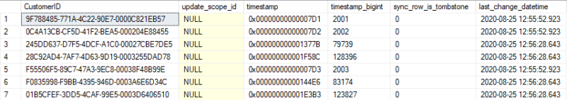

Metadatas
=====================

All tracking tables maintains the state of each row. Especially for deleted rows.   

For example, here is the content of the ``[Customer_tracking]`` after a successful sync:

.. code-block:: sql

    SELECT * FROM [Customer_tracking]

| So, over time, we can have an increase of these tracking tables, with a lot of rows that are not useful anymore.
| These **metadatas rows** are present on the server side of course, and also on the **client side**.

.. note:: If you are using the ``SqlSyncChangeTrackingProvider`` provider, you do not have to maintains and manage the metadatas, since it's handled by the **SQL Server** engine.

Client side
^^^^^^^^^^^^^^

On the client side, once the client has made a synchronization with success, we can easily purge the metadata rows from all the local tracking tables.  

The ``CleanMetadatas`` option (boolean ``true`` / ``false`` available through the ``SyncOptions`` object) allows you to clean automatically the ``_tracking`` tables metadata rows from your client databases.  

If enabled, the client database will basically delete all the metadata rows from the tracking tables, after every successful sync.

.. note:: The metadata rows purge mechanism will work only:

    * If the client has downloaded *something* from the server. If there is no changes downloaded and applied on the client, ``DeleteMetadasAsync()`` is not called
    * On **T-2** metadata rows. To be more secure, the **T-1** values stays in the tracking tables.

So far, the client side is easy to maintain, since it's by default, automatic... magic...

Server side
^^^^^^^^^^^^

There is no automatic mechanism on the server side. Mainly because **DMS** does not know *when* he should clean the metadata rows on the server.   

.. note:: Indeed we can launch the metadata rows cleanup routine after *every* client synchronization, but it will lead to an non-necessary overhead and will extend the time needed for each sync

| Basically, the most important is to keep the metadata rows as long as one client needs them to retrieve the deleted / updated rows.   
| Once all clients have made a sync and are up to date at time **T**, we can theoricaly supposing that the metadata rows from **0** to **T-1** are not needed anymore.

The easiest way to achieve that, on the server side, is to create a schedule task and call the ``DeleteMetadatasAsync`` method (from a console application, service windows, whatever...) with this kind of code:

.. code-block:: csharp

    var rmOrchestrator = new RemoteOrchestrator(serverProvider);
    await rmOrchestrator.DeleteMetadatasAsync();

**DMS** will delete the metadata rows in the safest way to ensure no client become *out-dated*.

How does it work
-------------------------

What happens under the hood ?

**DMS** will try to get the *min* timestamp available from the `scope_info_history` table to ensure that no clients becomes *out-dated*.

Basically, if you have this kind of `scope_info_history` table :

.. code-block:: sql

    SELECT [sync_scope_id] ,[sync_scope_name] ,[scope_last_sync_timestamp], [scope_last_sync]
    FROM [AdventureWorks].[dbo].[scope_info_history]

**Server database:**  

=============   ===============   =========================   =======================
sync_scope_id   sync_scope_name   scope_last_sync_timestamp   scope_last_sync   
-------------   ---------------   -------------------------   -----------------------
9E9722CD-...    DefaultScope      2090                        2020-04-01   
AB4122AE-...    DefaultScope      2100                        2020-04-10   
DB6EEC7E-...    DefaultScope      **2000**                    2020-03-20   
E9CBB51D-...    DefaultScope      2020                        2020-03-21   
CC8A9184-...    DefaultScope      2030                        2020-03-22   
D789288E-...    DefaultScope      2040                        2020-03-23   
95425970-...    DefaultScope      2050                        2020-03-24   
5B6ACCC0-...    DefaultScope      2060                        2020-03-25   
=============   ===============   =========================   =======================

The ``Min(scope_last_sync_timestamp)`` will be **2000** and then **DMS** will internally call ``remoteOrchestrator.DeleteMetadatasAsync(2000);``

Going further
---------------------------

Now imagine we have one client that did a first sync, and then **never did a sync again for 3 years** ... 
This situation will lead to this kind of rows in the `scope_info_history` table:

.. code-block:: sql

    SELECT [sync_scope_id] ,[sync_scope_name] ,[scope_last_sync_timestamp], [scope_last_sync]
    FROM [AdventureWorks].[dbo].[scope_info_history]

**Server database:**    

=============   ===============   =========================   =======================
sync_scope_id   sync_scope_name   scope_last_sync_timestamp   scope_last_sync   
-------------   ---------------   -------------------------   -----------------------
9E9722CD-...    DefaultScope      **100**                     **2017-04-01**   
AB4122AE-...    DefaultScope      2100                        2020-04-10   
DB6EEC7E-...    DefaultScope      2000                        2020-03-20   
E9CBB51D-...    DefaultScope      2020                        2020-03-21   
CC8A9184-...    DefaultScope      2030                        2020-03-22   
D789288E-...    DefaultScope      2040                        2020-03-23   
95425970-...    DefaultScope      2050                        2020-03-24   
5B6ACCC0-...    DefaultScope      2060                        2020-03-25   
=============   ===============   =========================   =======================
 

Once again, if you call the ``remoteOrchestrator.DeleteMetadatasAsync()`` from your schedule task, internally **DMS** will delete all rows where timestamp is inferior to **100** (and so far, all metadata rows existing before year 2017)

It's not really interesting to keep **all** the metadata rows from **2017** to **2020**, just because of **One** client who never did a sync since 2017...

Eventually we can assume this client has removed the app or changed his mobile device or whatever. We can argue that this client can be considered as *out-dated* and will have to **reinitialize** everything if he tries to sync again.

Then how to create a scheduled taks with that will workaround this situation ?

Well, can make this assumption:

- We will run the ``DeleteMetadatasAsync()`` every month (or weeks, choose the best interval for you)
- Each run will take the ``Min(scope_last_sync_timestamp)`` from the `scope_info_history` table for all client that have, at least, sync during the last **30** days.

The code became:

.. code-block:: csharp

    // get all history lines from `scope_info_history`
    var histories = await remoteOrchestrator.GetServerHistoryScopes();

    // select only clients that have synced at least 30 days earlier
    var historiesTwoWeeksAgo = histories.Where(h => h.LastSync.HasValue 
                                                    && h.LastSync.Value >= DateTime.Now.AddDays(-30));

    // Get the min timestamp
    var minTimestamp = historiesTwoWeeksAgo.Min(h => h.LastSyncTimestamp);

    // Call the delete metadatas with this timestamp
    await remoteOrchestrator.DeleteMetadatasAsync(minTimestamp);

Grab this code, create a *routine* to execute every month, and your server database won't growth too much because of the tracking tables metadata rows.