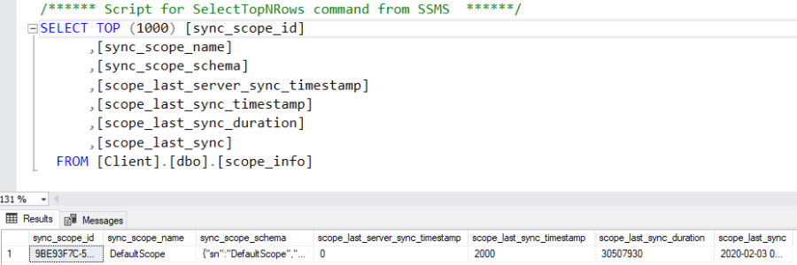

# Multi scopes

In some scenario, you may want to sync some tables at one time, and some others tables at another time.
For example, let's imagine we want to:
- Sync all the **products** during a certain amount of time.
- Sync all the **customers** and related **sales**, once we sure all products are on the client database.

This kind of scenario is possible using the **multi scopes** sync architecture

## How does it work ?

On the client side, we store metadatas in the **scope_info** table.  

By default, this table contains your whole sync information:
- A scope name: Defines a user friendly name (that is unique). Default name is `DefaultScope`.
- A schema, serialized: Contains all the tables, filters, parameters and so on, for this scope.
- A local last timestamp: Defines the last time this scope was successfully synced with the server.
- A server last timestamp: Defines the last time this scope was successfully synced, but from a server point of view. 
- A duration: Amount of times for the last sync.



## Multi Scopes

To be able to create a multi scopes scenario, you just have to create two `SyncSetup` with named scope:

- Create two tables array, containing your tables for each scope
- Create two named sync setup.
- Create two agents for each scope

Here is a full example, where we sync separately the products, then the customers:


``` cs
// Create 2 Sql Sync providers
var serverProvider = new SqlSyncChangeTrackingProvider(DbHelper.GetDatabaseConnectionString(serverDbName));
var clientProvider = new SqlSyncProvider(DbHelper.GetDatabaseConnectionString(clientDbName));

// Create 2 tables list (one for each scope)
string[] productScopeTables = new string[] { "ProductCategory", "ProductModel", "Product" };
string[] customersScopeTables = new string[] { "Address", "Customer", "CustomerAddress", "SalesOrderHeader", "SalesOrderDetail" };

// Create 2 sync setup with named scope 
var setupProducts = new SyncSetup(productScopeTables, "productScope");
var setupCustomers = new SyncSetup(customersScopeTables, "customerScope");

// Create 2 agents, one for each scope
var agentProducts = new SyncAgent(clientProvider, serverProvider, setupProducts);
var agentCustomers = new SyncAgent(clientProvider, serverProvider, setupCustomers);

// Using the Progress pattern to handle progession during the synchronization
// We can use the same progress for each agent
var progress = new SynchronousProgress<ProgressArgs>(s =>
{
    Console.ForegroundColor = ConsoleColor.Green;
    Console.WriteLine($"{s.Context.SyncStage}:\t{s.Message}");
    Console.ResetColor();
});

var remoteProgress = new SynchronousProgress<ProgressArgs>(s =>
{
    Console.ForegroundColor = ConsoleColor.Yellow;
    Console.WriteLine($"{s.Context.SyncStage}:\t{s.Message}");
    Console.ResetColor();
});

// Spying what's going on the server side
agentProducts.AddRemoteProgress(remoteProgress);
agentCustomers.AddRemoteProgress(remoteProgress);


do
{
    Console.Clear();
    Console.WriteLine("Sync Start");
    try
    {
        Console.WriteLine("Hit 1 for sync Products. Hit 2 for sync customers and sales");
        var k = Console.ReadKey().Key;

        if (k == ConsoleKey.D1)
        {
            Console.WriteLine("Sync Products:");
            var s1 = await agentProducts.SynchronizeAsync(progress);
            Console.WriteLine(s1);
        }
        else
        {
            Console.WriteLine("Sync Customers and Sales:");
            var s1 = await agentCustomers.SynchronizeAsync(progress);
            Console.WriteLine(s1);
        }

    }
    catch (Exception e)
    {
        Console.WriteLine(e.Message);
    }
} while (Console.ReadKey().Key != ConsoleKey.Escape);

Console.WriteLine("End");
```
