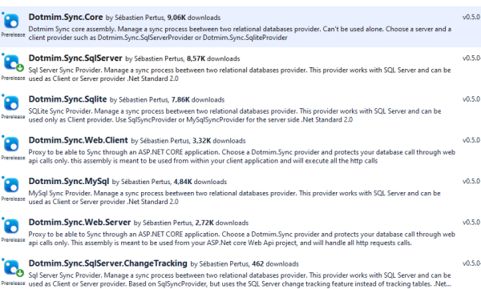

Overview
=============================================

.. image:: assets/Smallicon.png
    :align: center

**Dotmim.Sync** (**DMS**) is the easiest way to handle a full **synchronization** between one server database and multiples clients databases.  
**Dotmim.Sync** (**DMS**) is cross-platforms, multi-databases and based on **.Net Standard 2.0**.   
Choose either **SQL Server**, **SQLite**, **MySQL**, and (hopefully, I hope soon...) Oracle and PostgreSQL !

For simplicity, we can say **Dotmim.Sync** or **DMS** framework.

No need to handle any configuration file, or any generation code or whatever. Just code the list of tables you need to synchronize, call ``SynchronizeAsync()`` and that's all !

Nuget packages
^^^^^^^^^^^^^^^

You can add your database type provider, through nuget, from **Visual Studio**:  

Or you can add them through your command line, assuming you are developing with **Visual Studio Code**, **Rider** or even **Notepad** :)

.. code-block:: bash

    # Adding the package required to synchronize a SQL Server database:
    dotnet add package Dotmim.Sync.SqlServer
    # Adding the package required to synchronize a SQL Server database, using the Change Tracking feature:
    dotnet add package Dotmim.Sync.SqlServer.ChangeTracking
    # Adding the package required to synchronize a MySQL database:
    dotnet add package Dotmim.Sync.MySql
    # Adding the package required to synchronize a SQLite database:
    dotnet add package Dotmim.Sync.Sqlite

For instance, if you need to synchronize two **MySql** databases, the only package you need to install, on both Server and Client side, is ``Dotmim.Sync.MySql``.

On the other side, if you need to synchronize a SQL server database, with multiple SQLite client databases, install ``Dotmim.Sync.SqlServer`` (or ``Dotmim.Sync.SqlServer.ChangeTracking``) on the server side and then install ``Dotmim.Sync.Sqlite`` on the client side.

.. note:: The package ``Dotmim.Sync.Core`` is the core framework, and is used by all the providers. You don't have to explicitely add it to your projects, since it's always part of the provider you've just installed.

The last two packages available, ``Dotmim.Sync.Web.Client`` and ``Dotmim.Sync.Web.Server`` are packages used on a specific scenario, where you server database is not accessible directly, and is exposed with a web api.

All packages are available through **nuget.org**:

| **Dotmim.Sync.Core** : `<https://www.nuget.org/packages/Dotmim.Sync.Core>`_ 
| **Dotmim.Sync.SqlServer** : `<https://www.nuget.org/packages/Dotmim.Sync.SqlServer>`_ 
| **Dotmim.Sync.SqlSyncChangeTrackingProvider** : `<https://www.nuget.org/packages/Dotmim.Sync.SqlServer.ChangeTracking>`_ 
| **Dotmim.Sync.Sqlite** : `<https://www.nuget.org/packages/Dotmim.Sync.Sqlite>`_ 
| **Dotmim.Sync.MySql** : `<https://www.nuget.org/packages/Dotmim.Sync.MySql>`_ 
| **Dotmim.Sync.Web.Server** : `<https://www.nuget.org/packages/Dotmim.Sync.Web.Server>`_ 
| **Dotmim.Sync.Web.Client** : `<ttps://www.nuget.org/packages/Dotmim.Sync.Web.Client>`_ 

Tutorial: First sync
^^^^^^^^^^^^^^^^^^^^^^

First sync
----------------------

**TL,DR** : Here is the most straightforward way to synchronize two relational databases:

* If you don't have any databases ready for testing, you can use:

  * For **SQL Server** : `AdventureWorks for SQL Server <https://github.com/Mimetis/Dotmim.Sync/blob/master/CreateAdventureWorks.sql>`_    
  * For **MySQL** : `AdventureWorks for MySQL <https://github.com/Mimetis/Dotmim.Sync/blob/master/CreateMySqlAdventureWorks.sql>`_ 

* The script is ready to execute in SQL Server (or MySQL Workbench). It contains :

  * A lightweight AdvenureWorks database, acting as the Server database (called AdventureWorks)
  * An empty database, acting as the Client database (called Client)

* You will find this sample here : `HelloSync sample <https://github.com/Mimetis/Dotmim.Sync/blob/master/Samples/HelloSync>`_ 
* You can see this sample as well, live, hosted on `dotnetfiddle <https://dotnetfiddle.net>`_  : `Hello Sync On dotnetfiddle <https://dotnetfiddle.net/CZgNDm>`_ 

.. warning:: In the new code sample, we are using a special provider called Create ``SqlSyncChangeTrackingProvider`` using the **CHANGE_TRACKING** feature from **SQL SERVER**. 

   Before running this code, use this SQL statement on your server database to enable Change Tracking: 
   
   .. code-block:: sql
   
        ALTER DATABASE AdventureWorks SET CHANGE_TRACKING=ON 
        (CHANGE_RETENTION=2 DAYS,AUTO_CLEANUP=ON)
     
   Otherwise, if you don't want to use Change Tracking feature, just change ``SqlSyncChangeTrackingProvider`` to ``SqlSyncProvider``

.. code-block:: csharp

    // First provider on the server side, is using the Sql change tracking feature.
    var serverProvider = new SqlSyncChangeTrackingProvider(serverConnectionString);

    // IF you want to try with a MySql Database, use the [MySqlSyncProvider] instead
    // var serverProvider = new MySqlSyncProvider(serverConnectionString);

    // Second provider on the client side, is the [SqliteSyncProvider] used for SQLite databases 
    // relying on triggers and tracking tables to create the sync environment
    var clientProvider = new SqliteSyncProvider(clientConnectionString);

    // Tables involved in the sync process:
    var tables = new string[] {"ProductCategory", "ProductModel", "Product",
        "Address", "Customer", "CustomerAddress", "SalesOrderHeader", "SalesOrderDetail" };

    // Creating an agent that will handle all the process
    var agent = new SyncAgent(clientProvider, serverProvider, tables);

    do
    {
        // Launch the sync process
        var s1 = await agent.SynchronizeAsync();
        // Write results
        Console.WriteLine(s1);

    } while (Console.ReadKey().Key != ConsoleKey.Escape);

    Console.WriteLine("End");

And here is the result you should have, after a few seconds:

.. code-block:: bash

    Synchronization done.
            Total changes  uploaded: 0
            Total changes  downloaded: 2752
            Total changes  applied: 2752
            Total resolved conflicts: 0
            Total duration :0:0:3.776

It took almost **4 seconds** on my machine to make a full synchronization between the **Server** and the **Client**.  

Second sync
----------------------

This first sample took almost **4 seconds** to make a *full* sync between a **Server** and a **Client**.

It's a little bit long, because, under the hood, the ``Dotmim.Sync`` framework, on the **first sync only**, will have to:

* Get the schema from the **Server** side and create all the tables on the **Client** side, if needed. (yes, you don't need a client database with an existing schema)
* Create on both side all the required stuff to be able to manage a full sync process, creating *tracking* tables, stored procedures, triggers and so on ... be careful, ``Dotmim.Sync`` could be a little bit intrusive if you're not using the ``SqlSyncChangeTrackingProvider`` provider :)
* Then eventually launch the first sync, and get the **2752** items from the **Server**, and apply them on the **Client**.

Now everything is configured and the first sync is successfull.  

We can add **101** items in the `ProductCategory` table (on the server side, `Adventureworks`):

.. code-block:: sql

    Insert into ProductCategory (Name)
    Select SUBSTRING(CONVERT(varchar(255), NEWID()), 0, 7)
    Go 100

From the same console application (indeed, we have a `do while` loop), same code, just hit `enter` to relaunch the synchronization and see the results:

.. code-block:: bash

    Synchronization done.
            Total changes  uploaded: 0
            Total changes  downloaded: 100
            Total changes  applied: 100
            Total resolved conflicts: 0
            Total duration :0:0:0.145

Boom, less than **150** milliseconds. 
