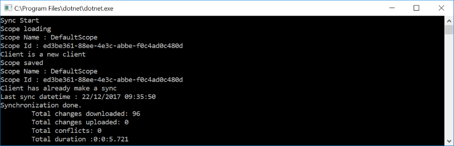
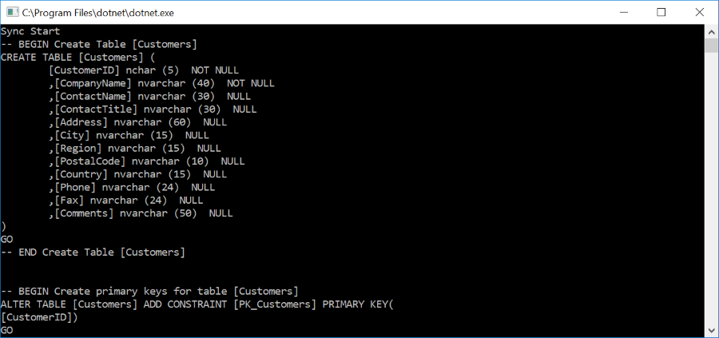
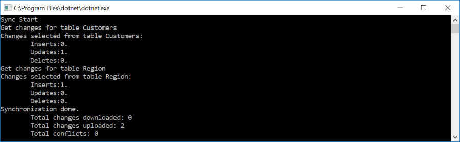
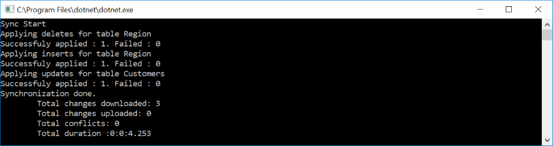

# Progression

Progression in a sync process could be complex.   
Firs of all, you have two kind of progression:
* Progression from the client side
* Progression from the server side.

Progression is divided in several ordered parts:
* **Server** begins a new session.
* **Client** begins a new session.
* **Client** ensures that its scope exists.
* **Server** ensures thats server and client scopes exists.
* **Server** reads the configuration, updating the tables metadatas.
* **Client** gets the configuration object from server.
* **Server** ensures database is ready (creating stored procedures, triggers and so on, if needed)
* **Client** ensures database is ready (creating tables, stored procedudes and so on, if needed)
* **Client** get local changes to be applied on server.
* **Server** applies changes from client.
* **Server** resolves conflicts if needed.
* **Server** get server changes to be applied on client.
* **Client** applies changes from server.
* **Server** get local timestamp and commit sync.
* **Client** get local timestamp and commit sync.
* **Server** ends the session
* **Client** ends the session

As you can see, you have a lot events raised by both server and client side.
Each event in a sync process is called a *stage*, represented by a **SyncStage** enumeration
``` cs
public enum SyncStage
{
    None,
    BeginSession,
    ScopeLoading,
    ScopeSaved,
    ConfigurationApplying,
    ConfigurationApplied,
    DatabaseApplying,
    DatabaseApplied,
    DatabaseTableApplying,
    DatabaseTableApplied,
    TableChangesSelecting,
    TableChangesSelected,
    TableChangesApplying,
    TableChangesApplied,
    EndSession,
    CleanupMetadata
}

```
Possibles values are:
* **BeginSession**: Begin a new sync session.
* **ScopeLoading** and **ScopeSaved**: Check if the scope table is created and check last sync.
* **ConfigurationApplying** and **ConfigurationApplied**: Raised before and after configuration is readed.
* **DatabaseApplying** and **DatabaseApplying**: Raised before and after the database is updated will all tables, stored procedures and triggers.
* **DatabaseTableApplying** and **DatabaseTableApplied** : Raised before and after each table has been created (with its stored procedure and triggers)
* **ChangesSelecting** and **ChangesSelecting**: Raised before and after changes have been selected from the server / client
* **ChangesApplying** and **ChangesApplying**: Raised before and after changes have been selected from server / client.
* **EndSession**: End the current sync session.
* **CleanupMetadata**: Cleanup metadata from tracking tables.
    
Now, imagine you have a really straightforward sync process :

``` csharp
SqlSyncProvider serverProvider = new SqlSyncProvider(GetDatabaseConnectionString("Northwind"));
SqlSyncProvider clientProvider = new SqlSyncProvider(GetDatabaseConnectionString("NW1"));

SyncAgent syncAgent = new SyncAgent(clientProvider, serverProvider, new string[] { "Customers", "Region" });

var context = await syncAgent.SynchronizeAsync();
Console.WriteLine(context);

```
We are going to see how to get informations through the stages, thanks to multiples events.

## How events are raised 

The events are raised from both side : Server and Client sides.   
In our sample, we can say that : 
The `serverProvider` instance will raise every events from the server side.   
The `clientProvider` instance will raise every events from the client side.  
To simplify things, the `syncAgent` instance will raise the events from the `clientProvider` side.

### Why SyncAgent handles the events from the client side and not from the server side ?

As we mentioned, the `SyncAgent` object (represented by `syncAgent` instance in our sample code) will only handle the client events.  
The reason is simple : The `SyncAgent` object is **always** on the client side of any architecture.  
If you are using a **multi-tiers** application composed with a client and a web api server, the `SyncAgent` instance will use a `WebProxyClientProvider` and a `WebProxyServerProvider`.  
In this particular case, the SyncAgent has no way to handle server events (since they are raised from the web api side)

## The SyncProgress event : Read only sync progress informations

You can follow the sync progression through the `SyncPogress` event. 
The informations you will get from the `SyncProgress` event are **read only** (If you want more options, see section below *Go further*)

Here is a quick example, often used to provide some feedback to the users:   

``` cs
agent.SyncProgress +=  (sender, args) => Console.WriteLine($"{args.Message} {args.PropertiesMessage}");
```


As you can see, it's a first synchronization:
* Session begins
* Client get configuration
* Client apply databases schema for Region and Customers
* Client select changes to send (nothing, obviously is selected since the tables are just created)
* Client applies changes from server 
* Session ends

If you want both informations from server and from client, we can do a little trick like this :

``` csharp
agent.SyncProgress += (s, a) => Console.WriteLine($"[Client] : {a.Message} {a.PropertiesMessage}");
serverProvider.SyncProgress += (s, a) => Console.WriteLine($"[Server] : {a.Message} {a.PropertiesMessage}");
```

The result is really verbose, but you have ALL the informations raised from both client side and server side as well !


*Note:* As you can see in this screenshot, no events are raised about server tables schemas. This is simple, a previous sync process may have already configured the server side !

## Go further

As `SyncProgress` is a readonly event, you have multiples others events that can interact and modify the current sync process.   
Basically, we have one typed event for each `SyncStage`.   
Here is an extract from the declarations of each event in the `SyncAgent` class :
``` csharp
// Read only SyncProgress for all SyncStage
public event EventHandler<ProgressEventArgs> SyncProgress = null;

// Types events for each SyncStage
public event EventHandler<BeginSessionEventArgs> BeginSession = null;
public event EventHandler<ScopeEventArgs> ScopeLoading = null;
public event EventHandler<ScopeEventArgs> ScopeSaved = null;
public event EventHandler<DatabaseApplyingEventArgs> DatabaseApplying = null;
public event EventHandler<DatabaseAppliedEventArgs> DatabaseApplied = null;
public event EventHandler<ConfigurationApplyingEventArgs> ConfigurationApplying = null;
public event EventHandler<ConfigurationAppliedEventArgs> ConfigurationApplied = null;
public event EventHandler<TableChangesSelectingEventArgs> TableChangesSelecting = null;
public event EventHandler<TableChangesSelectedEventArgs> TableChangesSelected = null;
public event EventHandler<TableChangesApplyingEventArgs> TableChangesApplying = null;
public event EventHandler<TableChangesAppliedEventArgs> TableChangesApplied = null;
public event EventHandler<EndSessionEventArgs> EndSession = null;
```
Each typed event has 2 properties in common :
* Stage : the current `SyncStage`.
* Action : Enumeration of type `ChangeApplicationAction` that can rollback a sync process during any stage.

Each typed event has several properties typically used during the stage involved.  
For example, you can set a boolean indicating you want a script when the `DatabaseApplying` event is raised, and then get a string script when `DatabaseApplied` is raised !   

### Rollback 
Each typed event can rollback the entire sync process. Just set the `Action` property to `Rollback` to rollback the entire sync process. 

the `BeginSession` event (and the `EndSession` as well) are the simpliest events since they have no more properties than the base class. We can test the Rollback action during this stage :

``` csharp
private static void Agent_BeginSession(object sender, BeginSessionEventArgs e)
{
    e.Action = ChangeApplicationAction.Rollback;
}
```


### ScopeLoading and ScopeLoaded

The scope represents each client and the server. A scope contains useful informations about the client like the last successful sync datetime.

```csharp
private static void Agent_ScopeLoading(object sender, ScopeEventArgs e)
{
    Console.WriteLine($"Scope loading");
    Console.WriteLine($"Scope Name : {e.ScopeInfo.Name}");
    Console.WriteLine($"Scope Id : {e.ScopeInfo.Id}");
    Console.WriteLine(e.ScopeInfo.IsNewScope ? "Client is a new client" : "Client has already make a sync");
    if (e.ScopeInfo.LastSync.HasValue)
        Console.WriteLine($"Last sync datetime : {e.ScopeInfo.LastSync.Value}");
}
```



### ConfigurationApplying and ConfigurationApplied

The configuration object contains the database schema. This schema is passed through server to clients, and then is cached.  
During this stage, you can edit the configuration object and disable the cache.   
Be careful, disabling the cache will imply a lot of sql statements to get the tables schemas each time a sync process is launched.
```csharp
private static void Agent_ConfigurationApplying(object sender, ConfigurationApplyingEventArgs e)
{
    // Disabling the cache configuration
    e.OverwriteConfiguration = true;
}
private static void Agent_ConfigurationApplied(object sender, ConfigurationAppliedEventArgs e)
{
    // Get the configuration
    var syncConfiguration = e.Configuration;
}
```

### DatabaseApplying and DatabaseApplied

One common scenario involving those two sync progress events is to get the SQL generated script.  

```csharp
private static void Agent_DatabaseApplying(object sender, DatabaseApplyingEventArgs e)
{
    e.GenerateScript = true;
}
private static void Agent_DatabaseApplied(object sender, DatabaseAppliedEventArgs e)
{
    Console.WriteLine(e.Script);
}
```


*Note:* If you set the property `OverwriteConfiguration` to `true`, the Dotmim.Sync framework will check every tables and every stored procedures and triggers, to create them if necessary, even if it knows tables already exists


### DatabaseTableApplying and DatabaseTableApplied

Like `DatabaseApplying` and `DatabaseApplied` for the overall database, these events will raise for each table creation.

```csharp
private static void Agent_DatabaseApplying(object sender, DatabaseApplyingEventArgs e)
{
    e.GenerateScript = true;
}
private static void Agent_DatabaseTableApplying(object sender, DatabaseTableApplyingEventArgs e)
{
    Console.WriteLine($"Current table generation : {e.TableName}");
}
private static void Agent_DatabaseTableApplied(object sender, DatabaseTableAppliedEventArgs e)
{
    Console.WriteLine(e.Script);
}
```

### TableChangesSelecting and TableChangesSelected

Occurs when a provider selects all records to be synchronize with server or client.

```csharp
private static void Agent_TableChangesSelecting(object sender, TableChangesSelectingEventArgs e)
{
    Console.WriteLine($"Get changes for table {e.TableName}");
}
private static void Agent_TableChangesSelected(object sender, TableChangesSelectedEventArgs e)
{
    Console.WriteLine($"Changes selected from table {e.TableChangesSelected.TableName}: ");
    Console.WriteLine($"\tInserts:{e.TableChangesSelected.Inserts}.");
    Console.WriteLine($"\tUpdates:{e.TableChangesSelected.Updates}.");
    Console.WriteLine($"\tDeletes:{e.TableChangesSelected.Deletes}.");
}
```



### TableChangesApplying and TableChangesApplied

Occurs when a provider applies changes locally. Be carfule those events are raised for each state :
* Deleted rows.
* Updated rows.
* Inserted rows.

```csharp
private static void Agent_TableChangesApplying(object sender, TableChangesApplyingEventArgs e)
{
    string kind =   e.State == DmRowState.Added ? "inserts" :
                    e.State == DmRowState.Deleted ? "deletes" :
                    e.State == DmRowState.Modified ? "updates" : "";

    Console.WriteLine($"Applying {kind} for table {e.TableName}");
}
private static void Agent_TableChangesApplied(object sender, TableChangesAppliedEventArgs e)
{
    Console.WriteLine($"Successfuly applied : {e.TableChangesApplied}. Failed : {e.TableChangesApplied.Failed}");
}
```

