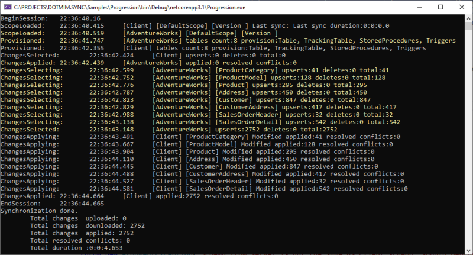
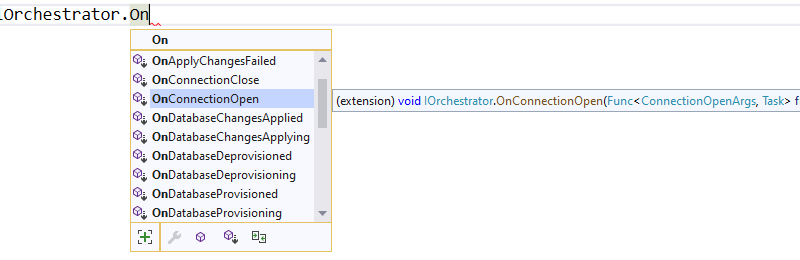

# Progression

## Sample
>
> You will find the sample used for this chapter, here : [Progression sample](https://github.com/Mimetis/Dotmim.Sync/tree/master/Samples/Progression)
>

## Introduction

Getting useful information during a sync process could be complex.

First of all, during a full synchronization, we have **two distincts** progression:
* A first **Progression** from the client side
* A second **Progression** from the server side.

We have a lot of progress values raised by both the **server** and the **client** side.
* Each progress value is catch from a callback from the assiocated **Orchestrator** instance.
* Each progress value in a sync process is associated with a specific *stage*, represented by a **SyncStage** enumeration:
``` cs
public enum SyncStage
{
    None,
    // Sync start and ends
    BeginSession,
    EndSession,

    // Loading metadatas
    ScopeLoading,
    ScopeLoaded,

    // Creating a snapshot on the server side
    SnapshotCreating,
    SnapshotCreated,

    // Applying a snapshot on the client side
    SnapshotApplying,
    SnapshotApplied,

    // Reading a schema
    SchemaReading,
    SchemaRead,

    // Provisioning a schema (tables / stored proc / triggers / tracking tables)
    Provisioning,
    Provisioned,

    // Deprovisioning a schema
    Deprovisioning,
    Deprovisioned,

    // Selecting changes to apply to the server or client
    ChangesSelecting,
    ChangesSelected,

    // Applying changes to the server or client
    ChangesApplying,
    ChangesApplied,

    // Cleaning tracking information from any tracking table
    MetadataCleaning,
    MetadataCleaned,

    // Migrating a setup to a new one
    Migrating,
    Migrated,
}
```

## How does it work


To explain how does it work, we are starting from a really straightforward sync process example, using the sample from [Hello sync sample](/Samples/HelloSync) :

``` csharp
var serverProvider = new SqlSyncChangeTrackingProvider(serverConnectionString);
var clientProvider = new SqlSyncProvider(clientConnectionString);

var tables = new string[] {"ProductCategory", "ProductModel", "Product",
            "Address", "Customer", "CustomerAddress", "SalesOrderHeader", "SalesOrderDetail" };

var agent = new SyncAgent(clientProvider, serverProvider, tables);
do
{
    // Launch the sync process
    var s1 = await agent.SynchronizeAsync();
    // Write results
    Console.WriteLine(s1);

} while (Console.ReadKey().Key != ConsoleKey.Escape);

Console.WriteLine("End");


```
We are going to see how to get useful information, from each stage involved during the sync processus, thanks to `IProgress<T>` and then we will go deeper with the notion of `Interceptor<T>`.

## IProgress\<T\> : How progression is handled 

The progress values are triggered from both side : **Server** side and **Client** side, ordered.  

In our sample, we can say that : 
- The `RemoteOrchestrator` instance using the `serverProvider` provider instance will report all the progress from the server side.   
- The `LocalOrchestrator` instance using the `clientProvider` provider instance will report all the progress from the client side.  

> The `syncAgent` instance will report progress **only** from the **Client** side.
> Why? Because the `syncAgent` instance always run **locally** on the client local machine, and the **server** may be is behind an **HTTP** endpoint. Then `syncAgent` has no idea what's going on the server side.

Just remember this true fact: The `syncAgent` object is **always** on the client side of any architecture.  

Since our main method `SynchronizeAsync()` is marked `async` method, we will use the [Progress\<T\>](https://docs.microsoft.com/en-us/dotnet/api/system.progress-1?view=netcore-2.2) to be able to report progress value.

So far, the most straightforward way to get feedback from a current sync, is to pass an instance of `Progress<T>` when calling the method `SynchronizeAsync()`

All the reported progress value that invokes a callback, are deriving from `ProgressArgs`.
So far, we can use a `Progress<ProgressArgs>` instance that we will pass to the `SynchronizeAsync()` method.

> Quick note about the `Progress<T>` object: `Progress<T>` is not synchronous. So far, no guarantee that the progress callbacks will be called in an ordered way.   
> That's why you can use a **DMS** progess class called `SynchronousProgress<T>` which is synchronous, using the correct synchronization context.

Here is a quick example used to provide some feedback to the users:   

``` cs
var serverProvider = new SqlSyncChangeTrackingProvider(serverConnectionString);
var clientProvider = new SqlSyncProvider(clientConnectionString);

// Tables involved in the sync process:
var tables = new string[] {"ProductCategory", "ProductModel", "Product",
            "Address", "Customer", "CustomerAddress", "SalesOrderHeader", "SalesOrderDetail" };

// Creating an agent that will handle all the process
var agent = new SyncAgent(clientProvider, serverProvider, tables);

// Using the IProgress<T> pattern to handle progession dring the synchronization
// Be careful, Progress<T> is not synchronous. We are using instead a custom made SynchronousProgress<T>
var progress = new SynchronousProgress<ProgressArgs>(args => Console.WriteLine($"{args.Context.SyncStage}:\t{args.Message}"));

do
{
    // Launch the sync process
    var s1 = await agent.SynchronizeAsync(progress);
    // Write results
    Console.WriteLine(s1);

} while (Console.ReadKey().Key != ConsoleKey.Escape);

Console.WriteLine("End");

```
Here is the result, after the first synchronization, assuming the **Client** database is empty:

``` cmd
BeginSession:   22:27:06.811
ScopeLoaded:    22:27:07.215     [Client] [DefaultScope] [Version ] Last sync: Last sync duration:0:0:0.0
Provisioned:    22:27:09.140     [Client] tables count:8 provision:Table, TrackingTable, StoredProcedures, Triggers
ChangesSelected:        22:27:09.207     [Client] upserts:0 deletes:0 total:0
ChangesApplying:        22:27:09.786     [Client] [ProductCategory] Modified applied:41 resolved conflicts:0
ChangesApplying:        22:27:09.819     [Client] [ProductModel] Modified applied:128 resolved conflicts:0
ChangesApplying:        22:27:09.897     [Client] [Product] Modified applied:295 resolved conflicts:0
ChangesApplying:        22:27:09.940     [Client] [Address] Modified applied:450 resolved conflicts:0
ChangesApplying:        22:27:10.83      [Client] [Customer] Modified applied:847 resolved conflicts:0
ChangesApplying:        22:27:10.124     [Client] [CustomerAddress] Modified applied:417 resolved conflicts:0
ChangesApplying:        22:27:10.164     [Client] [SalesOrderHeader] Modified applied:32 resolved conflicts:0
ChangesApplying:        22:27:10.218     [Client] [SalesOrderDetail] Modified applied:542 resolved conflicts:0
ChangesApplied: 22:27:10.268     [Client] applied:2752 resolved conflicts:0
EndSession:     22:27:10.269
Synchronization done.
        Total changes  uploaded: 0
        Total changes  downloaded: 2752
        Total changes  applied: 2752
        Total resolved conflicts: 0
        Total duration :0:0:3.463
```

As you can see, it's a first synchronization, so:
* Session begins 
* Client apply databases schema for all tables
* Client select changes to send (nothing, obviously, because the tables have just been created on the client)
* Client applies changes from server 
* Session ends


If you want both informations from server and from client, we can do a little trick here :

``` csharp
// I want the server side progress as well
var remoteProgress = new SynchronousProgress<ProgressArgs>(s =>
{
    Console.ForegroundColor = ConsoleColor.Yellow;
    Console.WriteLine($"{s.Context.SyncStage}:\t{s.Message}");
    Console.ResetColor();
});
agent.AddRemoteProgress(remoteProgress);
```

Since the agent is executing on the client, as we said, the `progress` instance reference passed to the `agent.SynchronizeAsync(progress)` will trigger all the progress fromt the client.   

On the other side, to be able to get progress from the server side (if you are not in a web proxy mode), you can call the `AddRemoteProgress()` method with your `remoteProgress` instance.

The result is really verbose, but you have ALL the informations  from both **Client** side and **Server** side !

*In the screenshot below, yellow lines are interceptors from server side.*




## Going further : Interceptor\<T\>

The `Progress<T>` stuff is great, but as we said, it's mainly read only, and the progress is always reported **at the end of the current sync stage**.   

So, if you need a more granular control on all the progress values, you can subscribe to an `Interceptor<T>`.   
On each **orchestrator**, you will find a lot of relevant methods to intercept the sync process:




Imagine you have a table that should **never** be synchronized. You're able to use an interceptor like this:

``` csharp
// We are using a cancellation token that will be passed as an argument to the SynchronizeAsync() method !
var cts = new CancellationTokenSource();

agent.LocalOrchestrator.OnTableChangesApplying((args) =>
{
    if (args.SchemaTable.TableName == "Table_That_Should_Not_Be_Sync")
        cts.Cancel();
});

```
Be careful, your `CancellationTokenSource` instance will rollback the whole sync session and you will get a `SyncException` error ! 

## Intercept rows before sending and before applying

You may want to intercept all the rows that have just been selected from the source (client or server), and are about to be sent to the destination (server or client).   
Or even intercept all the rows that are going to be applied on a destination database.   
That way, you may be able to modify these rows, to meet your business / requirements rules.  


To do so, you can use the **interceptors** `OnTableChangesSelecting` and `OnTableChangesSelected` to have more details on what changes are selected for each table.

In the other hand, you can use the **interceptors** `OnTableChangesApplying` and `OnTableChangesApplied` to get all the rows that will be applied to a destination database.

>
> You will find the sample used for this chapter, here : [Spy sample](https://github.com/Mimetis/Dotmim.Sync/tree/master/Samples/Spy)
>


``` csharp
// Intercept a table changes selecting stage.
agent.LocalOrchestrator.OnTableChangesSelecting(args =>
{
    Console.WriteLine($"-------- Getting changes from table {args.Table.GetFullName()} ...");
});

// Intercept a table changes applying stage, with a particular state [Upsert] or [Deleted]
// The rows included in the args.Changes table will be applied right after.
agent.LocalOrchestrator.OnTableChangesApplying(args =>
{
    Console.WriteLine($"-------- Applying changes {args.State} to table {args.Changes.GetFullName()} ...");

    if (args.Changes == null || args.Changes.Rows.Count == 0)
        return;

    foreach (var row in args.Changes.Rows)
        Console.WriteLine(row);
});

// Intercept a table changes selected stage.
// The rows included in the args.Changes have been selected from the local database and will be sent to the server.
agent.LocalOrchestrator.OnTableChangesSelected(args =>
{
    if (args.Changes == null || args.Changes.Rows.Count == 0)
        return;

    foreach (var row in args.Changes.Rows)
        Console.WriteLine(row);
});
```
*In the screenshot below, yellow lines are interceptors from server side.*


