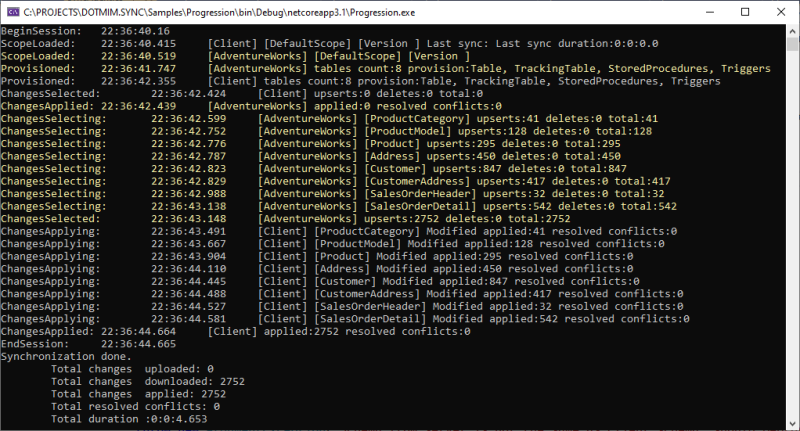

Progression
=====================

| Getting useful information during a sync process could be complex.
| You can have a lot of information from an in-going sync, through two kinds of things:

* ``IProgress<ProgressArgs>`` : A best practice using `IProgress<T> <https://docs.microsoft.com/en-us/dotnet/api/system.progress-1>`_ to handle progress from within an *awaitable* method.
* ``Ìnterceptor<T>`` : A more advanced technic to handle a lot of more events from within **DMS**

Overview
^^^^^^^^^^^^

During a full synchronization, we have **two distincts** progression:

* A first **Progression** from the client side
* A second **Progression** from the server side.

We have a lot of progress values raised from both the **server** and the **client** side:

* Each progress value is catched at the end of a method called by the **Orchestrator** instance.
* Each progress value in a sync process corresponds to a specific *stage*, represented by a ``SyncStage`` enumeration.

.. code-block:: csharp

    public enum SyncStage
    {
         None = 0,

        BeginSession,
        EndSession,

        ScopeLoading,
        ScopeWriting,

        SnapshotCreating,
        SnapshotApplying,

        SchemaReading,

        Provisioning,
        Deprovisioning,

        ChangesSelecting,
        ChangesApplying,

        Migrating,

        MetadataCleaning,
    }

To explain how things work, we are starting from a really straightforward sync process example, using the sample from `Hello sync sample <https://github.com/Mimetis/Dotmim.Sync/blob/master/Samples/HelloSync>`_:

.. code-block:: csharp

    var serverProvider = new SqlSyncChangeTrackingProvider(serverConnectionString);
    var clientProvider = new SqlSyncProvider(clientConnectionString);

    var tables = new string[] {"ProductCategory", "ProductModel", "Product",
                "Address", "Customer", "CustomerAddress", "SalesOrderHeader", 
                "SalesOrderDetail" };

    var agent = new SyncAgent(clientProvider, serverProvider, tables);
    do
    {
        // Launch the sync process
        var s1 = await agent.SynchronizeAsync();
        // Write results
        Console.WriteLine(s1);

    } while (Console.ReadKey().Key != ConsoleKey.Escape);

    Console.WriteLine("End");

We are going to see how to get useful information, from each stage involved during the sync processus, thanks to ``IProgress<T>`` and then we will go deeper with the notion of ``Interceptor<T>``.

.. hint:: You will find this complete sample here : `Progression sample <https://github.com/Mimetis/Dotmim.Sync/tree/master/Samples/Progression>`_ 

IProgress\<T\>
^^^^^^^^^^^^^^^^^^^^^^

As we said, the progress values are triggered from both side : **Server** side and **Client** side, ordered.  

In our sample, we can say that : 

* The ``RemoteOrchestrator`` instance, using the server provider instance, will report all the progress from the server side.   
* The ``LocalOrchestrator`` instance using the client provider instance, will report all the progress from the client side.  

.. note:: The ``syncAgent`` instance will report progress **only** from the **Client** side.
          
          Why? Because the ``syncAgent`` instance is always running **locally** on the client local machine, and the **server** may be is behind an **HTTP** endpoint. Then ``syncAgent`` has no idea what's going on the server side.

.. hint:: A ``syncAgent`` object is **always** running on the client side of **any** architecture.  

Since our main method ``SynchronizeAsync()`` is marked ``async`` method, we will use the `Progress\<T\> <https://docs.microsoft.com/en-us/dotnet/api/system.progress-1?view=netcore-2.2>`_ to be able to report progress value.

So far, the most straightforward way to get feedback from a current sync, is to pass an instance of ``Progress<T>`` when calling the method ``SynchronizeAsync()``.

.. note:: ``Progress<T>`` is **not** synchronous. So far, no guarantee that the progress callbacks will be raised in an ordered way.   
          
          That's why you can use a **DMS** progess class called ``SynchronousProgress<T>`` which is synchronous, using the correct synchronization context.

Here is a quick example used to provide some feedback to the user:   

.. code-block:: csharp

    var serverProvider = new SqlSyncChangeTrackingProvider(serverConnectionString);
    var clientProvider = new SqlSyncProvider(clientConnectionString);

    // Tables involved in the sync process:
    var tables = new string[] {"ProductCategory", "ProductModel", "Product",
        "Address", "Customer", "CustomerAddress", "SalesOrderHeader", "SalesOrderDetail" };

    // Creating an agent that will handle all the process
    var agent = new SyncAgent(clientProvider, serverProvider, tables);

    // Using the IProgress<T> pattern to handle progession dring the synchronization
    var progress = new SynchronousProgress<ProgressArgs>(args => 
            Console.WriteLine('$'"{args.Context.SyncStage}:{args.Message}"));

    do
    {
        // Launch the sync process
        var s1 = await agent.SynchronizeAsync(progress);
        // Write results
        Console.WriteLine(s1);

    } while (Console.ReadKey().Key != ConsoleKey.Escape);

    Console.WriteLine("End");

Here is the result, after the first synchronization, assuming the **Client** database is empty:

.. code-block:: bash

    BeginSession:   22:27:06.811
    ScopeLoaded:    22:27:07.215     [Client] [DefaultScope] [Version ] Last sync: Last sync duration:0:0:0.0
    Provisioned:    22:27:09.140     [Client] tables count:8 provision:Table, TrackingTable, StoredProcedures, Triggers
    ChangesSelected:        22:27:09.207     [Client] upserts:0 deletes:0 total:0
    ChangesApplying:        22:27:09.786     [Client] [ProductCategory] Modified applied:41 resolved conflicts:0
    ChangesApplying:        22:27:09.819     [Client] [ProductModel] Modified applied:128 resolved conflicts:0
    ChangesApplying:        22:27:09.897     [Client] [Product] Modified applied:295 resolved conflicts:0
    ChangesApplying:        22:27:09.940     [Client] [Address] Modified applied:450 resolved conflicts:0
    ChangesApplying:        22:27:10.83      [Client] [Customer] Modified applied:847 resolved conflicts:0
    ChangesApplying:        22:27:10.124     [Client] [CustomerAddress] Modified applied:417 resolved conflicts:0
    ChangesApplying:        22:27:10.164     [Client] [SalesOrderHeader] Modified applied:32 resolved conflicts:0
    ChangesApplying:        22:27:10.218     [Client] [SalesOrderDetail] Modified applied:542 resolved conflicts:0
    ChangesApplied: 22:27:10.268     [Client] applied:2752 resolved conflicts:0
    EndSession:     22:27:10.269
    Synchronization done.
            Total changes  uploaded: 0
            Total changes  downloaded: 2752
            Total changes  applied: 2752
            Total resolved conflicts: 0
            Total duration :0:0:3.463

As you can see, it's a first synchronization, so:

* Session begins 
* Client apply databases schema for all tables
* Client select changes to send (nothing, obviously, because the tables have just been created on the client)
* Client applies changes from server 
* Session ends

Since the agent is executing on the client, as we said, the ``progress`` instance reference passed to the ``agent.SynchronizeAsync(progress)`` will trigger all the progress from the client side only.   

To be able to get progress from the server side (if you are not in a web proxy mode), you can call the ``AddRemoteProgress()`` method with your `remoteProgress` instance.

.. code-block:: csharp

    // I want the server side progress as well
    var remoteProgress = new SynchronousProgress<ProgressArgs>(s =>
    {
        Console.ForegroundColor = ConsoleColor.Yellow;
        Console.WriteLine('$'"{s.Context.SyncStage}:\t{s.Message}");
        Console.ResetColor();
    });
    agent.AddRemoteProgress(remoteProgress);

The result is really verbose, but you have ALL the informations  from both **Client** side and **Server** side !

*In the screenshot below, yellow lines are progression events raised from server side.*

