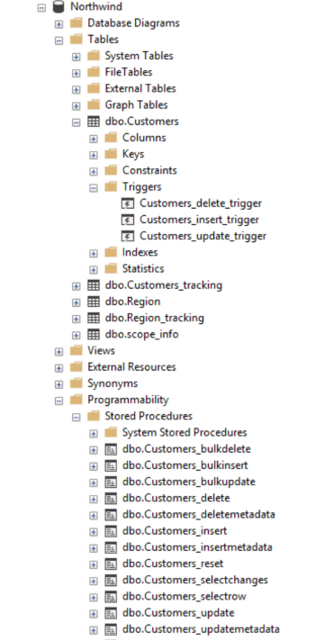
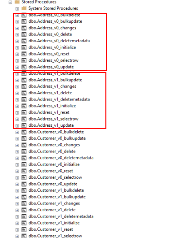

Provision, Deprovision & Migration
===================================

Overview
^^^^^^^^^^^

| Since your sync architecture will evolve over the time, you may need to update the sync generated code as well. 
| Regarding the **DMS** architecture, we have two situations, the first one is automatically handled by **DMS** and the other one, not. 
| Fortunately, **DMS** provides some useful methods for all these scenario.

Provision / Deprovision
^^^^^^^^^^^^^^^^^^^^^^^^

The ``ProvisionAsync`` and ``DeprovisionAsync`` methods are used internally by **DMS**

For instance, during the first sync, **DMS** will provision everything, on the server side and on the client side.

When you launch for the first time a sync process, **DMS** will:

- **[Server Side]**: Get the database schema from the server database.
- **[Server Side]**: Create **Stored procedures**, **triggers** and **tracking tables**.
- **[Client Side]**: Fetch the server schema.
- **[Client Side]**: Create **tables** on the client database, if needed.
- **[Client Side]**: Create **Stored procedures**, **triggers** and **tracking tables**

.. note:: If you're using the ``SqlSyncChangeTrackingProvider``, **DMS** will skip the creation of triggers and tracking tables, relying on the *Change Tracking* feature from SQL Server.

| Basically, all these steps are managed by the ``RemoteOrchestrator`` on the server side, and by the ``LocalOrchestrator`` on the client side. 
| All the methods used to provision and deprovision tables are available from both the ``LocalOrchestrator`` and ``RemoteOrchestrator`` instances.

.. code-block:: csharp

    public async Task<SyncSet> ProvisionAsync(SyncProvision provision)
    public async Task<SyncSet> ProvisionAsync(SyncSet schema, SyncProvision provision)
 
    public async Task DeprovisionAsync(SyncProvision provision)
    public virtual async Task DeprovisionAsync(SyncSet schema, SyncProvision provision)

Let's start with a basic example, where you have a simple database containing two tables *Customers* and *Region*:

.. image:: assets/Provision_Northwind01.png
    :alt: provision

And here the most straightforward code to be able to sync a client db :

.. code-block:: csharp

    SqlSyncProvider serverProvider = new SqlSyncProvider(GetDatabaseConnectionString("Northwind"));
    SqlSyncProvider clientProvider = new SqlSyncProvider(GetDatabaseConnectionString("NW1"));
    var setup = new SyncSetup("Customers", "Region");
    var agent = new SyncAgent(clientProvider, serverProvider);
    var result = await agent.SynchronizeAsync(setup);

    Console.WriteLine(result);

Once your sync process is finished, you will have a full configured database :

**DMS** has provisioned:

* One tracking table per table from your setup.
* Three triggers on each table.
* Several stored procedures for each table.

Provision
-------------

In some circumstances, you may want to provision manually your database, on the server using a remote orchestrator, or on the client side using a local orchestrator.

* If you have a really big database, the provision step could be really long, so it could be better to provision the server side before any sync process happens.
* If you have to modify your schema, you will have to **deprovision**, **edit** your schema and finally **provision** again your database.

That's why **DMS** exposes several methods to let you control how, and when, you want to provision and deprovision your database.

Each orchestrator has two main methods, basically:

.. code-block:: csharp

    ProvisionAsync(SyncSet schema, SyncProvision provision)
    DeprovisionAsync(SyncSet schema, SyncProvision provision)

The ``SyncProvision`` enum parameter lets you decide which kind of objects (tables, stored proc, triggers or tracking tables) you will provision on your target database.

.. code-block:: csharp

    [Flags]
    public enum SyncProvision
    {
        Table = 1,
        TrackingTable = 2,
        StoredProcedures = 4,
        Triggers = 8,
        ClientScope = 16,
        ServerScope = 32,
        ServerHistoryScope = 64,
    }

           

The remote (server side) provisioning is quite simple, since the schema is already there. 

| But the local (client side) provisioning could a little bit more tricky since we may miss tables. 
| In that particular case, we will rely on the schema returned by the remote orchestrator.

.. hint:: You will find this complete sample here : `Provision & Deprovision sample <https://github.com/Mimetis/Dotmim.Sync/tree/master/Samples/ProvisionDeprovision>`_ 

Provisioning from server side, using a remote orchestrator:

.. code-block:: csharp

    var serverProvider = new SqlSyncProvider(DbHelper.GetDatabaseConnectionString(serverDbName));

    // Create standard Setup and Options
    var setup = new SyncSetup("Address", "Customer", "CustomerAddress");
    
    // -----------------------------------------------------------------
    // Server side
    // -----------------------------------------------------------------

    // This method is useful if you want to provision by yourself the server database
    // You will need to :
    // - Create a remote orchestrator with the correct setup to create
    // - Provision everything

    // Create a server orchestrator used to Deprovision and Provision only table Address
    var remoteOrchestrator = new RemoteOrchestrator(serverProvider);

    // Provision everything needed (sp, triggers, tracking tables)
    // Internally provision will fectch the schema a will return it to the caller. 
    var newSchema = await remoteOrchestrator.ProvisionAsync(setup);

Provision on the client side is quite similar, despite the fact we will rely on the server schema to create any missing table.

.. code-block:: csharp

    // Create 2 Sql Sync providers
    var serverProvider = new SqlSyncProvider(DbHelper.GetDatabaseConnectionString(serverDbName));
    var clientProvider = new SqlSyncProvider(DbHelper.GetDatabaseConnectionString(clientDbName));

    // Create standard Setup and Options
    var setup = new SyncSetup("Address", "Customer", "CustomerAddress");

    // -----------------------------------------------------------------
    // Client side
    // -----------------------------------------------------------------

    // This method is useful if you want to provision by yourself the client database
    // You will need to :
    // - Create a local orchestrator with the correct setup to provision
    // - Get the schema from the server side using a RemoteOrchestrator or a WebRemoteOrchestrator
    // - Provision everything locally

    // Create a local orchestrator used to provision everything locally
    var localOrchestrator = new LocalOrchestrator(clientProvider);

    // Because we need the schema from remote side, create a remote orchestrator
    var remoteOrchestrator = new RemoteOrchestrator(serverProvider);

    // Getting the server scope from server side
    var serverScope = await remoteOrchestrator.GetServerScopeInfoAsync();

    // At this point, if you need the schema and you are not able to create a RemoteOrchestrator,
    // You can create a WebRemoteOrchestrator and get the schema as well
    // var proxyClientProvider = new WebRemoteOrchestrator("https://localhost:44369/api/Sync");
    // var serverScope = proxyClientProvider.GetServerScopeInfoAsync();

    // Provision everything needed (sp, triggers, tracking tables, AND TABLES)
    await localOrchestrator.ProvisionAsync(serverScope);

Deprovision
-------------

Like provisioning, deprovisioning uses basically the same kind of algorithm.

Deprovisioning from server side, using a remote orchestrator:

.. code-block:: csharp

    // Create server provider
    var serverProvider = new SqlSyncProvider(DbHelper.GetDatabaseConnectionString(serverDbName));

    // Create a server orchestrator used to Deprovision everything on the server side
    var remoteOrchestrator = new RemoteOrchestrator(serverProvider);

    // Deprovision everything
    var p = SyncProvision.ServerScope | SyncProvision.ServerHistoryScope | 
            SyncProvision.StoredProcedures | SyncProvision.TrackingTable |
            SyncProvision.Triggers;   

    // Deprovision everything
    await remoteOrchestrator.DeprovisionAsync(p);

Deprovisioning from client side, using a local orchestrator:

.. code-block:: csharp

    // Create client provider
    var clientProvider = new SqlSyncProvider(DbHelper.GetDatabaseConnectionString(clientDbName));

    // Create a local orchestrator used to Deprovision everything
    var localOrchestrator = new LocalOrchestrator(clientProvider);

    var p = SyncProvision.ClientScope |
            SyncProvision.StoredProcedures | SyncProvision.TrackingTable |
            SyncProvision.Triggers;

    // Deprovision everything
    await localOrchestrator.DeprovisionAsync(p);

Drop All
-------------

The ``DropAllAsync()`` method is almost the same as ``DeprovisionAsync()``. The main difference is that ``DropAllAsync()`` will make a ``DeprovisionAsync()`` on all scopes.

Basically ``DroppAllAsync()`` removes barely everything, and will let your database in a state without anything related to **DMS**

.. warning:: Be extremely cautious with DropAllAsync as you will lost all the tracking rows information of your database.

.. code-block:: csharp

    // Create client provider
    var clientProvider = new SqlSyncProvider(DbHelper.GetDatabaseConnectionString(clientDbName));

    // Create a local orchestrator used to Deprovision everything
    var localOrchestrator = new LocalOrchestrator(clientProvider);

    // Drop everything
    await localOrchestrator.DropAllAsync();

Migrating a database schema
^^^^^^^^^^^^^^^^^^^^^^^^^^^^^^

| During any dev cycle, you will probably have to make some evolutions on your server database.  
| Adding or deleting columns will break the sync process.  
| Manually, without the ``ProvisionAsync()`` and ``DeprovisionAsync()`` methods, you will have to edit all the stored procedures, triggers and so on to be able to recreate a full sync processus.  

Before going further, you need to decide:

- When your server is upgraded with a new schema, is any client should still be able to sync their old version, without the new columns / tables added (or removed) ?
- When your server is upgraded with a new schema, is any client should upgrade their local database before being able to eventually make a new sync on the new schema ?

The first scenario is the easiest one to handle, since we will not allow any client to make a sync if they don't have a schema up to date.

The second scenario is a little bit more complex, but we can handle it by using different scopes.

Before going further, here is the starting point, using a quite simple Synchronization:

Basically, we can imagine having a sync process already in place:

.. code-block:: csharp

    // Create the server Sync provider
    var serverProvider = new SqlSyncProvider(serverConnectionString);

    // Create 2 clients. First will migrate, 2nd will stay without new column
    var client1Provider = new SqlSyncProvider(clientConnectionString);
    var databaseName = $"{Path.GetRandomFileName().Replace(".", "").ToLowerInvariant()}.db";
    var client2Provider = new SqliteSyncProvider(databaseName);

    // Create standard Setup
    var setup = new SyncSetup("Address", "Customer", "CustomerAddress");

    // Creating agents that will handle all the process
    var agent1 = new SyncAgent(client1Provider, serverProvider);
    var agent2 = new SyncAgent(client2Provider, serverProvider);

    // Using the Progress pattern to handle progession during the synchronization
    var progress = new SynchronousProgress<ProgressArgs>(
        args => Console.WriteLine($"{args.ProgressPercentage:p}:\t{args.Message}"));

    // First sync to have a starting point
    // To make a full example, we are going to use differente scope name (v0, v1)
    // v0 is the initial database
    // v1 will contains the new column in the Address table
    var s1 = await agent1.SynchronizeAsync("v0", setup, progress);
    Console.WriteLine("Initial Sync on Sql Server Client 1");
    Console.WriteLine(s1);

    var s2 = await agent2.SynchronizeAsync("v0", setup, progress);
    Console.WriteLine("Initial Sync on Sqlite Client 2");
    Console.WriteLine(s2);

In place migration
----------------------

| The in place migration will use the same algorithm as the provisioning and deprovisioning.
| Eventually, we will just foce the ``ProvisionAsync`` call on both side.

The easiest method, **BUT** the downside is that once your server is upgraded, no clients will be able to sync unless they upgrade on their side as well.

Server Side
_________________

Now, we are adding a new column on the server side, in the **Address** table, and we are adding a new table **Product**.

.. hint:: Here, using a tool like EF Migrations could be really useful.

.. code-block:: csharp

    // -----------------------------------------------------------------
    // Migrating a table by adding a new column on the server side
    // -----------------------------------------------------------------

    // Adding a new column called CreatedDate to Address table, on the server, and on the client.
    await AddNewColumnToAddressAsync(serverProvider.CreateConnection());
    // Adding a new table Product
    await AddNewTableProductAsync(serverProvider.CreateConnection());

Then, upgrading the server scope:

.. code-block:: csharp

    // -----------------------------------------------------------------
    // Server side
    // -----------------------------------------------------------------

    // Create standard Setup
    var setup = new SyncSetup("Product", "Address", "Customer", "CustomerAddress");

    // Create a server orchestrator used to Deprovision and Provision only table Address
    var remoteOrchestrator = new RemoteOrchestrator(serverProvider);

    // Calling the ProvisionAsync method with overwrite to true, will force a refresh
    await remoteOrchestrator.ProvisionAsync("v0", setup, overwrite:true, progress:progress);
    Console.WriteLine("Server migration with new column CreatedDate and new table Product done.");

Client Side
_________________

On the client side, as on the server, you're still responsible of migrating your schema.
Once it's done, the code is almost the same, a part from that you need to get the ``ServerScopeInfo`` from the server to be able to call ``ProvisionAsync``:

.. code-block:: csharp

    // -----------------------------------------------------------------
    // Client side
    // -----------------------------------------------------------------
    
    // Provision client with the new the v0 scope, again
    // Getting the scope from server and apply it locally
    var serverScope = await agent1.RemoteOrchestrator.GetServerScopeInfoAsync("v0", progress: progress);

    // provision
    var clientScope = await agent1.LocalOrchestrator.ProvisionAsync(serverScope, overwrite:true, progress:progress);
    Console.WriteLine("Sql Server client1 Provision done.");

| You can use an interceptor as well, that can automate this step (if you are not updating your client application after a database schema update).
| Basically, the interceptor ``OnConflictingSetup`` is called every time a setup from the server is different from the one on the client.
| You can choose then to update your database accordingly:

.. code-block:: csharp

    // -----------------------------------------------------------------
    // Client side
    // -----------------------------------------------------------------
    
    agent.LocalOrchestrator.OnConflictingSetup(async args =>
    {
        if (args.ServerScopeInfo != null)
        {
            args.ClientScopeInfo = await localOrchestrator.ProvisionAsync(args.ServerScopeInfo, overwrite: true);

            // this action will let the sync continue
            args.Action = ConflictingSetupAction.Continue;

            return;
        }
        // if we raise this step, just and the sync without raising an error
        args.Action = ConflictingSetupAction.Abort;

        // The Rollback Action will raise an error
        // args.Action = ConflictingSetupAction.Rollback;
        }
    });

Multi scopes migration
--------------------------

We are going to handle, with a little example, how we could add a new column on an already existing sync architecture:

.. hint:: You will find this complete sample here : `Migration sample <https://github.com/Mimetis/Dotmim.Sync/tree/master/Samples/Migration>`_ 

The main constraint we have is to ensure that a client "not yet upgraded" will still continue to work, and a client "upgraded" will have a full sync available.

So far, we are going to use a multi scopes architecture:

- scope name "**v0**" will have the initial version of the schema.
- scope name "**v1**" will have the new version of the schema.

In our sample, we are going to migrate 2 clients. 

- First client (running on **Sql Server**) will receive the upgrade on the finally
- Second client (running on **SQLite**) will stay on first version and then will eventually upgrade later.

Here is the macro processus:

- Client 1 & 2 are synced with the server, using the scope "**v0**".
- Server will upgrade its schema by adding a new column (with null values allowed !).
- Server will create a new SyncSetup on a new scope "**v1**" to have this new column handled.
- Client 1 will upgrade on its own its schema, adding the new column as well.
- Client 1 will request the new scope "**v2**" and will sync successfully the new column.
- Client 2 remains on scope "**v0**" and is still able to sync (but not the new column values).
- Eventually Client 2 upgrade its schema.
- Client 2 gets the new scope "**v1**".
- Client 2 makes a ``Reinitialize`` sync to get all rows with the correct values.

.. warning:: Remember : You are in charge of migrating the schema of your server and your clients !

Server side
________________

Now, we are adding a new column on the server side, in the **Address** table:

.. hint:: Here, using a tool like EF Migrations could be really useful.

.. code-block:: csharp

    // -----------------------------------------------------------------
    // Migrating a table by adding a new column on the server side
    // -----------------------------------------------------------------

    // Adding a new column called CreatedDate to Address table, on the server, and on the client.
    await AddNewColumnToAddressAsync(serverProvider.CreateConnection());

Then, create a new scope "**v1**":

.. code-block:: csharp

    // -----------------------------------------------------------------
    // Server side
    // -----------------------------------------------------------------

    // Creating a new setup with the same tables
    // We are going to provision a new scope (v1)
    // Since this scope is not existing yet, it will force DMS to refresh the schema and
    // get the new column
    var setupAddress = new SyncSetup("Address", "Customer", "CustomerAddress");

    // Create a server orchestrator used to Deprovision and Provision only table Address
    var remoteOrchestrator = new RemoteOrchestrator(serverProvider);

    // Provision everything again for this new scope v1, 
    // This provision method will fetch the address schema from the database, 
    // since the new scope name is not existing yet
    // so it will contains all the columns, including the new Address column added
    await remoteOrchestrator.ProvisionAsync("v1", setupAddress, progress:progress);
    Console.WriteLine("Server migration with new column CreatedDate done.");

At this point, server database has two scopes:

- **v0**   : first scope with Address table without the new column
- **v1**   : second scope with Address table with the new column CreatedDate

If we look the database stored procedures, we see clearly the differences:

And if we are opening the stored procedures we see that "**v1**" is handling the new column.

As an example, let's add a new row on the server side, with this new column:

.. code-block:: csharp

    // Now add a row on the server (with the new column)
    var addressId = await Helper.InsertOneAddressWithNewColumnAsync(
        new SqlConnection(serverConnectionString));
    Console.WriteLine($"New address row added with pk {addressId}");

Now that the server is migrated, we are going to handle the clients:

- Client 1 migrates then sync on "**v1**".
- Client 2 stays on "**v0**" and sync.

Client 1 
_________________

.. code-block:: csharp

    // -----------------------------------------------------------------
    // Client side
    // -----------------------------------------------------------------
    

    // adding the column to the client
    await Helper.AddNewColumnToAddressAsync(new SqlConnection(clientConnectionString));
    Console.WriteLine("Sql Server client1 migration with new column CreatedDate done.");

    // Provision client with the new the V1 scope
    // Getting the scope from server and apply it locally
    var serverScope = await agent1.RemoteOrchestrator.GetServerScopeInfoAsync("v1", progress: progress);

    // provision this new scope
    var v1clientScope = await agent1.LocalOrchestrator.ProvisionAsync(serverScope, progress:progress);
    Console.WriteLine("Sql Server client1 Provision done.");

Now a tricky part to understand:

You have created a new scope locally, but this scope "**v1**" is **NEW** and 

- **DMS** considers that all the tables in this scope are empty.
- If we launch the sync on this new scope, **DMS** will download all the rows from the server.

In this scenario we want to sync the **v1** scope on the same basis timeframe as the **v0** scope.

That's why we are going to "**shadow copy**" the required properties from the "**v0**" scope to the "**v1**" scope using the ``ShadowScope()`` method:

.. code-block:: csharp

    // TRICKY PART
    /* 
        The scope v1 is new.
        If we sync now, since v1 is new, we are going to sync all the rows from start
        What we want is to sync from the last point we sync the old v0 scope
        That's why we are shadowing the metadata info from v0 into v1  
    */
    var v0clientScope = await agent1.LocalOrchestrator.GetClientScopeInfoAsync("v0");
    v1clientScope.ShadowScope(v0clientScope);
    v1clientScope = await agent1.LocalOrchestrator.SaveClientScopeInfoAsync(v1clientScope);

Now our client 1 is upgraded, has the new scope and can eventually launch a new sync on this new scope:

.. code-block:: csharp

    // Now test a new sync, on this new scope v1
    var s4 = await agent1.SynchronizeAsync("v1", progress: progress);
    Console.WriteLine($"Sql Server client1 migrated, doing a sync on second scope v1:");
    Console.WriteLine(s4);

    // If we get the client row from the client database, it should contains the value
    var client1row = await Helper.GetLastAddressRowAsync(
        new SqlConnection(clientConnectionString), addressId);

Optionally, we can remove the old scope on the Client 1, that we don't need anymore:

- On Sql Server, we just need to remove the stored procedures for **v0**
- We can (but optional) remove the "**v0**" scope information from the scope info table

.. code-block:: csharp

    // On this new client, migrated, we no longer need the v0 scope
    // we can deprovision it
    await agent1.LocalOrchestrator.DeprovisionAsync("v0", SyncProvision.StoredProcedures);

    await agent1.LocalOrchestrator.DeleteClientScopeInfoAsync(v0clientScope);

    Console.WriteLine($"Deprovision of old scope v0 done on Sql Server client1");

Client 2
-----------------

Client 2 is still syncing on the "**v0**" scope and will eventually migrate to "**v1**".

.. hint:: Notice we are using a ReinitializeWithUpload argument at the end to get all rows from server

.. code-block:: csharp

    // -----------------------------------------------------------------
    // SQlite Client will stay on old schema (without the new CreatedDate column)
    // -----------------------------------------------------------------

    // First of all, we are still able to sync the local database without having to migrate the client
    // allows old clients that do not have the new column, to continue sync normally
    // these old clients will continue to sync on the v0 scope

    var s3 = await agent2.SynchronizeAsync("v0", setup, progress: progress);
    Console.WriteLine($"Sqlite not migrated, doing a sync on first scope v0:");
    Console.WriteLine(s3);

    // If we get the row from the client, we have the new row inserted on server,
    // but without the new column
    var client2row = await Helper.GetLastAddressRowAsync(client2Provider.CreateConnection(), addressId);
    Console.WriteLine(client2row);

    // -----------------------------------------------------------------
    // SQLite Client will eventually migrate to v1
    // -----------------------------------------------------------------

    // It's time to migrate the sqlite client
    // Adding the column to the SQLite client
    await Helper.AddNewColumnToAddressAsync(client2Provider.CreateConnection());
    Console.WriteLine($"Column eventually added to Sqlite client2");

    // Provision SQLite client with the new the V1 scope
    var v1client2Scope= await agent2.LocalOrchestrator.ProvisionAsync(serverScope, progress: progress);
    Console.WriteLine($"Provision v1 done on SQLite client2");

    // ShadowScope old scope to new scope
    var v0client2Scope = await agent2.LocalOrchestrator.GetClientScopeInfoAsync("v0");
    v1client2Scope.ShadowScope(v0client2Scope);
    v1client2Scope = await agent2.LocalOrchestrator.SaveClientScopeInfoAsync(v1client2Scope);

    // let's try to sync firstly
    // Now test a new sync, on this new scope v1
    // Obviously, we don't have anything from the server
    var s5 = await agent2.SynchronizeAsync("v1", progress: progress);
    Console.WriteLine(s5);

    // If we get the row from client, we have the new column, but value remains null
    // since this row was synced before client migration
    client2row = await Helper.GetLastAddressRowAsync(client2Provider.CreateConnection(), addressId);
    Console.WriteLine(client2row);

    // What we can do here, is just make a sync with Renit
    var s6 = await agent2.SynchronizeAsync("v1", SyncType.Reinitialize, progress: progress);
    Console.WriteLine($"Making a full Reinitialize sync on SQLite client2");
    Console.WriteLine(s6);

    // And now the row is correct
    // If we get the row from client, we have the new column, but value remains null
    // since this row was synced before client migration
    client2row = await Helper.GetLastAddressRowAsync(client2Provider.CreateConnection(), addressId);
    Console.WriteLine(client2row);

