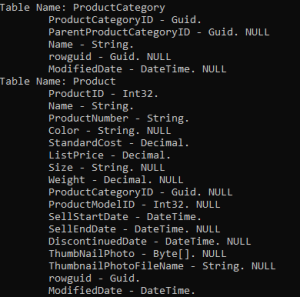

Scopes
================================

What is a scope ?
^^^^^^^^^^^^^^^^^^^^^^^^^^^^^^^^^^

Scopes are stored in the **scope_info** table, on each side (Server / Client).

.. note:: You can change the default table name **scope_info** using the ``ScopeInfoTableName`` property from ``SyncOptions``:

    .. code-block:: csharp

        var options = new SyncOptions();
        options.ScopeInfoTableName = "table_information";

Basically, a scope is defining a **setup** and its database **schema**, and is identified by a **unique name**.

For example, you can define multiples scopes representing:

- A first scope called **"products"** : Contains the **Product**, **ProductCategory** and **ProductModel** tables.
- A second scope called **"customers"**: Contains the **Customer** and related **SalesOrderHeader** tables.
- A third scope with the default name (default **DefaultScope**), containing all the tables to sync.

Example:

.. code-block:: csharp

    var serverProvider = new SqlSyncChangeTrackingProvider(serverConnectionString);
    var clientProvider = new SqliteSyncProvider(clientConnectionString);

    var setup = new SyncSetup("ProductCategory", "ProductModel", "Product",
        "Address", "Customer", "CustomerAddress", "SalesOrderHeader", "SalesOrderDetail" );

    var agent = new SyncAgent(clientProvider, serverProvider);
    var s1 = await agent.SynchronizeAsync(setup);

Here is the **scope_info** table, once the sync is complete:

===============   ============================================== =========================
sync_scope_name   sync_scope_setup                               sync_scope_schema         
---------------   ---------------------------------------------- -------------------------
DefaultScope      { "t" : [{"ProductCategory", "Product",        { "t" : [{"Prod...."}] }     
                  "ProductModel", "Address", "Customer", ...}] }         
===============   ============================================== =========================

.. note::
    The **sync_scope_setup** column is a serialized json object, containing all the tables and options you defined from your ``SyncSetup`` instance.

The corresponding object in ``DMS`` is the ``ScopeInfo`` class. It basically contains all fields from the **scope_info** table.

Methods & Properties
^^^^^^^^^^^^^^^^^^^^^^^^^^^^^^^^^^

You can access a ``SyncScope`` stored on the server or client, using a ``LocalOrchestrator`` or ``RemoteOrchestrator`` instance (directly from a ``SyncAgent`` instance or by creating a new instance directly)

Properties
---------------------

Once a first scope sync has been done, you will have, on both sides, a **scope_info** table, containing:

- A **scope name**: Defines a user friendly name (unique) for your scope. Default name is ``DefaultScope``.
- A **setup**, serialized: Contains all the tables and options you defined from your ``SyncSetup`` instance.
- A **schema**, serialized: Contains all the tables, filters, parameters and so on, for this scope.
- The **last cleanup timestamp**: This timestamp is used to cleanup the tracking tables. It's the last time the cleanup was done.
- The **version**: DMS database version.

The corresponding .NET objet is the ``ScopeInfo`` class:

.. code-block:: csharp

    public class ScopeInfo
    {
        public string Name { get; set; }
        public SyncSet Schema { get; set; }
        public SyncSetup Setup { get; set; }
        public string Version { get; set; }
        public long? LastCleanupTimestamp { get; set; }
        public string Properties { get; set; }
    }

GetScopeInfoAsync()
---------------------

Get the scope info from the database. This method will return a ``ScopeInfo`` object:

.. note:: If the **scope_info** table is not existing, it is created.

    If no scope record is found, an empty scope will be created with empty schema and setup properties.

.. code-block:: csharp

    var localOrchestrator = new LocalOrchestrator(clientProvider);
    var scopeInfo = await localOrchestrator.GetScopeInfoAsync();

    if (scopeInfo.Schema == null)
        return;

    foreach (var schemaTable in scopeInfo.Schema.Tables)
    {
        Console.WriteLine($"Table Name: {schemaTable.TableName}");

        foreach (var column in schemaTable.Columns)
            Console.WriteLine($"\t{column}. {(column.AllowDBNull ? "NULL": "")}");
    }

On ``RemoteOrchestrator``, you can use a ``SyncSetup`` argument to get a ``ScopeInfo`` object containing the **Setup** and **Schema** properties filled.

.. code-block:: csharp
    
    var remoteOrchestrator = new RemoteOrchestrator(clientProvider);
    var setup = new SyncSetup("Product, ProductCategory");
    var scopeInfo = await remoteOrchestrator.GetScopeInfoAsync(setup);

    foreach (var schemaTable in scopeInfo.Schema.Tables)
    {
        Console.WriteLine($"Table Name: {schemaTable.TableName}");

        foreach (var column in schemaTable.Columns)
            Console.WriteLine($"\t{column}. {(column.AllowDBNull ? "NULL": "")}");
    }

GetAllScopeInfosAsync()
---------------------------

Get all scope infos from a data source.

.. code-block:: csharp

    var localOrchestrator = new LocalOrchestrator(clientProvider);
    var scopeInfo = await localOrchestrator.GetAllScopeInfosAsync();

SaveScopeInfoAsync()
------------------------

Save a scope info to the local data source.

.. code-block:: csharp

    var scopeInfo = await localOrchestrator.GetScopeInfoAsync();
    scopeInfo.Setup = setup;
    scopeInfo.Schema = schema;
    scopeInfo.ScopeName = "v1";
    await localOrchestrator.SaveScopeInfoAsync(scopeInfo);

DeleteScopeInfoAsync()
------------------------

Delete a scope info from the local data source.

.. code-block:: csharp

    var scopeInfo = await localOrchestrator.GetScopeInfoAsync("v0");
    await localOrchestrator.DeleteScopeInfoAsync(scopeInfo);

CreateScopeInfoTableAsync()
----------------------------------

Create a scope info table in local data source.

.. code-block:: csharp

    await localOrchestrator.CreateScopeInfoTableAsync();

ExistScopeInfoTableAsync()
----------------------------------

Check if a scope_info table exists in the local data source

.. code-block:: csharp

    var exists = await localOrchestrator.ExistScopeInfoTableAsync();

Multi Scopes
^^^^^^^^^^^^^^^^

In some scenario, you may want to sync some tables at one time, and some others tables at another time.

These kind of scenarios are possible using the **multi scopes** sync architecture.

How does it work ?
----------------------------

To be able to create a multi scopes scenario, you just have to:

- Create two ``SyncSetup`` instances with your tables / filters and options.
- Sync your databases calling ``SynchronizeAsync`` with a different scope name for each setup.
- Or call ``ProvisionAsync`` with your scope name.

Example
----------------------------

Here is a full example, where we sync separately the **Product** table, then the **Customer** table:

.. code-block:: csharp

    // Create 2 Sql Sync providers
    var serverProvider = new SqlSyncProvider(DbHelper.GetDatabaseConnectionString(serverDbName));
    var clientProvider = new SqlSyncProvider(DbHelper.GetDatabaseConnectionString(clientDbName));

    // Create 2 setup 
    var setupProducts = new SyncSetup("ProductCategory", "ProductModel", "Product");
    var setupCustomers = new SyncSetup("Address", "Customer", "CustomerAddress", 
                "SalesOrderHeader", "SalesOrderDetail");

    // Create an agent
    var agent = new SyncAgent(clientProvider, serverProvider);

    // Using the Progress pattern to handle progession during the synchronization
    var progress = new SynchronousProgress<ProgressArgs>(s =>
        Console.WriteLine($"{s.Context.SyncStage}:\t{s.Message}");
    );

    Console.WriteLine("Hit 1 for sync Products. Hit 2 for sync customers and sales");
    var k = Console.ReadKey().Key;

    if (k == ConsoleKey.D1)
    {
        Console.WriteLine("Sync Products:");
        var s1 = await agent.SynchronizeAsync("products", setupProducts, progress);
        Console.WriteLine(s1);
    }
    else
    {
        Console.WriteLine("Sync Customers and Sales:");
        var s1 = await agent.SynchronizeAsync("customers", setupCustomers, progress);
        Console.WriteLine(s1);
    }

Once you have made the 2 syncs, your local syns_scope table should looks like that:

===============   =========================   ======================= 
sync_scope_name   sync_scope_schema           sync_scope_setup        
---------------   -------------------------   ----------------------- 
products          { "t" : [{......}] }        { "t" : [{......}] }    
customers         { "t" : [{......}] }        { "t" : [{......}] }    
===============   =========================   ======================= 
