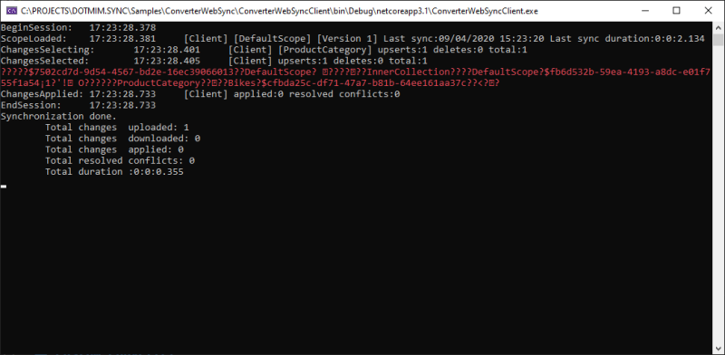

# Converters and Serializers

## Sample
>
> You will find the sample used for this chapter, here : [Converters sample](https://github.com/Mimetis/Dotmim.Sync/tree/master/Samples/ConverterWebSync)
>

## Introduction

When using the **HTTP** mode, **DMS** uses two additional components:
- A **serializer**, to transforms a database row to a serialized stream. The default serializer used by **DMS** is **JSON**
- A **converter**, to converts a data type into another (for example a `byte[]` array to `base64` `string`). There is no default converter.

You can create your own customer serializer, changing the default JSON serializer to any kind of serializer.
As well, if you have a special type that **DMS** is unable to convert correctly, you can use a custom converter with your own type conversion.

## Custom Serializer

Client dictates the serialization mechanism:

When you run a synchronization, The `WebClientOrchestrator` sends a special HTTP header `dotmim-sync-serialization-format`, containing two information:

- First one is specifying the serialization format to use. The server then knows how to deserialize the messages and also uses this serialization format when responding back to the client.
- Second one is specifying if the client needs batch mode or not.

Example:

```
dotmim-sync-serialization-format: {"f":"json","s":500}
```
- Serialization : **Json**
- Batch size : **500**

Once the server received this payload, contained in the header, he knows he has to serialize everything in a **JSON** format, and then will generate batch files, with approximatively **500 ko** for each payload

### Options to set a custom MessagePack serializer

You can now set your own serializer. 
Using the `SyncOptions` instance, the client can define the serializer he wants to use.

The server shoud have the serializer installed as well.

To be able to use a new serializer, you should:
- Implement the interfaces `ISerializerFactory` and `ISerializer<T>`
- Reference this serializer on both side (client and server)

```cs
/// <summary>
/// Represents a factory of generic serializers.
/// This object should be able to get a serializer of each type of T
/// </summary>
public interface ISerializerFactory
{
    string Key { get; }
    ISerializer<T> GetSerializer<T>();
}

/// <summary>
/// Represents a generic serializer for a defined type of T
/// </summary>
public interface ISerializer<T>
{
    Task<T> DeserializeAsync(Stream ms);
    Task<byte[]> SerializeAsync(T obj);
}
```


Here is an example using a new serializer based on **MessagePack**, using the package [MessagePack-CSharp](https://github.com/neuecc/MessagePack-CSharp):


``` csharp
public class CustomMessagePackSerializerFactory : ISerializerFactory
{
    public string Key => "mpack";
    public ISerializer<T> GetSerializer<T>() => new CustomMessagePackSerializer<T>();
}

public class CustomMessagePackSerializer<T> : ISerializer<T>
{
    public CustomMessagePackSerializer() => MessagePackSerializer.SetDefaultResolver(MessagePack.Resolvers.ContractlessStandardResolver.Instance);
    public T Deserialize(Stream ms) => MessagePackSerializer.Deserialize<T>(ms);
    public byte[] Serialize(T obj) => MessagePackSerializer.Serialize(obj);
}
```

This class should be added to both the server side and the client side.

Then, add the serializer to the web server serializers collection:
``` csharp
var connectionString = Configuration.GetSection("ConnectionStrings")["SqlConnection"];
var tables = new string[] {"ProductCategory", "ProductModel", "Product",
"Address", "Customer", "CustomerAddress", "SalesOrderHeader", "SalesOrderDetail" };

// To add a converter, create an instance and add it to the special WebServerOptions
var webServerOptions = new WebServerOptions();
webServerOptions.Serializers.Add(new CustomMessagePackSerializerFactory());

// Don't forget to add this converter when calling the DI AddSyncServer() method !
services.AddSyncServer<SqlSyncChangeTrackingProvider>(connectionString, tables, null, webServerOptions);
```

On the other hand, add this serializer on the client side:
``` csharp
// Create a web proxy Orchesrtrator with a custom serializer
var serverProxyOrchestrator = new WebClientOrchestrator("https://localhost:44342/api/sync")
{
    SerializerFactory = new CustomMessagePackSerializerFactory()
};

var clientProvider = new SqlSyncProvider(clientConnectionString);
var agent = new SyncAgent(clientProvider, serverOrchestrator);

```

Now the communication between the server side and the client side will be completely made in a **MessagePack** format !

To check if everything is serialized correctly, you can use a web debugging proxy, like [Fiddler](https://www.telerik.com/fiddler) or you can use an `Interceptor<T>`, available from the `WebClientOrchestrator` orchestrator instance:

``` cs
//Spy the changes sent
serverProxyOrchestrator.OnSendingChanges(args =>
{
    using (var ms = new MemoryStream(args.Content))
    {
        using (var reader = new StreamReader(ms))
        {
            var text = reader.ReadToEnd();
            Console.ForegroundColor = ConsoleColor.Red;
            Console.WriteLine(text);
            Console.ResetColor();
        }
    }
});

```


## Custom converter

**DMS** relies on the serializer's converter to convert each value from each row.

But you can create and use your own converter, that will be called on each row, before and after the serialization process.

Like the `ISerializerFactory`, you can create your own `IConverter`:
- This converter should be available both on the client and the server.
- The server should registers all converters used by any client
- The client registers its own converter.

``` csharp
public interface IConverter
{

    /// <summary>
    /// get the unique key for this converter
    /// </summary>
    string Key { get; }

    /// <summary>
    /// Convert a row before being serialized
    /// </summary>
    void BeforeSerialize(SyncRow row);

    /// <summary>
    /// Convert a row afeter being deserialized
    /// </summary>
    void AfterDeserialized(SyncRow row);
}
```


Example of a simple `IConverter`:

``` csharp
public class CustomConverter : IConverter
{
    public string Key => "cuscom";

    public void BeforeSerialize(SyncRow row)
    {
        // Each row belongs to a Table with its own Schema
        // Easy to filter if needed
        if (row.Table.TableName != "Product")
            return;

        // Encode a specific column, named "ThumbNailPhoto"
        if (row["ThumbNailPhoto"] != null)
            row["ThumbNailPhoto"] = Convert.ToBase64String((byte[])row["ThumbNailPhoto"]);

        // Convert all DateTime columns to ticks
        foreach (var col in row.Table.Columns.Where(c => c.GetDataType() == typeof(DateTime)))
        {
            if (row[col.ColumnName] != null)
                row[col.ColumnName] = ((DateTime)row[col.ColumnName]).Ticks;
        }
    }

    public void AfterDeserialized(SyncRow row)
    {
        // Only convert for table Product
        if (row.Table.TableName != "Product")
            return;

        // Decode photo
        row["ThumbNailPhoto"] = Convert.FromBase64String((string)row["ThumbNailPhoto"]);

        // Convert all DateTime back from ticks
        foreach (var col in row.Table.Columns.Where(c => c.GetDataType() == typeof(DateTime)))
        {
            if (row[col.ColumnName] != null)
                row[col.ColumnName] = new DateTime(Convert.ToInt64(row[col.ColumnName]));
        }
    }
}
```

On client side, register this converter from your `WebClientOrchestrator`:

``` csharp
// Create the web proxy client provider with specific options
var proxyClientProvider = new WebClientOrchestrator
{
    SerializerFactory = new CustomMessagePackSerializerFactory(),
    Converter = new CustomConverter()
};

```

On server side, add this converter to the list of available converters:

``` csharp
var webServerOptions = new WebServerOptions
{
   ...
};
webServerOptions.Serializers.Add(new CustomMessagePackSerializerFactory());
webServerOptions.Converters.Add(new CustomConverter());

```

Without Converter:


With Converter:


