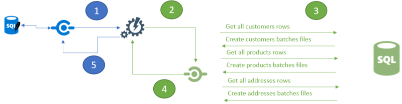
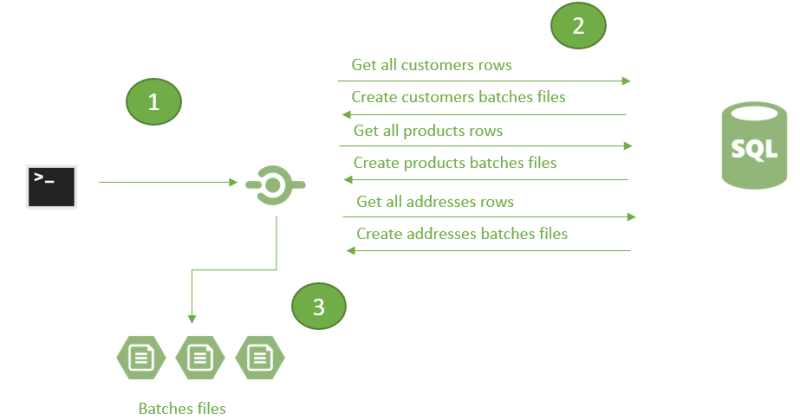

Snapshot
=========================

Overview
^^^^^^^^^^^

Sometimes, client initialization can be a problem due to the time needed for the server to generate the first batches.

The idea is to reduce this time for initialization of new clients.

Wihtout snapshot, we could have some troubles due to the heavy work from the server side, when initializing a new client:

1) A new **Client** launches a synchronization. Its local database is empty and should be synced with all rows from all tables part of the sync configuration.
2) **Server** orchestrator gets the request, initializes the medata stores, sends back the schema if needed, and then launches the sync process internally.
3) **Server** prepares batches files, based on all tables involved in the sync (using ``_Initialize`` stored procedures).
4) **Server** streams back the files to the **client** orchestrator.  
5) **Client** orchestrator applies the rows to the local database using the client provider.

| Depending on numbers of tables, and rows, the step **3** could take a lot of times.
| During this generation time the client has to wait, with no response from server, until the batches are ready.

.. warning:: In a **TCP** mode, it will work since the client will wait until a response from the server. But in an **HTTP** mode you can eventually have a **timeout** exception raised...

.. hint:: In **HTTP** mode, you can increase the `timeout duration </timeout.html>`_ , but it's not ideal...

The **snapshot** feature comes in here to resolve this issue.   

The idea is quite simple : Creating a snapshot of the server database on time **TS**, available for all new clients.

A common scenario would be:

* Create a snapshot every 2 weeks on the server side, to get the most relevant and up to date data.
* Every new client will download and apply this snapshot on initialization.
* This new client will then synchronize all new datas in between the snapshot (so TS) and T.

Here is the steps to create a server snapshot and the configuration from both server and client side:

Server side
^^^^^^^^^^^^^^^^^^

Create a new method, that will generate a *snapshot* at a current time *T* with all rows / tables, available for all new clients:

.. note:: Creates a new project, a console application for example, to create a snapshot.

.. code-block:: csharp

    var serverProvider = new SqlSyncProvider("Data Source= ...");

    // new setup with all tables involved
    var setup = new SyncSetup(allTables);

    // snapshot directory
    var snapshotDirectoryName = "snapshots";
    var snapshotDirctory = Path.Combine(Environment.CurrentDirectory, snapshotDirctoryName);

    var options = new SyncOptions
    {
        SnapshotsDirectory = snapshotDirctory,
        BatchSize = 3000
    };

    // Create a remote orchestrator
    var remoteOrchestrator = new RemoteOrchestrator(serverProvider, options);

    // Create a snapshot
    await remoteOrchestrator.CreateSnapshotAsync(setup);

Once created, the folder looks like this:

.. image:: https://user-images.githubusercontent.com/4592555/73745385-311c0900-4753-11ea-98d1-915df4bd2b9c.png

* Some `*.batch` files containing all the rows, for all the sync tables.
* A `summary.json` contains all the mandatory information regarding this snapshot

.. code-block:: json

    {
        "dirname": "ALL",
        "dir": "C:\\Users\\spertus.EUROPE\\Snapshots",
        "ts": 2001,
        "parts": [
            {
                "file": "000_fnwkoou5_tdj.batch",
                "index": 0,
                "last": false,
                "tables": [
                    {
                        "n": "ProductCategory"
                    },
                    {
                        "n": "ProductModel"
                    },
                    {
                        "n": "Product"
                    }
                ]
            },
            {
                "file": "001_02zy0swq_nce.batch",
                "index": 1,
                "last": true,
                "tables": [
                    {
                        "n": "Product"
                    },
                    {
                        "n": "Address"
                    },
                    {
                        "n": "Customer"
                    },
                    {
                        "n": "CustomerAddress"
                    },
                    {
                        "n": "SalesOrderHeader"
                    },
                    {
                        "n": "SalesOrderDetail"
                    }
                ]
            }
        ]
    }

We have here, the server ``timestamp`` when the snapshot was generated, all the files, ordered, with table contained in each file.

Filtered clients
-----------------------

For filtered client, the snapshot will be a little bit different, since it will not contains all the data.  
More, each filtered client will have its own snapshot, based on its filter parameters values  !

To generate a filtered snapshot, just add the ``SyncParameters`` values to the new ``SyncContext`` instance argument:

.. code-block:: csharp

    // Setup with a filter on CustomerId, on table Customer
    var setup = new SyncSetup(allTables);
    setup.Filters.Add("Customer", "CustomerId");

    // Create a filtered snapshot
    var snapshotCustomer1001 = new SyncContext();
    snapshotCustomer1001.Parameters = new SyncParameters();
    snapshotCustomer1001.Parameters.Add("CustomerId", "1001");

    await Server.RemoteOrchestrator.CreateSnapshotAsync(setup, snapshotCustomer1001);

Activate the snapshot option for all new clients
-------------------------------------------------

To activate this snapshot, the server should know where each snapshot is located.   

The `SyncOptions` has a new property called `SnapshotsDirectory`:

.. code-block:: csharp

    // Options used for client and server when used in a direct TCP mode:
    var options = new SyncOptions { 
        SnapshotsDirectory = Path.Combine(
                        Environment.GetFolderPath(Environment.SpecialFolder.UserProfile), 
                        "Snapshots") 
        };

HTTP mode with ASP.Net Core Web API
--------------------------------------------

The ``ASP.NET Core`` web api looks like this, now:

.. code-block:: csharp

    public void ConfigureServices(IServiceCollection services)
    {
        services.AddControllers();

        services.AddDistributedMemoryCache();
        services.AddSession(options => options.IdleTimeout = TimeSpan.FromMinutes(30));

            
        // Get a connection string for your server data source
        var connectionString = Configuration.GetSection("ConnectionStrings")["DefaultConnection"];

        // Set the web server Options
        var options = new SyncOptions()
        {
            SnapshotsDirectory = Path.Combine(
                    Environment.GetFolderPath(Environment.SpecialFolder.UserProfile), 
                    "Snapshots")
        };
            

        // Create the setup used for your sync process
        var tables = new string[] {"ProductCategory",
                        "ProductDescription", "ProductModel",
                        "Product", "ProductModelProductDescription",
                        "Address", "Customer", "CustomerAddress",
                        "SalesOrderHeader", "SalesOrderDetail" };

        var setup = new SyncSetup(tables);

        // add a SqlSyncProvider acting as the server hub
        services.AddSyncServer<SqlSyncProvider>(connectionString, setup, options);
    }

    // This method gets called by the runtime. Use this method to configure the HTTP request pipeline.
    public void Configure(IApplicationBuilder app, IWebHostEnvironment env)
    {
        if (env.IsDevelopment())
            app.UseDeveloperExceptionPage();

        app.UseHttpsRedirection();
        app.UseRouting();
        app.UseSession();
        app.UseEndpoints(endpoints =>
        {
            endpoints.MapControllers();
        });
    }

Client side
^^^^^^^^^^^^^^^^^^^^

On the client side, you don't have anything to do, just a normal new sync processus:

.. code-block:: csharp

    var s = await agent.SynchronizeAsync(progress);

Here is an output of new client coming with a new client database :

.. code-block:: bash

    BeginSession     14:00:22.651
    ScopeLoading     14:00:22.790    Id:b3d33500-ee06-427a-bccc-7518a9dfec93 LastSync: LastSyncDuration:0
    TableSchemaApplied       14:00:26.95     TableName: ProductCategory Provision:All
    TableSchemaApplied       14:00:26.234    TableName: ProductModel Provision:All
    TableSchemaApplied       14:00:26.415    TableName: Product Provision:All
    TableSchemaApplied       14:00:26.466    TableName: Address Provision:All
    TableSchemaApplied       14:00:26.578    TableName: Customer Provision:All
    TableSchemaApplied       14:00:26.629    TableName: CustomerAddress Provision:All
    TableSchemaApplied       14:00:26.777    TableName: SalesOrderHeader Provision:All
    TableSchemaApplied       14:00:26.830    TableName: SalesOrderDetail Provision:All
    SchemaApplied    14:00:26.831    Tables count:8 Provision:All
    TableChangesApplied      14:00:28.101    ProductCategory State:Modified Applied:41 Failed:0
    TableChangesApplied      14:00:28.252    ProductModel State:Modified Applied:128 Failed:0
    TableChangesApplied      14:00:28.449    Product State:Modified Applied:201 Failed:0
    TableChangesApplied      14:00:28.535    Product State:Modified Applied:295 Failed:0
    TableChangesApplied      14:00:28.686    Address State:Modified Applied:450 Failed:0
    TableChangesApplied      14:00:28.874    Customer State:Modified Applied:847 Failed:0
    TableChangesApplied      14:00:29.28     CustomerAddress State:Modified Applied:417 Failed:0
    TableChangesApplied      14:00:29.165    SalesOrderHeader State:Modified Applied:32 Failed:0
    TableChangesApplied      14:00:29.383    SalesOrderDetail State:Modified Applied:542 Failed:0
    DatabaseChangesApplied   14:00:29.385    Changes applied on database Client: Applied: 2752 Failed: 0
    ScopeSaved       14:00:29.455    Id:b3d33500-ee06-427a-bccc-7518a9dfec93 LastSync:04/02/2020 13:00:29 LastSyncDuration:68091840
    EndSession       14:00:29.457
    BeginSession     14:00:29.460
    ScopeLoading     14:00:29.466    Id:b3d33500-ee06-427a-bccc-7518a9dfec93 LastSync:04/02/2020 13:00:29 LastSyncDuration:68091840
    TableChangesSelected     14:00:29.481    ProductCategory Upserts:0 Deletes:0 TotalChanges:0
    TableChangesSelected     14:00:29.491    ProductModel Upserts:0 Deletes:0 TotalChanges:0
    TableChangesSelected     14:00:29.504    Product Upserts:0 Deletes:0 TotalChanges:0
    TableChangesSelected     14:00:29.514    Address Upserts:0 Deletes:0 TotalChanges:0
    TableChangesSelected     14:00:29.524    Customer Upserts:0 Deletes:0 TotalChanges:0
    TableChangesSelected     14:00:29.535    CustomerAddress Upserts:0 Deletes:0 TotalChanges:0
    TableChangesSelected     14:00:29.544    SalesOrderHeader Upserts:0 Deletes:0 TotalChanges:0
    TableChangesSelected     14:00:29.553    SalesOrderDetail Upserts:0 Deletes:0 TotalChanges:0
    TableChangesApplied      14:00:29.722    ProductCategory State:Modified Applied:1 Failed:0
    DatabaseChangesApplied   14:00:29.732    Changes applied on database Client: Applied: 1 Failed: 0
    ScopeSaved       14:00:29.772    Id:b3d33500-ee06-427a-bccc-7518a9dfec93 LastSync:04/02/2020 13:00:29 LastSyncDuration:71205855
    EndSession       14:00:29.773
    Synchronization done.
            Total changes downloaded: 2753
            Total changes uploaded: 0
            Total conflicts: 0
            Total duration :0:0:7.120

As you can see, we have basically **2** Sync in a row.

* First one get the **schema**, and apply all the **batches** from the snapshot
* Second one get all the rows added / deleted / modified from the snapshot ``TimeStamp`` ``T-1`` and the last server ``TimeStamp`` ``T`` (in our sample just one ``ProductCategory``)

