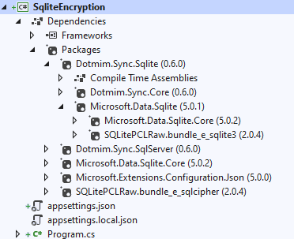

Sqlite Encryption
================================

Overview
^^^^^^^^^^

- **SQLite** doesn't support encrypting database files by default. 
- Instead, we need to use a modified version of SQLite like `SEE <https://www.hwaci.com/sw/sqlite/see.html>`_ , `SQLCipher <https://www.zetetic.net/sqlcipher/>`_ , `SQLiteCrypt <http://www.sqlite-crypt.com/>`_ , or `wxSQLite3 <https://utelle.github.io/wxsqlite3>`_ . 
- This article demonstrates using an unsupported, open-source build of **SQLCipher**, but the information also applies to other solutions since they generally follow the same pattern.

.. hint:: You will find more information about Sqlite Encryption with **Microsoft.Data.Sqlite** `Here <https://docs.microsoft.com/en-us/dotnet/standard/data/sqlite/encryption?tabs=netcore-cli>`_ .

.. hint:: You will find the sqlite encryption sample here : `Sqlite Encryption Sample <https://github.com/Mimetis/Dotmim.Sync/blob/master/Samples/SqliteEncryption>`_ 

Tweak the nuget packages
^^^^^^^^^^^^^^^^^^^^^^^^

Basically, installing the packages needed to use Sqlite encryption is pretty simple. Just override packages:

.. code-block:: bash

    dotnet add package Microsoft.Data.Sqlite.Core
    dotnet add package SQLitePCLRaw.bundle_e_sqlcipher

Your project file should be something like this:

.. code-block:: xml

    <Project Sdk="Microsoft.NET.Sdk">
        <PropertyGroup>
            <OutputType>Exe</OutputType>
            <TargetFramework>netcoreapp3.1</TargetFramework>
        </PropertyGroup>

        <ItemGroup>
            <PackageReference Include="Dotmim.Sync.Sqlite" Version="0.6.0" />
            <PackageReference Include="Microsoft.Data.Sqlite.Core" Version="5.0.2" />
            <PackageReference Include="SQLitePCLRaw.bundle_e_sqlcipher" Version="2.0.4" />
        </ItemGroup>
    </Project>

Here is a screenshot of Visual Studio, after installing the packages:

- As you can see, the ``Dotmim.Sync.Sqlite`` is referencing the ``Microsoft.Data.Sqlite`` package that is referencing ``Microsoft.Data.Sqlite.Core`` and ``SQLitePCLRaw.bundle_e_sqlite3``.
- Because we made references at the root level of ``Microsoft.Data.Sqlite.Core`` and ``SQLitePCLRaw.bundle_e_sqlcipher``, these two packages will be used in place of the ``Microsoft.Data.Sqlite``'s packages.

Code
^^^^^^^^

The code is prett much the same code, just ensure you're filling a **Password** in your **Sqlite** connection string:

.. code-block:: csharp

    // connection string should be something like "Data Source=AdventureWorks.db;Password=..."
    var sqliteConnectionString = configuration.GetConnectionString("SqliteConnection");
    var clientProvider = new SqliteSyncProvider(sqliteConnectionString);

    // You can use a SqliteConnectionStringBuilder() as well, like this:
    //var builder = new SqliteConnectionStringBuilder();
    //builder.DataSource = "AdventureWorks.db";
    //builder.Password = "...";

