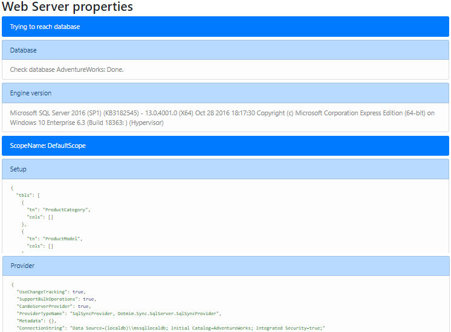

# ASP.NET Core 2.0 Web Proxy

Let's say... *in the real world*, you will not have *always* a direct TCP link from your client machine to your enterprise server.   
Even though, it's a good practice to protect you database server behing a web api.    
That's why we will use a *sync web proxy*, and we will expose our server to sync, through a web api.   

We can see the overall architecture with this big picture:


To be able to *proxify* everything, we will have to:

**Server side**:   
* Create a new **ASP.NET Core Web application**.
* Add the [`Dotmim.Sync.Web.Server`](https://www.nuget.org/packages/Dotmim.Sync.Web.Server) nuget package to the ASP.NET project.
* Add the server provider. As we are using sql server with change tracking, we are adding [`Dotmim.Sync.SqlSyncChangeTrackingProvider`](https://www.nuget.org/packages/Dotmim.Sync.SqlServer.ChangeTracking).
* Add the required configuration to the `Startup.cs` file.
* Create a new controller and intercept all requests to handle the synchronisation. 

**Client side**:
* Create any kind of client application (Console, Windows Forms, WPF ...)
* Add the [`Dotmim.Sync.Web.Client`](https://www.nuget.org/packages/Dotmim.Sync.Web.Client) nuget package to the client application: 
* Add the client provider. For example the [`Dotmim.Sync.SqliteSyncProvider`](https://www.nuget.org/packages/Dotmim.Sync.Sqlite) 
* Create a new `SyncAgent` using a local orchestrator with the `SqliteSyncProvider` and a remote `WebClientOrchestrator` orchestrator.


## Detailed steps
We will start from the [Hello sync sample](/Samples/HelloSync) sample and will migrate it to the web architecture.   
You will find the sample used for this demonstration, here : [Hello web sync sample](/Samples/HelloWebSync).

## Server side

Once your **ASP.NET** application is created, we're adding the specific web server package and our server provider:
* `Dotmim.Sync.Web.Server`: This package will allow us to expose everything we need, through a **.Net core Web API**
* `Dotmim.Sync.SqlSyncChangeTrackingProvider`: This package will allow us to communicate with the SQL Server database.

Once we have added these **DMS** packages to our project, we are configuring the Sync provider in the `Startup` class, thanks to Dependency Injection.

Read carefully the next portion of code, since some services are required, but not part of **DMS** (like `MemoryCache` for instance)

``` cs
public void ConfigureServices(IServiceCollection services)
{
    services.AddControllers();

    // [Required]: To be able to handle multiple sessions
    services.AddMemoryCache();

    // [Required]: Get a connection string to your server data source
    var connectionString = Configuration.GetSection("ConnectionStrings")["DefaultConnection"];

    // [Required]: Tables list involved in the sync process
    var tables = new string[] {"ProductCategory", "ProductModel", "Product",
            "Address", "Customer", "CustomerAddress", "SalesOrderHeader", "SalesOrderDetail" };

    // [Required]: Add a SqlSyncProvider acting as the server hub.
    services.AddSyncServer<SqlSyncChangeTrackingProvider>(connectionString, tables);
}
```

> We have added a memory cache, through `services.AddMemoryCache();`. Having a cache is mandatory to be able to serve multiple requests. 

Once we have correctly configured our sync process, we can create our controller:

* Create a new controller (for example `SyncController`)
* In this newly created controller, inject a `WebServerManager`.   
* Use it in the `POST` method, call the `HandleRequestAsync` method and ... **that's all** !
* We can optionally add a `GET` method, to see our configuration from within the web browser. Useful to check if everything is configured correctly.

``` cs
[Route("api/[controller]")]
[ApiController]
public class SyncController : ControllerBase
{
    // The WebServerManager instance is useful to manage all the Web server orchestrators register in the Startup.cs
    private WebServerManager webServerManager;

    // Injected thanks to Dependency Injection
    public SyncController(WebServerManager webServerManager) => this.webServerManager = webServerManager;

    /// <summary>
    /// This POST handler is mandatory to handle all the sync process
    /// </summary>
    [HttpPost]
    public async Task Post() => await webServerManager.HandleRequestAsync(this.HttpContext);

    /// <summary>
    /// This GET handler is optional. It allows you to see the configuration hosted on the server
    /// The configuration is shown only if Environmenent == Development
    /// </summary>
    [HttpGet]
    public async Task Get() => await webServerManager.HandleRequestAsync(this.HttpContext);
}

```

Launch your browser and try to reach *sync* web page. (Something like `https://localhost:[YOUR_PORT]/api/sync`)
You should have useful information, like a test to reach your server database, your `SyncSetup`, your `SqlSyncProvider`, your `SyncOptions` and your `WebServerOptions` configuration:



If your configuration is not correct, you should have an error message, like this:


## Client side

The client side is pretty similar to the starter sample, except we will have to use a proxy orchestrator instead of the server provider:


``` cs
    var serverOrchestrator = new WebClientOrchestrator("https://localhost:44342/api/sync");

    // Second provider is using plain old Sql Server provider, relying on triggers and tracking tables to create the sync environment
    var clientProvider = new SqlSyncProvider(clientConnectionString);

    // Creating an agent that will handle all the process
    var agent = new SyncAgent(clientProvider, serverOrchestrator);

    do
    {
        // Launch the sync process
        var s1 = await agent.SynchronizeAsync();
        // Write results
        Console.WriteLine(s1);

    } while (Console.ReadKey().Key != ConsoleKey.Escape);

    Console.WriteLine("End");
```
Now we can launch both application, The Web Api on one side, and the Console application on the other side.   
Just hit Enter and get the results from your synchronization over http.


