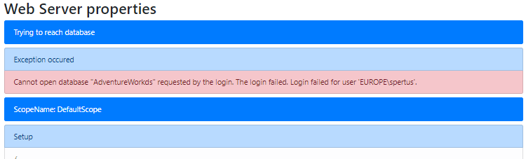

ASP.NET Core Web Proxy
================================

Let's say... *in the real world*, you will not have *always* a direct TCP link from your client machine to your enterprise server.   

Even though, it's a good practice to protect you database server behing a web api.    
That's why we will use a *sync web proxy*, and we will expose our server to sync, through a web api.   

Here is the overall architecture:

.. image:: /assets/Architecture03.png

Overview
^^^^^^^^^^

.. hint:: You will find the sample used on this chapter, here : `Hello web sync sample <https://github.com/Mimetis/Dotmim.Sync/tree/master/Samples/HelloWebSync>`_ .

To be able to *proxify* everything, we should:

**Server side**:   

* Create a new **ASP.NET Core Web application**.
* Add the `Dotmim.Sync.Web.Server <https://www.nuget.org/packages/Dotmim.Sync.Web.Server>`_  nuget package to the ASP.NET project.
* Add the server provider. As we are using sql server with change tracking, we are adding `Dotmim.Sync.SqlSyncChangeTrackingProvider <https://www.nuget.org/packages/Dotmim.Sync.SqlServer.ChangeTracking>`_ .
* Add the required configuration to the ``Startup.cs`` file.
* Create a new controller and intercept all requests to handle the synchronisation. 

**Client side**:

* Create any kind of client application (Console, Windows Forms, WPF ...)
* Add the `Dotmim.Sync.Web.Client <https://www.nuget.org/packages/Dotmim.Sync.Web.Client>`_  nuget package to the client application: 
* Add the client provider. For example the `Dotmim.Sync.SqliteSyncProvider <Dotmim.Sync.SqliteSyncProvider>`_  
* Create a new ``SyncAgent`` using a local orchestrator with the ``SqliteSyncProvider`` and a remote ``WebRemoteOrchestrator`` orchestrator.

Server side
^^^^^^^^^^^^

.. note:: We will start from the `Hello sync sample <https://github.com/Mimetis/Dotmim.Sync/tree/master/Samples/HelloSync>`_  sample and will migrate it to the web architecture.   

Once your **ASP.NET** application is created, we're adding the specific web server package and our server provider:

* ``Dotmim.Sync.Web.Server``: This package will allow us to expose everything we need, through a **.Net core Web API**
* ``Dotmim.Sync.SqlServer.ChangeTracking``: This package will allow us to communicate with the SQL Server database.

Once we have added these **DMS** packages to our project, we are configuring the Sync provider in the ``Startup`` class, thanks to Dependency Injection.

| Be careful, some services are required, but not part of **DMS** (like ``.AddDistributedMemoryCache()`` and ``.AddSession()`` for instance.)
| Do not forget to add the session middleware as well ( ``app.UseSession();`` )

.. note:: ``DMS`` uses a lot of http request during one user's sync. That's why Session is mandatory. Do not forget to add it in your configuration.
          
          Having a cache is mandatory to be able to serve multiple requests 
          for one particular session (representing one sync client)

Simple Scope
-----------------

.. code-block:: csharp

    public void ConfigureServices(IServiceCollection services)
    {
        services.AddControllers();

        services.AddDistributedMemoryCache();
        services.AddSession(options => options.IdleTimeout = TimeSpan.FromMinutes(30));

        // [Required]: Get a connection string to your server data source
        var connectionString = Configuration.GetSection("ConnectionStrings")["SqlConnection"];

        var options = new SyncOptions { };

        // [Required] Tables involved in the sync process:
        var tables = new string[] {"ProductCategory", "ProductModel", "Product",
        "Address", "Customer", "CustomerAddress", "SalesOrderHeader", "SalesOrderDetail" };

        // [Required]: Add a SqlSyncProvider acting as the server hub.
        services.AddSyncServer<SqlSyncChangeTrackingProvider>(connectionString, tables, options);

    }

    // This method gets called by the runtime. Use this method to configure the HTTP request pipeline.
    public void Configure(IApplicationBuilder app, IWebHostEnvironment env)
    {
        if (env.IsDevelopment())
        {
            app.UseDeveloperExceptionPage();
        }

        app.UseRouting();
        app.UseSession();

        app.UseEndpoints(endpoints =>
        {
            endpoints.MapControllers();
        });
    }

Once we have correctly configured our sync process, we can create our controller:

* Create a new controller (for example ``SyncController``)
* In this newly created controller, inject your ``WebServerAgent`` instance.   
* Use this newly injected instance in the ``POST`` method, calling the ``HandleRequestAsync`` method and ... **that's all** !
* We can optionally add a ``GET`` method, to see our configuration from within the web browser. Useful to check if everything is configured correctly.

.. code-block:: csharp

[ApiController]
    [Route("api/[controller]")]
    public class SyncController : ControllerBase
    {
        private WebServerAgent webServerAgent;
        private readonly IWebHostEnvironment env;

        // Injected thanks to Dependency Injection
        public SyncController(WebServerAgent webServerAgent, IWebHostEnvironment env)
        {
            this.webServerAgent = webServerAgent;
            this.env = env;
        }

        /// 

        /// This POST handler is mandatory to handle all the sync process
        /// 

        /// <returns></returns>
        [HttpPost]
        public Task Post() 
            => webServerAgent.HandleRequestAsync(this.HttpContext);

        /// 

        /// This GET handler is optional. It allows you to see the configuration hosted on the server
        /// 

        [HttpGet]
        public async Task Get()
        {
            if (env.IsDevelopment())
            {
                await this.HttpContext.WriteHelloAsync(webServerAgent);
            }
            else
            {
                var stringBuilder = new StringBuilder();

                stringBuilder.AppendLine("<!doctype html>");
                stringBuilder.AppendLine("<html>");
                stringBuilder.AppendLine("<title>Web Server properties</title>");
                stringBuilder.AppendLine("<body>");
                stringBuilder.AppendLine(" PRODUCTION MODE. HIDDEN INFO ");
                stringBuilder.AppendLine("</body>");
                await this.HttpContext.Response.WriteAsync(stringBuilder.ToString());
            }
        }

    }

Launch your browser and try to reach *sync* web page. (Something like `<https://localhost:[YOUR_PORT]/api/sync>`_ )

You should have useful information, like a test to reach your server database, your ``SyncSetup``, your ``SqlSyncProvider``, your ``SyncOptions`` and your ``WebServerOptions`` configuration:

.. image:: assets/WebServerProperties.png

If your configuration is not correct, you should have an error message, like this:

Mutlis Scope
-----------------

If you need to handle multi scopes, here is the implementation with 2 scopes : "prod", "cust".

.. code-block:: csharp

    public void ConfigureServices(IServiceCollection services)
    {
        services.AddControllers();

        services.AddDistributedMemoryCache();
        services.AddSession(options => options.IdleTimeout = TimeSpan.FromMinutes(30));

        var connectionString = Configuration.GetSection("ConnectionStrings")["SqlConnection"];

        var options = new SyncOptions { };

        var tables1 = new string[] {"ProductCategory", "ProductModel", "Product" };
        var tables2 = new string[] {"Address", "Customer", "CustomerAddress"};

        services.AddSyncServer<SqlSyncChangeTrackingProvider>(connectionString, "prod", tables1, options);
        services.AddSyncServer<SqlSyncChangeTrackingProvider>(connectionString, "cust", tables2, options);

    }

Once we have correctly configured our sync process, we can create our controller:

* Create a new controller (for example ``SyncController``)
* In this newly created controller, inject your ``IEnumerable<WebServerAgent>`` instance.   

.. code-block:: csharp

[ApiController]
    [Route("api/[controller]")]
    public class SyncController : ControllerBase
    {
        private IEnumerable<WebServerAgent> webserverAgents;
        private readonly IWebHostEnvironment env;

        // Injected thanks to Dependency Injection
        public SyncController(IEnumerable<WebServerAgent> webServerAgents, IWebHostEnvironment env)
        {
            this.webServerAgents = webServerAgents;
            this.env = env;
        }

        /// 

        /// This POST handler is mandatory to handle all the sync process
        /// 

        /// <returns></returns>
        [HttpPost]
        public Task Post() 
        {
            var scopeName = HttpContext.GetScopeName();

            var webserverAgent = webserverAgents.FirstOrDefault(c => c.ScopeName == scopeName);
            await webserverAgent.HandleRequestAsync(HttpContext).ConfigureAwait(false);
        }

        /// 

        /// This GET handler is optional. It allows you to see the configuration hosted on the server
        /// 

        [HttpGet]
        public async Task Get()
        {
            if (env.IsDevelopment())
            {
                await this.HttpContext.WriteHelloAsync(this.webserverAgents);
            }
            else
            {
                var stringBuilder = new StringBuilder();

                stringBuilder.AppendLine("<!doctype html>");
                stringBuilder.AppendLine("<html>");
                stringBuilder.AppendLine("<title>Web Server properties</title>");
                stringBuilder.AppendLine("<body>");
                stringBuilder.AppendLine(" PRODUCTION MODE. HIDDEN INFO ");
                stringBuilder.AppendLine("</body>");
                await this.HttpContext.Response.WriteAsync(stringBuilder.ToString());
            }
        }

    }

Client side
^^^^^^^^^^^^^^^^^^^^^^

The client side is pretty similar to the starter sample, except we will have to use a *proxy orchestrator* instead of a classic *remote orchestrator*:

.. code-block:: csharp

    var serverOrchestrator = new WebRemoteOrchestrator("https://localhost:44342/api/sync");

    // Second provider is using plain old Sql Server provider, 
    // relying on triggers and tracking tables to create the sync environment
    var clientProvider = new SqlSyncProvider(clientConnectionString);

    // Creating an agent that will handle all the process
    var agent = new SyncAgent(clientProvider, serverOrchestrator);

    do
    {
        // Launch the sync process
        var s1 = await agent.SynchronizeAsync();
        // Write results
        Console.WriteLine(s1);

    } while (Console.ReadKey().Key != ConsoleKey.Escape);

    Console.WriteLine("End");

Now we can launch both application, The Web Api on one side, and the Console application on the other side.   
Just hit Enter and get the results from your synchronization over http.

.. image:: assets/WebSync01.png
