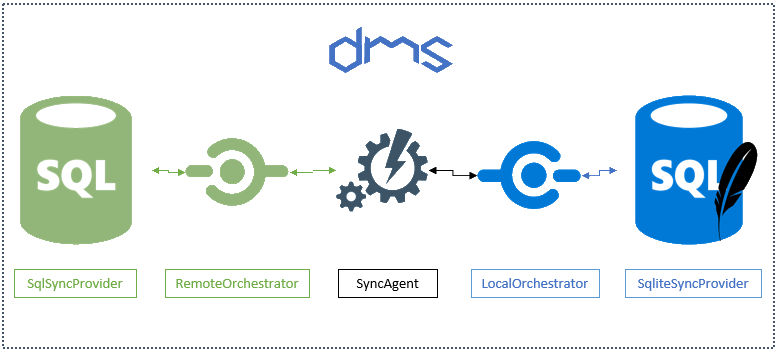

.. Dotmim.Sync documentation master file, created by
   sphinx-quickstart on Tue Apr 21 15:27:02 2020.
   You can adapt this file completely to your liking, but it should at least
   contain the root `toctree` directive.

Welcome to Dotmim.Sync
=============================================

**DotMim.Sync** (**DMS**) is a straightforward framework for syncing relational databases, developed on top of **.Net Standard 2.0**, available and ready to use within  **IOT**, **Xamarin**, **.NET**, **.NET Core**, **UWP** and so on :)  

.. note:: The source code is available on `Github <https://www.github.com/mimetis/dotmim.sync>`_. 
   
   This framework is still in beta. There is no support other than me and the time I can put on it. Don't be afraid to reach me out, but expect delay sometimes :)

.. image:: assets/allinone.png
   :align: center

Starting from scratch
=============================================

Here is the easiest way to create a first sync, from scratch : 

* Create a **.Net Standard 2.0** compatible project, like a **.Net Core 2.0 / 3.1** or **.Net Fx 4.8** console application.  
* Add the nugets packages `DotMim.Sync.SqlServer <https://www.nuget.org/packages/Dotmim.Sync.SqlServer>`_  and `DotMim.Sync.Sqlite <https://www.nuget.org/packages/Dotmim.Sync.Sqlite>`_  
* If you don't have any hub database for testing purpose, use this one : `AdventureWorks lightweight script for SQL Server </CreateAdventureWorks.sql>`_ 
* If you want to test **MySql**, use this script : `AdventureWorks lightweight script for MySQL Server </CreateMySqlAdventureWorks.sql>`_   

Add this code ::

   // Sql Server provider, the "server" or "hub".
   SqlSyncProvider serverProvider = new SqlSyncProvider(
      @"Data Source=.;Initial Catalog=AdventureWorks;Integrated Security=true;");

   // Sqlite Client provider acting as the "client"
   SqliteSyncProvider clientProvider = new SqliteSyncProvider("advworks.db");

   // Tables involved in the sync process:
   var tables = new string[] 
   {"ProductCategory", "ProductDescription", "ProductModel", "Product", 
    "ProductModelProductDescription", "Address", "Customer", 
    "CustomerAddress", "SalesOrderHeader", "SalesOrderDetail" };

   // Sync agent
   SyncAgent agent = new SyncAgent(clientProvider, serverProvider, tables);

   do
   {
      var result = await agent.SynchronizeAsync();
      Console.WriteLine(result);

   } while (Console.ReadKey().Key != ConsoleKey.Escape);

And here is the result you should have, after a few seconds::

   Synchronization done.
         Total changes  uploaded: 0
         Total changes  downloaded: 2752
         Total changes  applied: 2752
         Total resolved conflicts: 0
         Total duration :0:0:3.776

You're done !

Now try to update a row in your client or server database, then hit enter again.   
You should see something like that::

   Synchronization done.
         Total changes  uploaded: 0
         Total changes  downloaded: 1
         Total changes  applied: 1
         Total resolved conflicts: 0
         Total duration :0:0:0.045

Yes it's blazing fast !

Need Help
=============================================

Feel free to ping me: `@sebpertus <http://www.twitter.com/sebpertus>`_ 

.. toctree::
   :maxdepth: 1
   :hidden:
   :caption: DMS

   Overview
   HowDoesItWorks
   Synchronize
   Progression
   ChangeTracking
   Web
   SerializerConverter
   Timeout
   Snapshot
   Configuration
   Provision
   Metadatas
   Schemas
   Conflict
   Filters
   AlreadyExisting
   MultiScopes
   Debugging
