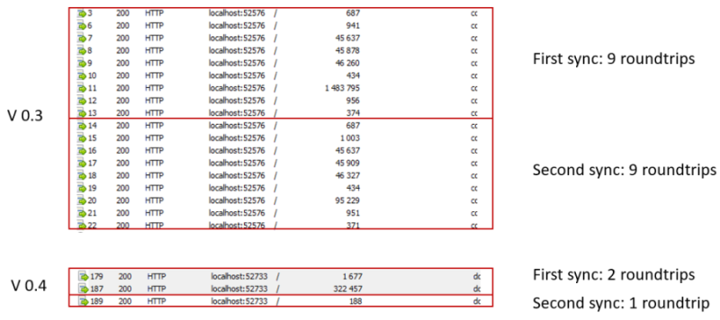

## Server scopeinfo table

The `sync_scope` table disappears from the server side data source.
This **PR** changes the role regarding the management of the `LastSyncTimestamp`. 

Now, the client is responsible of storing the values from both **Server** side and **Local** side:

``` sql
SELECT TOP (1000) [sync_scope_id]
      ,[sync_scope_name]
      ,[sync_scope_schema]
      ,[scope_last_server_sync_timestamp]
      ,[scope_last_sync_timestamp]
      ,[scope_last_sync_duration]
      ,[scope_last_sync]
  FROM [Client].[dbo].[scopeinfo]
```

sync_scope_id | sync_scope_name | sync_scope_schema | scope_last_server_sync_timestamp | scope_last_sync_timestamp | scope_last_sync_duration | scope_last_sync
-------------|---------------------|--------------------|-------------|---------------------|--------------------|--------------------
F6780CB1... | DefaultScope  | { }   |  10001  | 7815753  |  2019-12-27 06:12:15.617


With this new feature, the server is completely independant, and is able to response to any requests, from any clients, and any timestamps requested.


## Less Roundtripts

Today we have at least 6 requests-responses roundtrips:

> 1) BeginSession
> 2) EnsureScopesAsync
> 3) EnsureSchemaAsync
> 4) EnsureDatabaseAsync
> 5) ApplyChangesAsync
> 6) GetLocalTimestampAsync
> 7) GetChangeBatchAsync
> 8) WriteScopesAsync
> 9) EndSessionAsync

It's quite a lot of messages, and so far, a lot of opportunities to fail for various reasons (network and so on)   
Almost all steps has its own transaction, and it could be potentially not safe, if all the steps are not correctly done.


This **PR**  will introduce a new concept of `Orchestrator`.   
An orchestrator is responsible of the communication and need a provider (which is responsible of the datastore)   

At the end, we have now only 2 requests-response:

> 1) EnsureScopeAsync
> 2) ApplyThenGetChangesAsync

Basically, we have **2 transactions** on the client side and only **1 transaction** on the server side.

This PR will include a new **Schema** cache, on the client side.
Once the schema readed from the server, the client will store the schema in its `sync_scopes` table.
So far, we reduce the roundtrip to **1** query:

> 1) ApplyThenGetChangesAsync

Here is a screenshot, comparing `v0.3` and `v0.4`:



## Replacing DmSet with SyncSet

`DmSet` is a great object, that simulate a `DataSet`.  
I have created thie object, because at the beginning, `.Net Core 1` did not have the `DataSet`.

Today the `DmSet` is too complicated to handle, especially when optimizing **memory** and **network**

The `SyncSet` object is able to serialize its schema without the datas, and is able to export the datas in a convenient way (using an object called `ContainerSet`)

Here is a comparison, regarding the serialization of the schema :

- **V0.3** : Schema serialization : **45 961 bytes**
- **V0.4** : Schema serialization : **11 580 bytes** 

## Client decides which serializer to use

Client can dictate the serialization mechanism
The client sends a special HTTP header `dotmim-sync-serialization-format`, containing two information:

- First one is specifying the serialization format to use. The server then knows how to deserialize the messages and also uses this serialization format in each response
- Second one is specifying if the client needs batch mode or not.

Example:

```
dotmim-sync-serialization-format: {"f":"json","s":500}
```
- Serialization : **Json**
- Batch size : **500**


## Options to set a custom serializer

You can now set your own serializer. 
Using the `SyncOptions` instance, the client can define the serializer he wants to use.

The server shoud have the serializer installed as well.

To be able to use a new serializer, you should:
- Implements thes interfaces `ISerializerFactory` and `ISerializer<T>`
- References this serializer on both side (client and server)

Here is an example using a new serializer based on **MessagePack**:


``` csharp
public class CustomMessagePackSerializerFactory : ISerializerFactory
{
    public string Key => "mpack";
    public ISerializer<T> GetSerializer<T>() => new CustomMessagePackSerializer<T>();
}

public class CustomMessagePackSerializer<T> : ISerializer<T>
{
    public CustomMessagePackSerializer() => MessagePackSerializer.SetDefaultResolver(MessagePack.Resolvers.ContractlessStandardResolver.Instance);
    public T Deserialize(Stream ms) => MessagePackSerializer.Deserialize<T>(ms);
    public byte[] Serialize(T obj) => MessagePackSerializer.Serialize(obj);
}
```
Add the serializer to the web server serializers collection:
``` csharp
var webServerOptions = new WebServerOptions
{
    UseBulkOperations = ...
};
webServerOptions.Serializers.Add(new CustomMessagePackSerializerFactory());

```

Add the serializer on the client side:
``` csharp
var proxyClientProvider = new WebClientOrchestrator
{
    SerializerFactory = new CustomMessagePackSerializerFactory()
};
```

## WebClientOrchestrator


### 1 - HttpClient
To be able to use the last features from **ASP.NET Core**, especially Dependency Injection of `HttpClient`, the `WebClientOrchestrator` is taking an `HttpClient` as parameter

``` csharp
public WebClientOrchestrator(string serviceUri = null, ISerializerFactory serializerFactory = null, HttpClient client = null)
{
}
```

### 2 - Gzip compression

Gzip compression can be used, but is not enabled by default. Use an instance of `HttpClientHandler` and check the `SupportsAutomaticDecompression` property:

``` csharp
var handler = new HttpClientHandler();

if (handler.SupportsAutomaticDecompression)
    handler.AutomaticDecompression = DecompressionMethods.GZip | DecompressionMethods.Deflate;

var httpClient = new HttpClient(handler);

var client = new WebClientOrchestrator("http://...", SerializersCollection.JsonSerializer, httpClient);

```